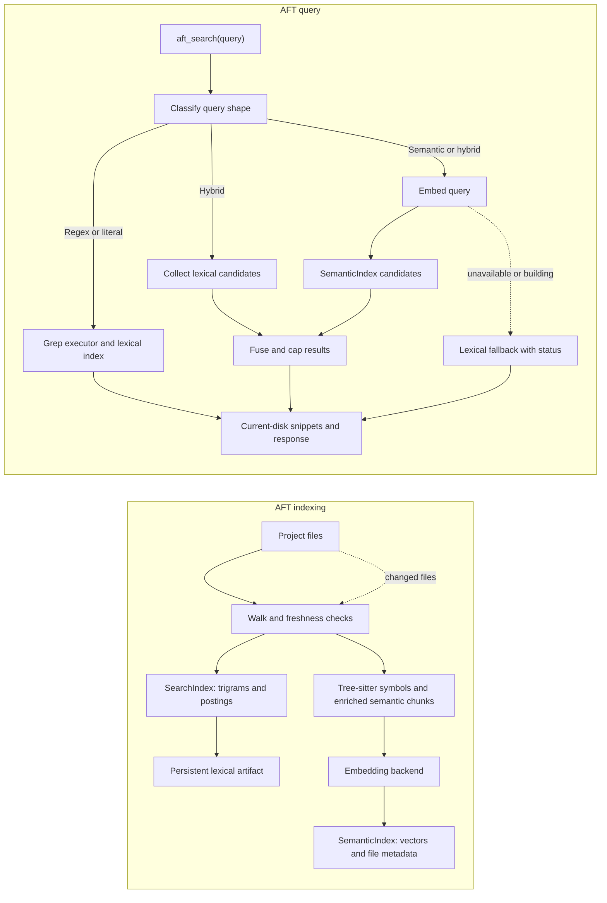
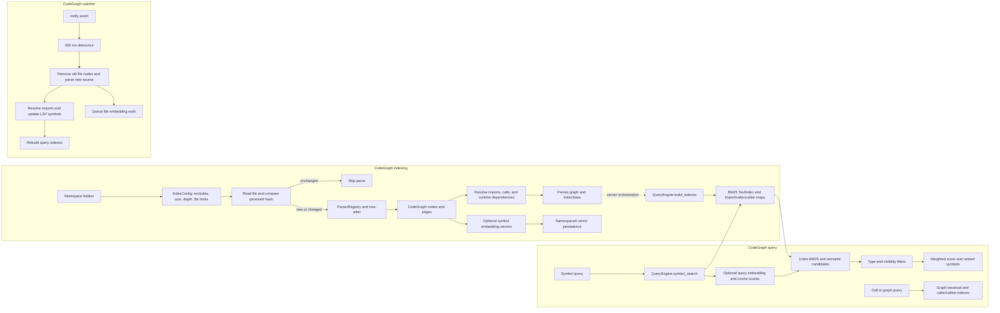
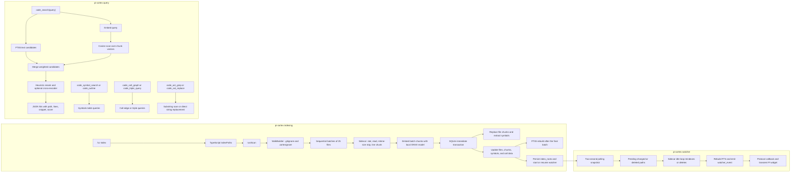

# Code intelligence comparison

This document compares pi-cortex with AFT and CodeGraph. It is an implementation comparison, not a benchmark.

## Evidence and scope

- **Verified** means the behavior is visible in the inspected source.
- **Inference** means an architectural conclusion, not a measured performance result.
- The pi-cortex claims refer to this repository's current implementation.
- The AFT and CodeGraph claims refer to the local checkouts listed in [Sources](#sources).

The most important difference is the retrieval unit:

| Project   | Primary retrieval unit                                | Primary data model                           |
| --------- | ----------------------------------------------------- | -------------------------------------------- |
| pi-cortex | Source line chunks                                    | SQLite rows with FTS5 and vectors            |
| AFT       | Full-file lexical postings and symbol semantic chunks | Persistent trigram and semantic indexes      |
| CodeGraph | Parsed symbols and graph nodes                        | Tree-sitter graph plus derived query indexes |

## Feature comparison

| Capability                    | pi-cortex                                                                                                                              | AFT                                                                                                         | CodeGraph                                                                                 |
| ----------------------------- | -------------------------------------------------------------------------------------------------------------------------------------- | ----------------------------------------------------------------------------------------------------------- | ----------------------------------------------------------------------------------------- |
| Host integration              | Native Pi extension with a Rust JSON-over-stdio sidecar                                                                                | Rust application with Pi and OpenCode integrations                                                          | MCP/LSP-oriented Rust server                                                              |
| Lexical search                | SQLite FTS5 over stored chunk text, multiword OR fallback, heuristic rerank                                                            | Persistent trigram postings, literal and regex grep, freshness-aware deltas                                 | BM25 over symbol names, docstrings, and comments                                          |
| Semantic search               | Cosine similarity over embedded source chunks                                                                                          | Embedding search over enriched symbol chunks                                                                | Optional symbol embeddings with cosine similarity                                         |
| Hybrid search                 | Exact identifiers use FTS directly; other queries use weighted reciprocal-rank fusion and optional cross-encoder reranking             | Query-shape routing, semantic overfetch, lexical candidates, lexical boost, and capped lexical-only results | BM25 and semantic scores are normalized and combined with 0.4 and 0.6 weights             |
| Incremental indexing          | File mtime and size checks, transactional replacement of a file's rows                                                                 | File freshness metadata, reusable semantic embeddings, trigram deltas, spill, and compaction                | Content-hash checks through persisted `IndexState`; changed files are reparsed            |
| Symbol search                 | Regex or substring matching against an extracted symbols table, with kind and path filters                                             | Tree-sitter symbol extraction, outline, semantic metadata, and exported-symbol ranking                      | Graph nodes plus BM25 text search and symbol filters                                      |
| Call relationships            | Regex-extracted `call_edges`, callers, callees, and triple queries                                                                     | Tree-sitter-backed call graph and traversal tools                                                           | Graph `Calls` edges, caller/callee indexes, and traversal                                 |
| Structural search and replace | **Not structural.** Current implementation uses case-insensitive substring matching for grep and direct string replacement for replace | Real tree-sitter and ast-grep patterns with metavariables                                                   | Graph and parsed-node queries; this comparison does not treat it as an AST rewrite engine |
| Memory                        | First-class remember, recall, and forget commands with session, project, and global scopes                                             | Not treated as a core AFT index feature here                                                                | Memory layer with code-node invalidation and vector persistence                           |
| Watcher                       | Two-second polling, mtime and size snapshots, sidecar reindexing, persisted roots, and Pi widget notices                               | Long-running integration with freshness-aware incremental indexes                                           | `notify` events, 300 ms debounce, reparsing, query-index rebuild, and embedding queue     |
| Persistence                   | Per-project SQLite database in the Pi session directory; local model cache is shared                                                   | Persistent lexical and semantic cache artifacts                                                             | Persisted graph/index state and namespaced vector storage                                 |

## AFT flow

The diagram shows the two index lanes and the query routing visible in AFT's semantic search implementation. Hybrid mode collects lexical candidates from the trigram index, then fuses them with semantic results. Semantic disabled, failed, or building states can produce a disclosed lexical fallback.

### AFT observations

- **Verified:** `choose_mode` routes regex queries to grep, routes short natural-language queries to hybrid when the lexical index is ready, and routes longer natural-language queries to semantic search.
- **Verified:** semantic queries embed the query, fetch semantic candidates, optionally collect lexical candidates, and call `fuse_hybrid_results`.
- **Verified:** lexical matches that do not have a semantic result are allowed into hybrid results, but their score is capped. Non-generated lexical matches can receive a lexical boost.
- **Inference:** AFT's symbol-level semantic chunks should usually give an agent a more focused result context than a very large source chunk. This is a likely precision advantage, not a benchmark result.

## CodeGraph flow

CodeGraph first builds a tree-sitter graph and then derives text, import, caller, and callee indexes from that graph. The watcher uses a separate incremental path that reparses one changed file, refreshes query indexes, and queues embedding work.

### CodeGraph observations

- **Verified:** `Indexer::index_workspace` applies exclusion and file limits, skips unchanged files using `IndexState`, parses changed files, resolves cross-file imports and runtime dependencies, and saves index state.
- **Verified:** `QueryEngine::build_indexes` builds a BM25 text index and import, caller, and callee maps from graph nodes and edges.
- **Verified:** `symbol_search` unions BM25 candidates with semantic-only candidates, applies type and visibility filters, and combines normalized BM25 and semantic scores.
- **Verified:** the watcher debounces `notify` events, replaces the changed file's graph nodes, rebuilds query indexes, and queues embedding work.
- **Inference:** CodeGraph is the strongest of the three for navigation questions that are naturally graph-shaped, such as callers, callees, imports, and bounded traversal.

## pi-cortex flow

The TypeScript extension owns Pi commands and tool calls. The Rust sidecar owns file walking, embedding, SQLite access, FTS5, and polling. `/cc-index` sends files in sequential batches of 25 so the extension can report progress and remain abortable between batches.

### pi-cortex observations

- **Verified:** the walker enables project `.gitignore` rules, disables global Git ignores and `.git/info/exclude`, and adds `.cortexignore` as the custom ignore file. `.cortexignore` has precedence when rules overlap.
- **Verified:** indexing checks mtime and size, stores source text and embeddings in `chunks`, extracts declaration rows into `symbols`, and stores regex-extracted calls. The write path uses an immediate SQLite transaction and rechecks freshness inside the transaction.
- **Verified:** exact standalone identifiers bypass query embedding and use the FTS lane directly. Other `code_search` queries embed the query, overfetch semantic and FTS candidates, add FTS-only candidates, fuse ranks, apply heuristic reranking, and can apply a cross-encoder reranker when requested.
- **Verified:** the current AST-named commands do not parse ASTs. `code_ast_grep` lowercases chunk text and uses substring matching. `code_ast_replace` reads full files and calls direct string replacement. Metavariables such as `$NAME` therefore have no structural meaning.
- **Verified:** watcher roots are stored in `meta.index_roots`, the sidecar resumes them on startup, and watcher events reach a transient Pi widget instead of persistent chat entries.
- **Inference:** line-chunk embeddings make pi-cortex simple and broadly applicable, but a large chunk can dilute the meaning of a result. This is the most direct explanation for broad snippets displacing focused matches in the observed search issue.

## What the comparison means

### Where pi-cortex is competitive

1. It is native to Pi and exposes custom Pi tools, commands, renderers, cleanup commands, and watcher notices without an MCP boundary.
2. It combines semantic chunks, FTS5, symbols, calls, triples, and scoped memory in one local project database.
3. It has a small operational footprint: one sidecar, one project database, and a shared model cache.
4. Its watcher survives Pi restarts because indexed roots are persisted.

### Where the other designs are ahead

1. AFT has a more mature lexical index and a more explicit hybrid candidate pipeline. Its lexical index is built around trigrams, postings, freshness, deltas, and compaction rather than a table scan plus FTS5.
2. AFT provides real structural AST search and rewrite. pi-cortex's current AST names describe an intended interface, not the current implementation.
3. CodeGraph makes parsed relationships first-class. A caller, callee, import, reference, or bounded traversal query maps directly to graph nodes and edges.
4. AFT and CodeGraph both align semantic retrieval more closely with symbols than pi-cortex's current line chunks do.

These are architectural comparisons. They do not establish that one project is faster or more accurate for every repository.

## Recommended pi-cortex improvements

The first retrieval improvements are now implemented: hard chunk bounds, exact-identifier lexical routing, reciprocal-rank fusion, and an in-memory vector cache with write invalidation. Remaining priorities are:

1. **Add symbol-aware semantic chunks.** Keep bounded line chunks as fallback, but embed declaration-level context with symbol name, kind, signature, and file path so results align with code entities.
2. **Batch watcher updates.** Coalesce changed files and embed them in one bounded batch before rebuilding FTS once.
3. **Add real structural matching only if required.** A tree-sitter or ast-grep implementation is a separate feature from improving the current substring commands.
4. **Benchmark before tuning thresholds.** Scores are ranking values bounded for display, not probabilities. Use a small query set with expected files, symbols, snippets, and latency before changing weights or thresholds.

## Sources

### pi-cortex

- `extensions/pi-cortex/index.ts`
- `extensions/pi-cortex/src/search.ts`
- `extensions/pi-cortex/src/protocol.ts`
- `extensions/pi-cortex/src/watcher.ts`
- `extensions/pi-cortex/rust-embedder/src/main.rs`

### AFT

- Repository: <https://github.com/cortexkit/aft>
- Local checkout: `C:\Users\niel\.cache\checkouts\github.com\cortexkit\aft`
- `crates/aft/src/commands/semantic_search.rs`
- `crates/aft/src/search_index.rs`
- `crates/aft/src/semantic_index.rs`

### CodeGraph

- Repository: <https://github.com/codegraph-ai/codegraph>
- Local checkout: `C:\Users\niel\.cache\checkouts\github.com\codegraph-ai\codegraph`
- `crates/codegraph-server/src/indexer.rs`
- `crates/codegraph-server/src/ai_query/engine.rs`
- `crates/codegraph-server/src/ai_query/text_index.rs`
- `crates/codegraph-server/src/watcher.rs`
