# Harbor Monorepo Package Product Design & Specification

> **Package Name**: `@nielpattin/pi-harbor`  
> **Package Path**: `packages/pi-harbor`  
> **Effect Version**: `effect@4.0.0-beta.101`  
> **Architecture**: Standalone all-in-one Effect v4 monorepo package for agent task execution, process supervision, inter-agent messaging, and director mode management.

---

## 1. Identity, Scope & Hard Constraints

`@nielpattin/pi-harbor` is a greenfield publishable monorepo package located in `packages/pi-harbor/` (following the same local package pattern as `packages/pi-permission-system` and `packages/pi-station`). It provides complete infrastructure for subagent spawning, background OS process supervision, shell execution, inter-agent message routing, agent definition management, vibe/director workflows, and side-task execution.

### 1.1 Local Package Registration Pattern & Manifest Requirements

Local monorepo packages declare their entry points via the package `package.json` `"pi"` field:

```json
{
  "name": "@nielpattin/pi-harbor",
  "version": "0.1.0",
  "dependencies": {
    "effect": "4.0.0-beta.101",
    "typebox": "1.3.8"
  },
  "peerDependencies": {
    "@earendil-works/pi-coding-agent": "^0.82.1"
  },
  "pi": {
    "extensions": ["./index.ts"]
  }
}
```

In user settings (`settings.json`), local packages are registered in the `packages` array. Extension paths use `+path` to force-include extensions or omit filter arrays when relying on the package manifest. Prefixes with `-` force-exclude matching extensions.

When Harbor is enabled, legacy extensions (`extensions/tasks` and `extensions/background-terminals`) **must** be explicitly disabled in `settings.json` via `-` paths to avoid command and tool name collisions (`task`, `/tasks`, `/ps`). The user must set force-exclude entries:

```json
{
  "extensions": [
    "-extensions/tasks/index.ts",
    "-extensions/background-terminals/index.ts"
  ]
}
```

At parent `session_start` Harbor runs this concrete cutover check before registering parent tools or commands:

```typescript
function pathFrom(item: { sourceInfo?: { path?: string } }): string {
  return item.sourceInfo?.path ?? "";
}

const NAME_COLLISION_TOOLS = [
  "task", "task_spawn", "task_spawn_batch", "task_wait", "task_cancel", "task_check", "task_list",
  "bg_start", "bg_kill", "bg_status", "bg_list", "bg_logs"
];
const NAME_COLLISION_COMMANDS = ["/ps", "/tasks", "/agents", "/vibe", "/btw"];

// At session_start:
// 1. Prefer path-based detection: any tool/command path containing
//    "extensions/tasks" or "extensions/background-terminals" without settings force-exclude
//    of "-extensions/tasks/index.ts" and "-extensions/background-terminals/index.ts".
// 2. Fallback if path empty: if any registered tool name is in NAME_COLLISION_TOOLS
//    or any command name is in NAME_COLLISION_COMMANDS AND settings still lists
//    those legacy extensions without '-', fail closed.
// 3. On collision: log hard error, refuse parent tool/command registration.
```

Harbor refuses to register parent tools/commands until the legacy extensions are force-excluded.

```json
{
  "packages": [
    {
      "source": "./packages/pi-permission-system",
      "extensions": ["+src/index.ts"]
    },
    {
      "source": "./packages/pi-station",
      "extensions": ["+dist/index.js"]
    },
    {
      "source": "./packages/pi-harbor",
      "extensions": ["+index.ts"]
    }
  ],
  "extensions": [
    "-extensions/tasks/index.ts",
    "-extensions/background-terminals/index.ts"
  ]
}
```

The agent loader loads `@nielpattin/pi-harbor` directly from `packages/pi-harbor` on startup.

### 1.2 Greenfield Framing & Reference Codebases

This package is a **greenfield product design**, not a migration guide. Existing legacy extension locations (`extensions/tasks` and `extensions/background-terminals`) serve strictly as **reference implementations**:
- **Pi Extensions Reference**: `C:/Users/niel/.cache/checkouts/github.com/earendil-works/pi/packages/coding-agent/docs/extensions.md`
- **Oh-My-Pi Reference**: `C:/Users/niel/.cache/checkouts/github.com/can1357/oh-my-pi/packages/coding-agent/src/tools/hub/` and `.../src/task/`
- **Tasks Backend Reference**: `extensions/tasks/src/backends/pi.ts`

### 1.3 Hard Architectural Constraints

1. **Zero External Extension Imports**: `packages/pi-harbor` imports zero code from `extensions/shared/**` and zero code from any other `extensions/` directory. All utilities (`shell-env.ts`, `output-buffer.ts`, `kill-tree.ts`, `ready-poller.ts`, `stream-close.ts`, `acp-decoder.ts`) exist as local module copies under `packages/pi-harbor/src/utils/`.
2. **Monorepo Dependencies**:
   - Depends on `effect@4.0.0-beta.101` (exact pin).
   - Depends on `typebox@1.3.8` (root monorepo resolved version after `pnpm up --latest`) for Pi tool parameter JSON Schema surfaces.
   - Peer `@earendil-works/pi-coding-agent` ^0.82.1. Monorepo root already pins `^0.82.1` (resolved `0.82.1`).
   - Harbor internal domain models, tagged errors, and `outputSchema` validation use Effect `Schema` (`Schema.Class`, `Schema.TaggedErrorClass`, `Schema.decodeUnknownEffect`).
   - Idioms follow `docs/effect-v4-cheatsheet.md` and `repos/effect/LLMS.md`.
3. **Unified UI Command Surface**: `/tasks` is the **ONLY** unified TUI dashboard command for monitoring agent jobs, bash tasks, named OS processes, stdio log tailing, and interactive session takeover tabs. Harbor package registers no `/ps`; legacy bg-terminals `/ps` must be force-disabled at cutover. Separate helper commands are `/agents`, `/vibe`, and `/btw`.
4. **Pi API & Session Contracts**:
   - `createAgentSession` and `DefaultResourceLoader` are imported directly from `@earendil-works/pi-coding-agent`.
   - `DefaultResourceLoader` takes `{ cwd, agentDir, settingsManager, systemPrompt: agentDef.body }`. Call `await loader.reload()` before passing as `resourceLoader`. Child body prompt goes on `DefaultResourceLoader.systemPrompt`. `CreateAgentSessionOptions` does NOT include `customPrompt` or `modelRegistry`.
   - Model resolution uses `resolvePiModel(registry, model, inheritedModel)` in `packages/pi-harbor/src/backends/pi-model.ts`. Reasoning effort maps to Pi `thinkingLevel`. Pi SDK 0.82 `ThinkingLevel` may include `"max"`. Harbor maps parent `reasoning_effort: "max"` to `thinkingLevel: "max"` when the SDK type accepts it. If the selected model clamp rejects `"max"`, Harbor falls back to `"xhigh"`. Agy `--effort` maps `"off"`, `"minimal"`, `"low"` → `"low"`; `"medium"` → `"medium"`; `"high"`, `"xhigh"`, `"max"` → `"high"`.
   - Child sessions are created via `const { session: childSession } = await createAgentSession({ cwd, agentDir, sessionManager, settingsManager, resourceLoader: loader, model, thinkingLevel, customTools: [submitTool, hubWorkerTools], excludeTools: ["task", "bash"] })`. If parent can provide `modelRuntime`, pass it; if omitted, `createAgentSession` creates a fresh runtime.
   - Child sessions execute `await childSession.bindExtensions({ mode: "print" })`.
   - Child tool surface: requested profile tools are intersected with `childSession.getAllTools().map(t => t.name)` and set via `childSession.setActiveToolsByName(allowedTools)` on the `AgentSession` instance. Parent ExtensionAPI methods remain `pi.setActiveTools(string[])` and `pi.getActiveTools(): string[]`.
   - Child recursion guard: in package factory `session_start`, if `ctx.mode === "print"` || `ctx.hasUI === false`, register only worker surfaces (`submit` tool and hub worker ops: `send`, `inbox`, `list`, `wait-from`, `exec`) and skip parent tools (`task`, parent `hub`), commands (`/tasks`, `/agents`, `/vibe`, `/btw`), and dashboard. Set `HARBOR_CHILD_SESSION=1` on OS environment for `agy` process spawns.
   - Result capture: subscribe to child session `tool_execution_end` events to observe `submit` tool calls.
5. **Structured Submit Validation**: `pi` workers submit results strictly via `{ result: { data: T } }` or `{ result: { error: string } }`. `outputSchema` is accepted as a raw JSON Schema document via `Type.Unknown()` from tool params. At spawn time `SchemaValidator` converts it once through the full Effect JSON Schema pipeline and caches the resulting schema on the job:

   ```typescript
   const document = JsonSchema.fromSchemaDraft2020_12(outputSchema);
   const representation = SchemaRepresentation.fromJsonSchemaDocument(document);
   const schema = SchemaRepresentation.toSchema(representation);
   ```

   The conversion is wrapped in `Effect.try`; failure produces a spawn-time `SchemaConversionError`. At `submit` time `Schema.decodeUnknownEffect(schema)(result.data)` validates the payload; failure produces a tool-time `SchemaValidationError`. Conversion errors are never conflated with validation errors.
6. **Durable Vibe State Restoration**:
   - Pre-vibe baseline tool snapshots are persisted using durable session entries: `pi.appendEntry("vibe-state", { savedTools })`.
   - `pi.getActiveTools()` returns a `string[]` array of active tool names. Baseline snapshot filters active tool names to exclude `vibe_*` names.
   - Disabling Vibe Mode reads session entries via `ctx.sessionManager.getEntries()`, filters entries for `customType === "vibe-state"`, and selects the LAST entry in the array.
   - Tool restoration computes the intersection of `savedTools` with `pi.getAllTools().map(t => t.name)` names (`savedTools.filter(name => registeredNames.includes(name))`).
   - Fallback when no `vibe-state` entry exists: all registered non-vibe tool names from `pi.getAllTools().map(t => t.name)`.
   - Harbor NEVER calls `getActiveTools()` while Vibe mode is active.
   - While Vibe mode is ON, a hard `tool_call` hook block rejects execution of non-director tools.
   - Director mode tool surface is definitive: `vibe_spawn`, `vibe_send`, `vibe_wait`, `vibe_kill`, `vibe_list`, `read`, plus read-only info tools (`describe_image`, `web_search_exa`, `deep_search_exa`, `web_fetch_exa`, `read_session`, `workflow`, `mcp`).
7. **Concurrency & Uninterruptible Reservation Windows**:
   - Max 4 concurrent running agent jobs (`MAX_RUNNING_AGENTS = 4`) and max 8 concurrent background OS processes (`MAX_RUNNING_PROCESSES = 8`).
   - Reservation, spawn, registration, and setting status to `"running"` execute inside an `Effect.uninterruptible` critical section using `reservedAgentSlots` and `reservedProcessSlots`. The uninterruptible window ends immediately after the entry is registered and status is set to `"running"`; the `reserved--` decrement runs in the `Effect.ensuring` of that uninterruptible block. `Effect.uninterruptible` may span async `Effect` operations such as `createAgentSession`; it is not a mutex. Counter updates remain synchronous. Never hold a mutex across async spawn.
   - Capacity pruning selects candidates where `status !== "running"` AND `waitInterest === 0` AND `killInterest === 0`. Candidates are sorted by `settledAt` ascending, then `createdAt` ascending. Entries are dropped from the front until the registry is under `MAX_TRACKED_JOBS` (64). Only if `MAX_TRACKED_JOBS` (64) remains full after pruning are new registrations **rejected** with `CapacityError`.
   - `JobRegistry` tracks both `waitInterest` and `killInterest`. Capacity pruning skips entries where `waitInterest > 0` || `killInterest > 0` || status === "running".
8. **Dual Cancellation & Tree Kill Paths**:
   - Canonical Pi harness cancellation sequence: `session.clearQueue()` then `session.abort()` followed by a bounded 5,000 ms timeout before forcing scope closure (`Scope.close`), matching the tasks backend manager pattern (never `session.interrupt`).
   - Agy harness and OS process cancellation invokes process tree termination via `taskkill /pid <pid> /T /F` on Windows and POSIX process group signals (`SIGTERM` followed by `SIGKILL` after 2,000 ms).
9. **Phased `agy` Harness Evolution**: Phase 1a ships one-shot print-mode execution only (no FSM, no DB poll). Phase 2a adds full agy control FSM (`steer` kill+resume, `followUp` queue+chain, SQLite DB poll for mid-turn tool events; messaging tools remain unsupported on agy). Full CLI argv matches reference: `--model <model>`, `--effort <effort>`, `--mode accept-edits`, `--dangerously-skip-permissions`, `--add-dir <cwd>`, `--print-timeout 15m`, `--print <prompt>`. Process spawning routes through `buildChildEnv` and `ShellExecutor` PATH logic.

### 1.4 Package Source Directory Layout

```text
packages/pi-harbor/
├── index.ts                     # Package entry point & pi extension registration export
├── package.json                 # Monorepo manifest (@nielpattin/pi-harbor with pi.extensions)
├── tsconfig.json                # TypeScript build configuration
└── src/
    ├── domain.ts                # Domain types & Schema.TaggedErrorClass errors
    ├── runtime.ts               # Effect ManagedRuntime & HarborLive Layer assembly
    ├── services/
    │   ├── TaskManager.ts       # Agent spawning & lifecycle execution service
    │   ├── JobRegistry.ts       # SSOT job state registry & event bus
    │   ├── ProcessSupervisor.ts # OS background process supervision service
    │   ├── ShellExecutor.ts     # Process spawning & dynamic Git Bash PATH detection
    │   ├── MailBus.ts           # Inter-agent message router & mailbox bus
    │   ├── VibeState.ts         # Director mode state machine & tool locker
    │   ├── AgentsStore.ts       # Agent definition resolution & file loader
    │   └── SchemaValidator.ts   # Effect Schema validation engine (not TypeBox-only)
    ├── backends/
    │   ├── pi.ts                # Pi harness backend (imports createAgentSession)
    │   ├── pi-model.ts          # ModelRegistry resolver helper & thinking level mapper
    │   └── agy.ts               # Agy harness backend (FSM, process spawning & DB poller)
    ├── tools/
    │   ├── task.ts              # Parent task tool definition & handler
    │   ├── hub.ts               # Unified hub tool definition & handler
    │   ├── submit.ts            # Worker submit tool definition & handler
    │   └── vibe.ts              # Vibe director tools (vibe_spawn, etc.)
    ├── ui/
    │   ├── tasks-dashboard.ts   # Unified /tasks TUI dashboard overlay
    │   ├── agents-panel.ts      # /agents configuration TUI panel
    │   ├── log-viewer.ts        # Stdio log tailing terminal component
    │   └── takeover.ts          # Interactive session takeover component
    └── utils/
        ├── shell-env.ts         # Git Bash PATH detection & environment helpers (local copy)
        ├── output-buffer.ts     # Ring buffer & spill file logic (local copy)
        ├── kill-tree.ts         # Windows taskkill /T /F and POSIX tree kill (local copy)
        ├── ready-poller.ts      # Log scanner & TCP port poller (local copy)
        ├── stream-close.ts      # Stream closure listener & timeout helper (local copy)
        └── acp-decoder.ts       # Protobuf step decoder for agy DB poll (local copy)
```

### 1.5 Surface Area Inventory

| Surface Category | Identification | Operational Role & Access Scope |
| --- | --- | --- |
| **Package Location** | `packages/pi-harbor` | Publishable monorepo package tree. |
| **Parent Surface Tools (Normal Mode)** | `task`, `hub` | Registered on parent session for subagent spawning, job control, process supervision, shell execution, and messaging. |
| **Parent Surface Tools (Vibe Mode)** | `vibe_spawn`, `vibe_send`, `vibe_wait`, `vibe_kill`, `vibe_list`, `read`, info tools | Active when Vibe Director mode is ON. Hard `tool_call` block rejects standard editing/execution tools. |
| **Worker Surface Tool** | `submit` | Injected into `pi` child sessions via `createAgentSession` `customTools` for structured result returns. |
| **Worker Surface Operations** | `submit`, `hub op: "send"`, `"inbox"`, `"list"`, `"wait-from"`, `"exec"` | Injected into `pi` child sessions via `customTools` for inter-agent communication and synchronous shell execution. |
| **Interactive TUI Commands** | `/tasks`, `/agents`, `/vibe`, `/btw` | Unified dashboard (`/tasks`), agent configuration (`/agents`), mode toggle (`/vibe`), side task (`/btw`). |

---

## 2. Product Surface Map & Architecture

Harbor consolidates subagent execution, shell tasks, background process control, and TUI overlays into a single Effect-driven system.


### 2.1 Parent Session Surface
- **Normal Mode**: Parent agents access `task` (batch and flat spawning) and `hub` (job monitoring, wait, cancellation, shell execution, process start/stop/logs, and messaging).
- **Vibe Mode**: When active, director tools lock strictly to `vibe_spawn`, `vibe_send`, `vibe_wait`, `vibe_kill`, `vibe_list`, `read`, plus read-only info tools (`describe_image`, `web_search_exa`, `deep_search_exa`, `web_fetch_exa`, `read_session`, `workflow`, `mcp`). All non-director tools are blocked at the `tool_call` hook layer.

### 2.2 Worker Session Surface (`pi` Harness)
- **Injected Tools**: `pi` workers receive `submit` for result delivery and `hub` restricted to messaging (`send`, `inbox`, `list`, `wait-from`) and synchronous shell execution (`exec`).
- **Excluded Tools**: `task` and stock `bash` are removed via `excludeTools`. Shell execution routes through `hub op: "exec"`.
- **Child Recursion Guard**: Package factory `session_start` checks if `ctx.mode === "print"` || `ctx.hasUI === false`. When true, it registers only worker surfaces (`submit` and worker `hub`) and skips parent harbor tools, commands, and dashboard. OS environment sets `HARBOR_CHILD_SESSION=1` for `agy` child processes.
- **Child Initialization**: Calls `await childSession.bindExtensions({ mode: "print" })`. Intersects agent profile tools with `childSession.getAllTools().map(t => t.name)` and calls `childSession.setActiveToolsByName(allowedTools)`.
- **Result Capture**: Subscribes to child session `tool_execution_end` events to observe `submit` tool calls.

### 2.3 Worker Session Surface (`agy` Harness)
- Primary execution routes via `agy --print` process with full argv (`--model`, `--effort`, `--mode accept-edits`, `--dangerously-skip-permissions`, `--add-dir`, `--print-timeout`).
- Implements the definitive agy control state machine (`steer` interrupt+resume via process tree kill and `--conversation <id>` re-spawn, `followUp` queue+chain across exit 0 runs).
- Mid-turn tool events monitored via SQLite DB polling and local `acp-decoder.ts`.
- Zero injected `submit`/`hub` tools; final answer is stdout after queues drain.

### 2.4 Interactive TUI Command Surface
- **`/tasks`**: The **ONLY** unified TUI dashboard for all jobs and processes. Contains sub-tabs for Agent Jobs, Background Processes, Stdio Log Viewer, and Live Session Takeover. Harbor package registers no `/ps`; legacy bg-terminals `/ps` must be force-disabled at cutover.
- **`/agents`**: Configuration editor for file-based agent definitions (`agents/*.md`), built-in definitions (`scout`, `task`), and Vibe profiles (`fast`, `good`).
- **`/vibe`**: Director mode state toggle. Updates tool locks, persists baseline tool snapshots via `pi.appendEntry`, and toggles status widgets.
- **`/btw`**: Side-task execution interface. Uses built-in `task` agent profile, inherits parent model, sets `origin: "btw"`, and runs asynchronously without consuming an agent slot from `MAX_RUNNING_AGENTS` (side-channel; max 1 concurrent btw). Results append via `btw-result` entry using `pi.registerEntryRenderer("btw-result", ...)` (primary path on 0.82.0; fallback renderer otherwise) without altering LLM context.

---

## 3. Operational Modes: Normal vs Director (Vibe) Mode

Harbor maintains two explicit operating states: Normal Mode and Director Mode.

### 3.1 Normal Mode (Vibe OFF)
- **Tool Catalog**: `task`, `hub`, and registered workspace tools (`read`, `write`, `edit`, `grep`, `find`).
- **Agent Selection**: Spawns built-in agents (`scout`, `task`), file-based agents (`high-task`, `reviewer`), and custom project agents.
- **Execution Flow**: Parent delegates work, monitors via `hub op: "wait"` || `hub op: "jobs"`, and receives `harbor-result` messages via `pi.sendMessage`.

### 3.2 Director Mode (Vibe ON)
- **Activation**: Toggled via `/vibe`.
- **Tool Catalog**: Director tool surface includes `vibe_spawn`, `vibe_send`, `vibe_wait`, `vibe_kill`, `vibe_list`, `read`, and read-only info tools (`describe_image`, `web_search_exa`, `deep_search_exa`, `web_fetch_exa`, `read_session`, `workflow`, `mcp`).
- **Hard `tool_call` Block**: In addition to `setActiveTools`, Harbor registers a `tool_call` hook that intercepts and aborts any attempt to execute non-director tools (e.g. `write`, `edit`, `bash`, `task`, `hub`).
- **System Prompt Guard**: Appends `VIBE_DIRECTOR_SYSTEM_PROMPT` to every turn.
- **Profile Restriction**: Spawns restrict to profile keys: `vibe_spawn({ cli: "fast" | "good" })`. Spawning raw agent names is disallowed.

### 3.3 Vibe Director System Prompt

```markdown
# VIBE DIRECTOR MODE ACTIVE

You are operating as a Vibe Director. You possess access strictly to director tools:
- `vibe_spawn({ cli: "fast" | "good", prompt: "..." })` to spawn subagents.
- `vibe_send({ session: "...", message: "..." })` to send follow-up instructions to active workers.
- `vibe_wait({ sessions: [...], timeout: N })` to block until worker subagents complete.
- `vibe_kill({ session: "..." })` to cancel active subagents.
- `vibe_list()` to inspect running and completed subagents.
- `read` and informational inspection tools.

## Directives
1. Direct work exclusively through worker subagents. Do not attempt direct tool calls for file edits and shell execution.
2. Use `fast` profile for quick research and light edits. Use `good` profile for complex implementation tasks.
3. Call `vibe_wait` after spawning subagents to receive their structured outputs before issuing next instructions.
```

### 3.4 Vibe State Persistence & Restoration Specification

To resolve tool loss during Vibe OFF restoration:

#### Restoration Read Path & Algorithm:
1. **Durable Snapshotting (Entering Vibe ON)**:
   - Read active tool names via `pi.getActiveTools()` (which returns a `string[]` array of names).
   - Extract current active tool names before Vibe mode activation: `savedTools = pi.getActiveTools().filter(name => !name.startsWith("vibe_"))`.
   - Persist snapshot into session history:
     ```typescript
     pi.appendEntry("vibe-state", { savedTools, timestamp: Date.now() });
     ```
2. **Durable Restoration (Disabling Vibe OFF)**:
   - Read session history entries via `ctx.sessionManager.getEntries()`.
   - Filter entries for custom entries with `customType === "vibe-state"`.
   - Select the **LAST** entry in the array.
   - Compute restored tools by taking the **intersection of `savedTools` with `pi.getAllTools().map(t => t.name)`**:
     ```typescript
     const registeredNames = pi.getAllTools().map(t => t.name);
     const restored = latestVibeStateEntry
       ? latestVibeStateEntry.data.savedTools.filter(name => registeredNames.includes(name))
       : registeredNames.filter(name => !name.startsWith("vibe_"));
     ```
   - Fallback when no `vibe-state` entry exists: all registered non-vibe tool names from `registeredNames.filter(name => !name.startsWith("vibe_"))`.
   - Harbor **NEVER** calls `getActiveTools()` while Vibe mode is active as a fallback.
3. **Hard Hook Guard**:
   - Register `tool_call` hook:
     ```typescript
     pi.on("tool_call", (event) => {
       if (VibeState.isVibeActive() && !isDirectorTool(event.toolName)) {
         return { block: true, reason: `Tool '${event.toolName}' is disabled in Vibe Director mode.` };
       }
     });
     ```
   - Director tool predicate:
     ```typescript
     const DIRECTOR_TOOLS = new Set([
       "vibe_spawn", "vibe_send", "vibe_wait", "vibe_kill", "vibe_list",
       "read", "describe_image", "web_search_exa", "deep_search_exa",
       "web_fetch_exa", "read_session", "workflow", "mcp"
     ]);

     function isDirectorTool(name: string): boolean {
       if (DIRECTOR_TOOLS.has(name)) return true;
       // MCP wrapper tools are named mcp_<server>_<tool>
       if (name === "mcp" || name.startsWith("mcp_")) return true;
       return false;
     }
     ```
   - Director mode allows `mcp` for read-only research use; the hard `tool_call` block still rejects write/edit/bash/task/hub tools.

---

## 4. Agent Resolution, Profile System & Control FSM

Harbor resolves agents across built-in definitions, markdown files, and Vibe profiles.

### 4.1 Built-in Agents (`scout` & `task`)

1. **`scout`**
   - **Role**: Read-only codebase research and dependency mapping.
   - **Tools**: `read`, `grep`, `find`, `web_search_exa`.
   - **Harness**: `pi`.
2. **`task`**
   - **Role**: Implementation worker for delegated file edits and execution.
   - **Tools**: `read`, `write`, `edit`, `grep`, `find`, `hub`.
   - **Harness**: `pi`.

### 4.2 File-based Agents (`agents/*.md`)

Agent markdown definitions are loaded from global `~/.pi/agent/agents/*.md` and project `<workspace>/.pi/agents/*.md` per existing `AgentsStore` rules:
- **`high-task`**: Complex multi-step implementation agent (`gemini-3.6-flash-medium`, harness `agy` / `pi`).
- **`reviewer`**: Code review agent (`cpit/gpt-5.6-sol`, harness `pi`).

*Precedence Invariant*: Project-local agents override global agents by name, which override built-in agents by name. Display names (`name`) are display-only handles and not unique; job IDs (`task-N`) are always unique.

### 4.3 Vibe Profiles (`fast` & `good`)

Configured in `agents.json` (project `.pi/agents.json` overrides global `~/.pi/agent/agents.json` for vibe profiles only):

```json
{
  "version": 1,
  "profiles": {
    "fast": {
      "harness": "pi",
      "pi": {
        "model": "proxy/cfai/@cf/moonshotai/kimi-k2.7-code",
        "reasoning_effort": "low",
        "tools": ["read", "write", "edit", "grep", "find"]
      },
      "agy": {
        "model": "gemini-3.6-flash-medium",
        "reasoning_effort": "low"
      }
    },
    "good": {
      "harness": "pi",
      "pi": {
        "model": "cpit/gpt-5.6-sol",
        "reasoning_effort": "high",
        "tools": ["read", "write", "edit", "grep", "find", "hub"]
      },
      "agy": {
        "model": "gemini-3.6-flash-medium",
        "reasoning_effort": "high"
      }
    }
  }
}
```

### 4.4 Harness vs Agent Profile & Reasoning Effort Mapping

- **Harness Mechanics**: `pi` creates a child agent session via `createAgentSession` with `DefaultResourceLoader({ cwd, agentDir, settingsManager, systemPrompt: agentDef.body })`, calling `await loader.reload()`, resolving model via `resolvePiModel` in `pi-model.ts`, invoking `await childSession.bindExtensions({ mode: "print" })`, injecting worker tools (`submit`, messaging + `exec`), intersecting requested tools with `childSession.getAllTools().map(t => t.name)`, and invoking `childSession.setActiveToolsByName(allowedTools)`. Note that `createAgentSession` options do NOT include `customPrompt` or `modelRegistry`. `agy` executes a CLI process (`agy --print <prompt>`) managed via the agy control FSM.
- **Reasoning Effort to Pi `thinkingLevel` Mapping**:

| `reasoning_effort` | Pi `thinkingLevel` |
| --- | --- |
| `"off"` | `"off"` |
| `"minimal"` | `"minimal"` |
| `"low"` | `"low"` |
| `"medium"` | `"medium"` |
| `"high"` | `"high"` |
| `"xhigh"` | `"xhigh"` |
| `"max"` | `"max"` (fallback `"xhigh"` if model clamp rejects `"max"`) |

Pi SDK 0.82 `ThinkingLevel` may include `"max"`. Harbor maps parent `reasoning_effort: "max"` to `thinkingLevel: "max"` when the SDK type accepts it. If the selected model clamp rejects `"max"`, Harbor falls back to `"xhigh"`.

`agy --effort` accepts only `low`, `medium`, `high`. Harbor maps:
- `"off"`, `"minimal"`, `"low"` → `"low"`
- `"medium"` → `"medium"`
- `"high"`, `"xhigh"`, `"max"` → `"high"`.

---

### 4.5 Run Lifecycle vs Job Settlement, `control(mode)` Contract & Agy Control FSM

#### 1. Separation of Run Lifecycle from Job Settlement (Pi Workers)
- For `pi` workers, `agent_end` / `agent_settled` or `RunSettled` events mark the end of an individual LLM turn / **run**, NOT job settlement for the parent.
- The job remains in state `"running"` until:
  a. The worker invokes `submit({ result: { data: T } })` successfully.
  b. The worker submits an explicit error: `submit({ result: { error: string } })`.
  c. Missing-submit reminder loop reaches limit (3 reminders) and transitions job to `"failed"`.
  d. User cancels the job.
  e. Unrecoverable backend exception occurs.
- The missing-submit reminder loop runs after `agent_end` while the job remains `"running"`.

#### 2. Backend Capabilities & `control(mode)` Contract
Every backend adapter implements the unified `control(mode)` signature and exposes explicit capability flags:

```typescript
export interface BackendCapabilities {
  readonly steering: boolean;       // Mid-run interrupt + resume
  readonly followUp: boolean;       // Queue until current turn / run completes
  readonly midTurnTools: boolean;   // Live tool execution event stream
  readonly modelSelection: boolean; // Dynamic model override
  readonly reasoningEffort: boolean;// Thinking level selection
}

export type ControlMode = "steer" | "followUp";

export interface BackendSession {
  readonly capabilities: BackendCapabilities;
  readonly control: (text: string, mode: ControlMode) => Effect.Effect<void, ControlError>;
  readonly abort: () => Effect.Effect<void, CancelError>;
}
```

- **Pi Harness Capabilities**: `steering: true`, `followUp: true`, `midTurnTools: true`, `modelSelection: true`, `reasoningEffort: true`.
  - `control(text, "steer")` while streaming invokes `session.steer(text)`.
  - `control(text, "followUp")` while streaming invokes `session.followUp(text)`.
  - `control(text, mode)` while idle starts `session.prompt(text)`.
  - Interactive Takeover / `TaskReadModel`: `requestControl(id, text, mode)` routes Enter → `"steer"` and Alt+Enter → `"followUp"`.
  - Cancellation: `session.clearQueue()` then `session.abort()`, wait up to 5,000 ms before forcing scope closure (`Scope.close`).

#### 3. Agy Control FSM (Definitive State Machine)

The `agy` backend harness operates a strict single-fiber FSM per session.

##### FSM States:
- `idle`: Session initialized, process not yet spawned.
- `running`: Active agy process executing.
- `resumePending`: Steering request has been accepted and any required kill is in flight or complete; awaiting process exit to spawn continuation.
- `chainingFollowUp`: Natural exit 0 occurred with non-empty `pendingFollowUps`; preparing continuation spawn.
- `settled`: Job finished (`Completed`, `Failed`).
- `cancelled`: User cancelled job (`Interrupted`).

```mermaid
stateDiagram-v2
    [*] --> idle
    idle --> running: spawn agy --print
    running --> resumePending: control steer (kill tree)
    chainingFollowUp --> resumePending: control steer (clear pendingFollowUps; no kill)
    resumePending --> running: exit + spawn agy --conversation <id>
    running --> chainingFollowUp: exit 0 + pendingFollowUps non-empty
    chainingFollowUp --> running: spawn agy --conversation <id>
    running --> settled: exit 0 + pendingFollowUps empty (Completed)
    running --> settled: exit non-zero + queue empty (Failed)
    running --> settled: exit non-zero + queue non-empty (clear queue & Failed)
    running --> cancelled: user cancel (clear queue, kill tree)
    resumePending --> cancelled: user cancel
    chainingFollowUp --> cancelled: user cancel
```



##### CLI argv lock (verified agy 1.1.7):
- `-p` is a short alias for `--print`. `--prompt` is also an alias for `--print`.
- Harbor always uses the long form `--print <prompt>` as the last argv token for initial spawn, follow-up chain, and steer resume. Do not mix `-p` and `--print` in the same spawn path.
- Full print argv shape: `agy --model <model> --effort <low|medium|high> --mode accept-edits --dangerously-skip-permissions --add-dir <cwd> --print-timeout 15m [--log-file <path>] [--conversation <id>] --print <prompt>`.

##### FSM Transitions & Definitive Rules:
1. **Slot Ownership**: Capacity is `JobRegistry` status, not a long-lived `reservedAgentSlots` hold. `reservedAgentSlots` is only a spawn-window guard: increment before spawn, set status `"running"`, then decrement in `Effect.ensuring` of that uninterruptible window. Between chain/resume steps the job stays `status: "running"`, so it continues to count toward `MAX_RUNNING_AGENTS` via `runningCount` with no second reservation. Chain/resume spawns do not re-increment `reservedAgentSlots`. The capacity slot is released only when the job leaves `running` (`settled` Completed/Failed or `cancelled`).
2. **Initial Spawn**: Spawn `agy --print <prompt>` with full argv (long form `--print` only). Capture `conversationId` from the `--log-file` private output line (`Print mode: conversation=`) / from the new `.db` stem under `$AGY_CONVERSATIONS_DIR` / `$ANTIGRAVITY_CLI_HOME/conversations`, defaulting to `~/.gemini/antigravity-cli/conversations`. Transition → `running` only after the process has started and the conversation id is recovered / accepted as pending. If initial spawn fails, settle the job `Failed`, clear all queues, release the agent slot, and close the job Scope.
3. **DB Poller Lifecycle**: Start the poller only after `conversationId` is known. Each agy process spawn creates a child Scope under the job Scope. One DB-poll fiber is `forkScoped` inside that child Scope when the process is `running` **and** `conversationId` is set. If the process is running but the id is not yet known, do not open a poller; start it when the id is recovered. The poller stops when the child Scope closes. A new child Scope and new poller are created for every `--conversation` chain/resume spawn. Polling interval is 200 ms. The poller reads `$AGY_CONVERSATIONS_DIR/<id>.db`, decodes protobuf step records with local `packages/pi-harbor/src/utils/acp-decoder.ts`, and maps `in_progress` → `ToolStart`, completed → `ToolEnd`, stdout deltas → `AssistantDelta`.
4. **Natural Exit 0 + Empty Queue**: `pendingFollowUps` is empty. Settle job `Completed` with final stdout text. Transition → `settled`.
5. **Natural Exit 0 + Non-Empty Queue**: `pendingFollowUps` has items. Transition → `chainingFollowUp`. Shift the next prompt from FIFO `pendingFollowUps`. Do NOT emit parent `Completed` settlement. Spawn:
   `agy --conversation <id> --model <model> --effort <effort> --mode accept-edits --dangerously-skip-permissions --add-dir <cwd> --print-timeout 15m --print <nextPrompt>`
   Transition → `running`.
6. **Natural Exit Non-Zero + Empty Queue**: Settle job `Failed` with partial stdout / error text. Transition → `settled`.
7. **Natural Exit Non-Zero + Non-Empty Queue**: **Clear `pendingFollowUps` queue**, settle job `Failed` with partial text and error code. Transition → `settled`.
8. **Control `followUp` while `running`**: Enqueue the text into FIFO `pendingFollowUps`. Emit `QueueChanged` event. Session remains `running`.
8a. **Control `followUp` while `resumePending`**: Append to FIFO `pendingFollowUps` (do not start a second process). After the in-flight kill+resume spawn enters `running`, the queued follow-ups remain pending for the next natural exit chain.
8b. **Control `followUp` while `chainingFollowUp`**: Append to FIFO `pendingFollowUps` after any already-shifted next prompt. The serial queue processes the currently scheduled spawn first; newly appended follow-ups run on later chain steps.
8c. **Control `followUp` between natural exit and chain handler**: Because all control and exit handlers share one per-session serial queue, the exit handler and the follow-up enqueue cannot interleave. Order is FIFO: whichever effect is enqueued first runs first. If exit runs first, rule 5/7 applies with the queue state after prior enqueues. If followUp runs first, it is already in `pendingFollowUps` when exit runs.
9. **Control `steer` while `running`**:
   - **Clear `pendingFollowUps`** when accepting a steer (same policy as steer during chaining). Steer replaces deferred follow-ups for this turn chain.
   - If `conversationId` is not yet captured, enqueue the text as `pendingSteer` instead of failing. When `conversationId` becomes available:
     - If the process is still running, apply the normal kill+resume using `pendingSteer` text.
     - If the process has already exited / the FSM has entered `chainingFollowUp`, treat the queued `pendingSteer` as a `steer` during `chainingFollowUp` per the unified rule.
   - If `conversationId` is never recovered, drop `pendingSteer` and settle the job `Failed`.
   - If `conversationId` is present, transition → `resumePending`. Suppress parent-facing `Interrupted` status during the internal kill.
   - Execute process tree kill (POSIX group SIGTERM/SIGKILL / Windows `taskkill /pid <pid> /T /F`).
   - Await process exit. Do NOT emit parent settlement.
   - Spawn continuation:
     `agy --conversation <id> --model <model> --effort <effort> --mode accept-edits --dangerously-skip-permissions --add-dir <cwd> --print-timeout 15m --print <steerText>`
   - Transition → `running`.
10. **Steer during `chainingFollowUp` (unified rule)**: All `control(text, "steer")` requests are serialized through the per-session FSM queue. If current state is `chainingFollowUp`:
    1. Clear `pendingFollowUps`.
    2. Set `pendingSteerText = text`.
    3. Transition to `resumePending`.
    4. The chain exit handler, before spawning the next follow-up process, checks `pendingSteerText`. If set, spawn the steer continuation (`agy --conversation <id> --model <model> --effort <effort> --mode accept-edits --dangerously-skip-permissions --add-dir <cwd> --print-timeout 15m --print <steerText>`) instead of the follow-up.
    5. Because no active child exists, no process tree kill is performed.
11. **Double `steer` while `resumePending`**: **Replace** the pending steer text (latest steer text wins). Do NOT launch a second kill process. If the first kill is still in progress, the replacement text is used for the subsequent continuation spawn.
12. **Any Spawn Failure**: Any spawn failure (initial, chain, resume) settles the job `Failed`, clears all queues, releases the agent slot, and closes the job Scope. The reserved slot decrement runs if still held; `runningCount` drops via status change.
13. **Natural Crash During `resumePending` Kill**: If the agy process crashes naturally during the kill window, treat it as an induced exit and proceed with the resume spawn if `conversationId` is known; otherwise transition to `settled` `Failed`.
14. **User Cancel**: Clear `pendingFollowUps` and any pending steer text, execute tree kill, settle job `cancelled` (`Interrupted`). Transition → `cancelled`.

##### Concurrency & Serial Queue:
All `control` requests and process exit handlers for a session run through a single per-session Effect queue / mutex. Concurrent state mutations of `activeRun`, `pendingFollowUps`, `pendingSteer`, and `pendingSteerText` are structurally impossible. Exit handlers and control effects are enqueued on the same serial queue, so micro-window races between natural exit and followUp/steer are ordered FIFO, not concurrent.

##### Mid-Turn DB Poller & Protobuf Decoder:
(See rule 3 above.)

---

## 5. Tool Specifications & Schemas

### 5.1 `task` Tool (Parent Only, Normal Mode)

Spawns worker subagents in batch and flat format.

#### TypeBox Schemas

```typescript
import { Type } from "typebox";

export const TaskSpecSchema = Type.Object({
  task: Type.String({ description: "Detailed instruction prompt for the subagent worker." }),
  name: Type.Optional(Type.String({ description: "Display name handle for the job (display-only, not unique; job IDs task-N are always unique)." })),
  agent: Type.Optional(Type.String({ description: "Target agent profile name (scout, task, high-task, reviewer)." })),
  model: Type.Optional(Type.String({ description: "Model identifier override for child session." })),
  outputSchema: Type.Optional(Type.Unknown({ description: "RAW JSON Schema document. Spawn time runs the full Effect JSON Schema pipeline: JsonSchema.fromSchemaDraft2020_12 → SchemaRepresentation.fromJsonSchemaDocument → SchemaRepresentation.toSchema; conversion failure raises SchemaConversionError. The converted schema is cached on the job. Submit time validates result.data with Schema.decodeUnknownEffect(schema); validation failure raises SchemaValidationError." })),
  schemaMode: Type.Optional(Type.Union([Type.Literal("strict"), Type.Literal("permissive")], { default: "permissive" })),
  async: Type.Optional(Type.Boolean({ default: true, description: "True runs background job; false blocks parent until settled." }))
});

export const TaskToolParamsSchema = Type.Union([
  Type.Object({
    context: Type.Optional(Type.String({ description: "Shared background context prepended to all batch task prompts." })),
    tasks: Type.Array(TaskSpecSchema, { minItems: 1, maxItems: 4, description: "Array of 1 to 4 task specifications." })
  }),
  TaskSpecSchema
]);
```

### 5.2 `submit` Tool (`pi` Workers Only)

Injected into `pi` child sessions for returning outcomes.

#### TypeBox Schema

```typescript
export const SubmitToolParamsSchema = Type.Object({
  result: Type.Union([
    Type.Object({
      data: Type.Unknown({ description: "Structured result data matching the job outputSchema." })
    }),
    Type.Object({
      error: Type.String({ description: "Error explanation string if task failed." })
    })
  ])
});
```

- Workers MUST call `submit` to conclude execution.
- At `submit` time `Schema.decodeUnknownEffect(schema)(result.data)` validates `result.data` against the cached converted schema; validation failure raises `SchemaValidationError`.
- Missing submit calls trigger up to 3 automated reminders before job failure.

### 5.3 `hub` Tool (Parent & `pi` Workers)

**Runtime validation guards** (enforced before dispatch):
- `op: "wait"` requires `target` present; reject with an error if missing.
- `op: "wait-from"` requires `from` present; reject with an error if missing.
- `op: "describe"` requires a single identifier. Accept `id` alone. Accept `name` alone. Reject when both `id` and `name` are missing. Reject when both `id` and `name` are present. Reject when `ids[]` is used.

Unified tool using `op` discriminator.

#### TypeBox Schema

```typescript
export const HubToolParamsSchema = Type.Object({
  op: Type.Union([
    Type.Literal("jobs"),
    Type.Literal("wait"),
    Type.Literal("cancel"),
    Type.Literal("exec"),
    Type.Literal("start"),
    Type.Literal("ps"),
    Type.Literal("logs"),
    Type.Literal("stop"),
    Type.Literal("restart"),
    Type.Literal("describe"),
    Type.Literal("send"),
    Type.Literal("inbox"),
    Type.Literal("list"),
    Type.Literal("wait-from")
  ]),
  target: Type.Optional(Type.Union([Type.Literal("jobs"), Type.Literal("process"), Type.Literal("message")])),
  ids: Type.Optional(Type.Array(Type.String())),
  id: Type.Optional(Type.String()),
  name: Type.Optional(Type.String()),
  command: Type.Optional(Type.String()),
  cwd: Type.Optional(Type.String()),
  env: Type.Optional(Type.Record(Type.String(), Type.String())),
  async: Type.Optional(Type.Boolean()),
  timeoutMs: Type.Optional(Type.Number()),
  signal: Type.Optional(Type.Union([Type.Literal("SIGTERM"), Type.Literal("SIGKILL")])),
  ready: Type.Optional(Type.Object({
    log: Type.Optional(Type.String()),
    port: Type.Optional(Type.Number()),
    timeoutSec: Type.Optional(Type.Number())
  })),
  to: Type.Optional(Type.String()),
  from: Type.Optional(Type.String()),
  message: Type.Optional(Type.String()),
  replyTo: Type.Optional(Type.String()),
  peek: Type.Optional(Type.Boolean()),
  lines: Type.Optional(Type.Number()),
  grep: Type.Optional(Type.String())
});
```

#### Operations Access Matrix & Operation Contracts
- **Parent Session**: Full access to all `op` values.
  - `op: "wait"` requires `target: "jobs" | "process" | "message"`. (`target: "jobs"` waits for job settlement; `target: "process"` waits for process exit; `target: "message"` waits for parent mailbox message from `from`).
  - `op: "describe"`: Returns detail snapshot for exactly one job ID (`id`) / exactly one process name (`name`). The request must include exactly one identifier: accept `id` alone; accept `name` alone. Reject when both are missing; reject when both are present; reject when `ids[]` is used.
- **Worker Sessions**: Restricted to messaging ops (`send`, `inbox`, `list`, `wait-from`) and synchronous shell execution (`exec`).
  - `op: "wait-from"`: Workers use `wait-from` exclusively for waiting on incoming messages from sender `from`; `from` is **required** (workers do NOT use parent `wait` with `target: "message"`).
  - `op: "exec"`: Workers execute shell commands synchronously. Rejects `async: true` with an error (workers sync exec only).

### 5.4 Vibe Director Tools (Parent Only, Vibe Mode ON)

`vibe_send` delivers the message to the target worker's backend session via `control(text, mode)`. The default `mode` is `"followUp"`; callers may set `"steer"` to interrupt a running worker.

```typescript
export const VibeSpawnParamsSchema = Type.Object({
  cli: Type.Union([Type.Literal("fast"), Type.Literal("good")]),
  prompt: Type.String({ description: "Instruction prompt for profile worker." }),
  name: Type.Optional(Type.String())
});

export const VibeSendParamsSchema = Type.Object({
  session: Type.String({ description: "Target session ID handle." }),
  message: Type.String({ description: "Follow-up message text." }),
  mode: Type.Optional(Type.Union([Type.Literal("steer"), Type.Literal("followUp")], { default: "followUp", description: "Control mode to deliver to the worker backend session." }))
});

export const VibeWaitParamsSchema = Type.Object({
  sessions: Type.Optional(Type.Array(Type.String())),
  timeout: Type.Optional(Type.Number())
});

export const VibeKillParamsSchema = Type.Object({
  session: Type.String({ description: "Session ID to cancel." })
});

export const VibeListParamsSchema = Type.Object({});
```

### 5.5 Mixed Sync/Async Batch Response Specification

When `task` is called with a batch array containing a mix of `async: true` and `async: false` tasks, the single returned response payload contains both settled synchronous results and asynchronous job IDs:

```json
{
  "ok": true,
  "batchId": "batch-108",
  "count": 2,
  "jobs": [
    {
      "id": "task-1",
      "name": "lint-check",
      "agent": "scout",
      "status": "completed",
      "async": false,
      "result": { "data": { "clean": true } },
      "errorText": null,
      "schemaWarning": null
    },
    {
      "id": "task-2",
      "name": "deep-refactor",
      "agent": "task",
      "status": "running",
      "async": true,
      "result": null,
      "errorText": null,
      "schemaWarning": null
    }
  ],
  "syncSettled": true,
  "timedOut": false,
  "aborted": false
}
```

*Atomic Batch Reservation*: Before spawning any task in a batch, TaskManager checks inside an `Effect.uninterruptible` block if `runningCount + reservedAgentSlots + batch.length > 4`. If exceeded, the entire batch array is rejected synchronously without spawning any task.

---

## 6. Wire Contracts & Message Payload Schemas

### 6.1 Child Session Spawning Contract

Child sessions are constructed using authoritative Pi APIs:

```typescript
import {
  createAgentSession,
  DefaultResourceLoader,
  SessionManager,
  SettingsManager,
  getAgentDir
} from "@earendil-works/pi-coding-agent";
import { resolvePiModel } from "../backends/pi-model.ts";

// 1. Resource Loader with Child System Prompt via Resource Loader
const agentDir = getAgentDir();
const settingsManager = SettingsManager.create(cwd, agentDir, { projectTrusted });
const loader = new DefaultResourceLoader({
  cwd,
  agentDir,
  settingsManager,
  systemPrompt: workerAgentDefinition.body // agent body is system prompt via resource loader
});
await loader.reload();

// 2. Resolve Model & Thinking Level via ModelRegistry helper
const model = resolvePiModel(ctx.modelRegistry, agentProfile.model, parentInheritedModel);
const thinkingLevel = mapReasoningEffortToThinkingLevel(agentProfile.reasoning_effort);

// 3. Create Child Session (CreateAgentSessionOptions does NOT take customPrompt or modelRegistry)
// optional: modelRuntime if parent can provide; if omitted, createAgentSession creates fresh runtime
const { session: childSession } = await createAgentSession({
  cwd,
  agentDir,
  sessionManager: SessionManager.create(cwd),
  settingsManager,
  resourceLoader: loader,
  model,
  thinkingLevel,
  customTools: [submitTool, hubWorkerTool],
  excludeTools: ["task", "bash"]
});

// 4. Bind Child Extension Hooks in Print Mode
await childSession.bindExtensions({ mode: "print" });

// 5. Intersect Requested Profile Tools & Call setActiveToolsByName
const registeredNames = childSession.getAllTools().map((t) => t.name);
const allowedTools = agentProfile.tools.filter((name) => registeredNames.includes(name));
childSession.setActiveToolsByName(allowedTools);
```

### 6.2 Custom Session Entries & Wire Messages

#### `harbor-result` Parent Notification
Delivered to parent session via a custom entry renderer. Primary path: `pi.registerEntryRenderer("harbor-result", ...)` (available in 0.82.0). Fallback: `pi.registerMessageRenderer("harbor-result", ...)` + `pi.sendMessage`:
```json
{
  "customType": "harbor-result",
  "content": "┌─ Harbor Task Completed: audit-security (task-1) ────────────────────────────┐\n│ Agent: scout | Status: completed | Time: 2.8s                               │\n├─────────────────────────────────────────────────────────────────────────────┤\n│ {\n│   \"vulnerabilities\": []\n│ }\n└─────────────────────────────────────────────────────────────────────────────┘",
  "display": true,
  "details": {
    "id": "task-1",
    "title": "audit-security",
    "status": "completed",
    "agent": "scout",
    "schemaWarning": null
  }
}
```

#### `btw-result` Custom Entry
Appended via `pi.appendEntry` with renderer registered via `pi.registerEntryRenderer("btw-result", ...)` (primary path on 0.82.0). Fallback: `pi.registerMessageRenderer("btw-result", ...)` + `pi.sendMessage`:
```json
{
  "type": "btw-result",
  "data": {
    "id": "task-4",
    "title": "What is Effect Layer?",
    "status": "completed",
    "prompt": "What is Effect Layer?",
    "answer": "Effect Layer represents modular dependency construction...",
    "sessionFilePath": "C:/Users/niel/.pi/agent/sessions/session-456.json"
  }
}
```

#### Parent Idle Flush & Result De-duplication Trigger
When subagents settle, results buffer in a deferred delivery queue.
**De-duplication Suppression Rule**: If a job has `waitInterest > 0` OR `killInterest > 0` at settlement time, transcript `harbor-result` delivery is **suppressed** (the result was already returned directly to the caller via `hub op: "wait"` or `task` sync execution).
For background jobs with `waitInterest === 0` && `killInterest === 0`, Harbor listens for `agent_end` / `agent_settled` events. When `ctx.isIdle()` is `true`, it flushes deferred delivery messages to `pi.sendMessage`.

---

## 7. Business Logic & Control-Flow Algorithms

### 7.1 Algorithm A: `task.execute` Normalization & Uninterruptible Concurrency Window

```text
1. INPUT PARSING & NORMALIZATION
   a. Normalize batch and flat payload format into a uniform TaskSpec array (1 to 4 items).
   b. Prepend optional shared context string to each prompt.
   c. Resolve agent profile for each task item.

2. UNINTERRUPTIBLE CONCURRENCY RESERVATION WINDOW
   a. Wrap reservation, spawn, registration, and status setting to "running" in Effect.uninterruptible.
   b. Query active running agent jobs count in JobRegistry: runningCount.
   c. Query active reservedAgentSlots count.
   d. Compute total required = runningCount + reservedAgentSlots + incomingCount.
   e. If total required > MAX_RUNNING_AGENTS (4):
      - Return { ok: false, error: "Concurrency limit exceeded. Maximum 4 concurrent agent jobs allowed." }
   f. Increment reservedAgentSlots += incomingCount.
   g. Uninterruptible window ends immediately after child Scope + entry registered in map AND status set to "running", then reservedAgentSlots is decremented inside Effect.ensuring.

3. JOB SPAWNING & REGISTRATION
   a. For each task item inside Effect.ensuring(decrement reservedAgentSlots):
      - Allocate unique job ID (task-N). Display name is display-only.
      - Prune JobRegistry: select candidates where status !== "running" AND waitInterest === 0 AND killInterest === 0; sort by settledAt ascending, then createdAt ascending; drop from the front until under MAX_TRACKED_JOBS (64).
      - If MAX_TRACKED_JOBS (64) is full after pruning and all entries are retained:
        * Reject registration with CapacityError.
      - Register entry in JobRegistry with status "pending" and `ownerSessionId` set to the parent session id.
      - Branch execution based on profile harness:
        * HARNESS === "pi":
          - Construct DefaultResourceLoader({ cwd, agentDir, settingsManager, systemPrompt: agentDef.body }). Call await loader.reload().
          - Resolve model via resolvePiModel in pi-model.ts.
          - Call createAgentSession({ cwd, agentDir, sessionManager, settingsManager, resourceLoader: loader, model, thinkingLevel, customTools: [submitTool, hubWorkerTools], excludeTools: ["task", "bash"] }).
          - Call await childSession.bindExtensions({ mode: "print" }).
          - Intersect requested tools with childSession.getAllTools().map(t => t.name) and call childSession.setActiveToolsByName(allowedTools).
          - Attach background Effect fiber. Set status to "running" BEFORE reservedAgentSlots is decremented in ensuring.
        * HARNESS === "agy":
          - Spawn process via ShellExecutor and agy FSM adapter.
          - Pass HARBOR_CHILD_SESSION=1 on OS environment.
          - Set status to "running" BEFORE reservedAgentSlots is decremented in ensuring.

4. RESUMPTION RESOLUTION
   a. If all tasks have async === true:
      - Return immediate spawn response array.
   b. If any task has async === false:
      - Await settlement handle for synchronous tasks (timeout 600,000 ms).
      - Compile mixed sync/async settlement response payload containing both settled results and async job IDs.
```

### 7.2 Algorithm B: Missing-Submit Reminder Loop (`pi` Workers Only)

```text
1. ON CHILD AGENT TURN END (agent_end / agent_settled):
   a. Query JobRegistry for job ID.
   b. If job status !== "running" || submit call was executed: exit hook.
   c. If turn concluded without calling submit:
      - Increment missingSubmitCount for job ID.
      - If missingSubmitCount <= SUBMIT_REMINDER_CAP (3):
        * Inject system prompt message to child session:
          "[SYSTEM REMINDER]: Task incomplete. You MUST call submit({ result: { data: ... } }) to return your final result."
        * Trigger next worker turn. Job remains "running".
      - If missingSubmitCount > SUBMIT_REMINDER_CAP (3):
        * Transition job status to "failed" in JobRegistry.
        * Record errorText: "Worker failed to invoke submit tool within 3 turn reminders."
        * Execute job settlement pipeline.
```

### 7.3 Algorithm C: Submit Validation, Settlement & Result De-duplication

```text
1. WORKER CALLS submit({ result }):
   a. If result contains 'error':
      - Mark job status "failed", errorText = result.error.
      - Execute job settlement immediately.
   b. If result contains 'data':
      - Set target object dataObj = result.data.
      - If a converted schema is cached on the job (spawn-time conversion produced `SchemaConversionError` on failure, never at submit):
        * At `submit` time validate `dataObj` with `Schema.decodeUnknownEffect(schema)(dataObj)`. Failure raises `SchemaValidationError`.
        * If valid: proceed to settlement.
        * If invalid and schemaMode === "strict":
          - Increment schemaRetryCount.
          - If schemaRetryCount <= 3:
            * Return tool error to worker detailing schema validation errors.
          - If schemaRetryCount > 3:
            * Mark job "failed", errorText = "Strict output schema validation failed after 3 retries."
            * Proceed to settlement.
        * If invalid and schemaMode === "permissive":
          - If permissiveWarned === false:
            * Set permissiveWarned = true.
            * Return warning tool result to worker requesting schema correction.
          - If permissiveWarned === true:
            * Accept dataObj. Attach schemaWarning string to job entry.
            * Proceed to settlement.

2. SETTLEMENT & DE-DUPLICATION PIPELINE:
   a. Update job status to "completed" || "failed". Set settledAt timestamp.
   b. Close child Effect scope and release concurrency slot.
   c. DE-DUPLICATION & RESULT DELIVERY CHECK:
      - Query waitInterest and killInterest counters for job ID in JobRegistry:
        * If waitInterest > 0 || killInterest > 0:
          - Resolve pending hub op: "wait" Deferred handle.
          - SUPPRESS harbor-result transcript message (caller receives result via wait/sync response).
        * If waitInterest === 0 && killInterest === 0:
          - Buffer result payload in DeferredDelivery queue.
          - On parent agent idle event (agent_end / agent_settled when ctx.isIdle() is true): flush DeferredDelivery queue and emit pi.sendMessage({ customType: "harbor-result" }).
```

### 7.4 Algorithm D: Vibe Mode Locking & Tool Restoration

```text
1. ENTERING VIBE MODE (/vibe ON):
   a. Read active tool names via pi.getActiveTools() (returns string[] array).
   b. Filter out any vibe director tool names: baseline = activeToolNames.filter(name => !name.startsWith("vibe_")).
   c. Persist baseline to session history:
      pi.appendEntry("vibe-state", { savedTools: baseline, timestamp: Date.now() });
   d. Set active tools catalog: pi.setActiveTools(directorToolNames).
   e. Enable hard tool_call hook guard blocking non-director tools.
   f. Set status widget: "🎬 vibe".

2. LEAVING VIBE MODE (/vibe OFF):
   a. Read session history entries via ctx.sessionManager.getEntries().
   b. Filter entries for customType === "vibe-state".
   c. Select the LAST (latest) vibe-state entry in the array.
   d. Extract savedTools from latest entry:
      - If latest entry exists: savedList = latestEntry.data.savedTools.
      - If no entry exists: savedList = allRegisteredToolNames.filter(name => !name.startsWith("vibe_")).
   e. Compute restored catalog using INTERSECTION with all registered tools:
      registeredNames = pi.getAllTools().map(t => t.name);
      restored = savedList.filter(name => registeredNames.includes(name));
   f. Invoke pi.setActiveTools(restored).
   g. Disable hard tool_call hook guard.
   h. Clear status widget.
   i. Terminate running vibe worker sessions.
```

### 7.5 Algorithm E: Unified `hub op: "wait"` Race Resolution

```text
1. CALL TO hub op: "wait":
   a. Extract required target discriminator: target = params.target (required: "jobs" | "process" | "message").
   b. Branch execution by target discriminator:
      * TARGET === "jobs":
        - Identify watched job IDs (params.ids ?? all running jobs owned by session).
        - Check already-settled jobs first. If all watched jobs are settled, return immediately.
        - Increment waitInterest counter on watched jobs in JobRegistry.
        - Register waiter / Deferred handle for job settlement using nextChange / onSettled pattern.
        - RECHECK settled state after Deferred registration before awaiting. If settled, resolve immediately.
        - Race: job settlement Deferred vs timeoutMs timer vs caller abort signal.
        - Release waitInterest counter inside Effect.ensuring block. Return jobs snapshot array.
      * TARGET === "process":
        - Validate params.name presence. Query ProcessSupervisor for process entry.
        - Check if process is already exited. If exited, return status immediately.
        - Increment processWaitInterest counter on process entry.
        - Register waiter / Deferred handle for process exit using nextChange / onSettled pattern.
        - RECHECK exited state after Deferred registration before awaiting. If exited, resolve immediately.
        - Race: process exit Deferred vs timeoutMs timer vs caller abort signal.
        - Release processWaitInterest inside Effect.ensuring block. Return process status snapshot.
      * TARGET === "message":
        - (Parent only; workers use wait-from exclusively). Register bus waiter in MailBus for params.from sender.
        - RECHECK inbox state after waiter registration before awaiting.
        - Race: incoming message Deferred vs timeoutMs timer vs caller abort signal.
        - Return message content on success and timeout result on timeout.
```

### 7.6 Algorithm F: Process Supervision, Dual Tree Termination & Dynamic Shell-env

```text
1. COMMAND EXECUTION & DYNAMIC PATH DETECTION (ShellExecutor):
   a. Detect platform OS.
   b. Detect Git Bash sh.exe location dynamically using buildChildEnv logic from background-terminals (gitPathPrefixes derived from sh.exe directory and sibling ..\..\bin).
   c. Prepend detected Git binaries to process environment PATH.
   d. hub op: "exec" slot usage:
      - Synchronous exec (async === false): executed inline via ShellExecutor, does NOT consume a MAX_RUNNING_PROCESSES slot.
      - Asynchronous exec (async === true): parent only; registered under ProcessSupervisor, DOES consume a MAX_RUNNING_PROCESSES slot. Workers requesting async exec are REJECTED with an error.
   e. Spawn OS child process with stdio: ["ignore", "pipe", "pipe"].

2. PROCESS TREE TERMINATION & CANCELLATION:
   a. Canonical Pi Harness Cancellation:
      - Call session.clearQueue().
      - Call session.abort().
      - Wait up to 5,000 ms; force-close entry Effect scope (Scope.close).
   b. ProcessSupervisor.stop, Agy Harness & Task Tree Cancel:
      - ProcessSupervisor tracks processKillInterest per process for stop de-duplication (mirroring killInterest on Job).
      - Windows: Execute command taskkill /pid <pid> /T /F. Fall back to child.kill() on failure.
      - POSIX: Send SIGTERM to process group (-pid). Schedule 2,000 ms timer. Send SIGKILL (-pid) if still running.

3. PROCESS PRUNING RULE:
   a. ProcessSupervisor retains exited processes up to MAX_TRACKED_PROCESSES (32).
   b. Pruning skips process entries where processWaitInterest > 0 || processKillInterest > 0 || status === "running".

4. READINESS SCANNING:
   a. If hub op: "start" specifies ready condition ({ log, port, timeoutSec }):
      - Fork background readiness scanner fiber.
      - Log Scanner: Evaluate stdout/stderr stream chunks against ready.log regex.
      - Port Poller: Execute TCP socket connection to 127.0.0.1:port every 50 ms.
      - Transition readyState to { ready: true } when specified conditions pass before timeoutSec: if only log is supplied -> log must pass; if only port is supplied -> port must pass; if both log and port are supplied -> BOTH log and port must pass before timeoutSec.
      - If timeoutSec elapses before required conditions pass: transition readyState to { ready: false, timedOut: true }. Process continues running.
```

---

## 8. Domain Model, Caps & Effect Services Stack

### 8.1 TypeScript Domain Types

```typescript
export type JobKind = "agent" | "bash";
export type JobStatus = "pending" | "running" | "completed" | "failed" | "cancelled";
export type HarnessName = "pi" | "agy";
export type ControlMode = "steer" | "followUp";

export interface BackendCapabilities {
  readonly steering: boolean;
  readonly followUp: boolean;
  readonly midTurnTools: boolean;
  readonly modelSelection: boolean;
  readonly reasoningEffort: boolean;
}

export interface Job {
  readonly id: string;
  readonly ownerSessionId: string;
  readonly name: string | null; // display-only handle
  readonly kind: JobKind;
  readonly harness?: HarnessName;
  readonly agent?: string;
  readonly origin?: "standard" | "vibe" | "btw";
  readonly promptOrCommand: string;
  status: JobStatus;
  readonly createdAt: number;
  startedAt?: number;
  settledAt?: number;
  pid?: number;
  exitCode?: number;
  signal?: string;
  resultData?: unknown;
  errorText?: string;
  rawText?: string;
  schemaWarning?: string;
  waitInterest: number;
  killInterest: number;
}

export interface ProcessReadyState {
  ready: boolean;
  logMatched: boolean;
  portMatched: boolean;
  timedOut?: boolean;
  error?: string;
}

export interface ProcessEntry {
  readonly id: string;
  readonly name: string | null;
  readonly command: string;
  readonly cwd: string;
  readonly pid: number;
  status: "starting" | "running" | "exited" | "failed";
  readonly readyCondition?: { log?: string; port?: number; timeoutSec?: number };
  readyState: ProcessReadyState;
  readonly spawnTime: number;
  settledAt?: number;
  exitCode?: number;
  signal?: string;
  readonly stdoutBytes: number;
  readonly stderrBytes: number;
  processWaitInterest: number;
  processKillInterest: number;
}

export interface MailboxMessage {
  readonly id: string;
  readonly senderId: string;
  readonly recipientId: string;
  readonly payload: string;
  readonly replyTo?: string;
  readonly timestamp: number;
  readonly consumed: boolean;
}

export interface AgentDefinition {
  readonly name: string;
  readonly display_name?: string;
  readonly description: string;
  readonly tools: readonly string[];
  readonly guidance?: string;
  readonly harness: HarnessName;
  readonly enabled: boolean;
  readonly source: "builtin" | "global" | "project";
  readonly body: string;
  readonly model?: string;
  readonly thinking?: string;
}
```

### 8.2 Caps, Capacity Rejection & System Invariants

| System Threshold | Quantitative Cap | Enforcement Layer & Action |
| --- | --- | --- |
| `MAX_RUNNING_AGENTS` | 4 concurrent | Enforced by `TaskManager` uninterruptible `reservedAgentSlots` reservation window. Spawns exceeding 4 are rejected. |
| `MAX_TRACKED_JOBS` | 64 entries | `JobRegistry` in-memory limit. Prune candidates are entries where `status !== "running"` AND `waitInterest === 0` AND `killInterest === 0`; candidates are sorted by `settledAt` ascending, then `createdAt` ascending, and dropped from the front until under 64. Entries with interest or running status are skipped. If the 64 limit remains full after pruning, new registrations are **rejected** with `CapacityError`. |
| `MAX_RUNNING_PROCESSES` | 8 concurrent | Enforced by `ProcessSupervisor` uninterruptible `reservedProcessSlots` reservation window. Processes exceeding 8 are rejected. Async `hub op: "exec"` consumes a slot; sync `exec` does NOT consume a slot. |
| `MAX_TRACKED_PROCESSES` | 32 entries | `ProcessSupervisor` in-memory limit. Exited processes pruned beyond 32 (skipping entries with `processWaitInterest > 0` \|\| status === "running"). |
| `MAX_MAILBOX_SIZE` | 100 messages | Enforced by `MailBus`. Oldest messages dropped beyond 100 per agent. |
| `RETAINED_STREAM_BYTES` | 2,097,152 (2 MB) | Stdio ring-buffer limit per process in `ProcessSupervisor`. |
| `SUBMIT_REMINDER_CAP` | 3 reminders | `TaskManager` reminder loop limit before failing missing-submit workers. |
| `SYNC_TASK_TIMEOUT_MS` | 600,000 ms (10 m) | Timeout for synchronous parent `task` invocations. |
| `COMMAND_EXEC_TIMEOUT_MS` | 60,000 ms (1 m) | Timeout for synchronous `hub op: "exec"`. |

### 8.3 Effect v4 Architecture (HarborLive)

Idioms follow `docs/effect-v4-cheatsheet.md` and `repos/effect/LLMS.md`.

```text
makeHarborRuntime() -> ManagedRuntime.make(HarborLive)
└── HarborLive (Layer)
    ├── TaskManager.layer
    │   ├── JobRegistry.layer          # SSOT jobs + waitInterest/killInterest
    │   ├── BackendRegistry.layer      # pi + agy backends
    │   ├── SchemaValidator.layer      # Effect SchemaRepresentation conversion for outputSchema
    │   └── AgentsStore.layer
    ├── ProcessSupervisor.layer
    │   └── ShellExecutor.layer
    ├── MailBus.layer                  # Queue/PubSub mailboxes
    └── VibeState.layer
```

#### Coding rules (mandatory for all harbor services)

1. Define services as `Context.Service<Name, Shape>()("harbor/Name")` with `static readonly layer = Layer.effect(...)`.
2. Implement every service method with `Effect.fn("Name.method")(function* (...) { ... })`.
3. Domain errors use `Schema.TaggedErrorClass` (not ad-hoc `Error` strings inside the Effect layer).
4. Reservation: increment `reserved*` **synchronously before first yield** inside `Effect.uninterruptible`. End `Effect.uninterruptible` immediately after the entry is registered and status is set to `"running"`. Set status to `"running"` **before** `reserved--` decrements in `Effect.ensuring`. Never hold a mutex across async spawn.
5. Per job/process: own `Scope`; fork pumps with `Effect.forkScoped`; close scope on settle/cancel.
6. Interest counters (`waitInterest`, `killInterest`, `processWaitInterest`, `processKillInterest`) release only in `Effect.ensuring` paths.
7. Settlement waits: check already-settled first; then register waiter/Deferred; **recheck settled state after registration** before awaiting.
8. Canonical Pi cancel sequence: `session.clearQueue()` then `session.abort()` + ≤5s timeout + `Scope.close`. OS/agy cancel: tree kill via `utils/kill-tree` + await exit Deferred.
9. Tool handlers stay thin: `runTool(runtime, effect, { signal: ctx.signal })` only.
10. TUI (`/tasks`, panels) stays imperative; read snapshots via `runtime.runSync`/`runPromise` on pure query effects.

#### Canonical service shape

```typescript
import { Context, Effect, Layer, Schema } from "effect";

export class ConcurrencyLimitError extends Schema.TaggedErrorClass<ConcurrencyLimitError>()(
  "ConcurrencyLimitError",
  { message: Schema.String, limit: Schema.Number }
) {}

export class CapacityError extends Schema.TaggedErrorClass<CapacityError>()(
  "CapacityError",
  { message: Schema.String, limit: Schema.Number }
) {}

export interface JobRegistryShape {
  readonly register: (
    job: Omit<Job, "status" | "createdAt" | "waitInterest" | "killInterest">
  ) => Effect.Effect<Job, CapacityError>;
  readonly get: (id: string) => Effect.Effect<Job | undefined>;
  readonly list: (filter?: { kind?: JobKind; status?: JobStatus }) => Effect.Effect<ReadonlyArray<Job>>;
  readonly updateStatus: (
    id: string,
    status: JobStatus,
    patch?: Partial<Job>
  ) => Effect.Effect<Job>;
  readonly incrementWaitInterest: (ids: ReadonlyArray<string>) => Effect.Effect<void>;
  readonly decrementWaitInterest: (ids: ReadonlyArray<string>) => Effect.Effect<void>;
  readonly incrementKillInterest: (ids: ReadonlyArray<string>) => Effect.Effect<void>;
  readonly decrementKillInterest: (ids: ReadonlyArray<string>) => Effect.Effect<void>;
  readonly awaitSettlement: (
    ids: ReadonlyArray<string>,
    timeoutMs?: number
  ) => Effect.Effect<ReadonlyArray<Job>>;
}

export class JobRegistry extends Context.Service<JobRegistry, JobRegistryShape>()("harbor/JobRegistry") {
  static readonly layer = Layer.effect(
    JobRegistry,
    Effect.gen(function* () {
      const register = Effect.fn("JobRegistry.register")(function* (job) {
        return {} as Job;
      });
      const get = Effect.fn("JobRegistry.get")(function* (id) {
        return undefined as Job | undefined;
      });
      const list = Effect.fn("JobRegistry.list")(function* (_filter?) {
        return [] as ReadonlyArray<Job>;
      });
      const updateStatus = Effect.fn("JobRegistry.updateStatus")(function* (id, status, patch?) {
        return {} as Job;
      });
      const incrementWaitInterest = Effect.fn("JobRegistry.incrementWaitInterest")(function* (ids) {
        return;
      });
      const decrementWaitInterest = Effect.fn("JobRegistry.decrementWaitInterest")(function* (ids) {
        return;
      });
      const incrementKillInterest = Effect.fn("JobRegistry.incrementKillInterest")(function* (ids) {
        return;
      });
      const decrementKillInterest = Effect.fn("JobRegistry.decrementKillInterest")(function* (ids) {
        return;
      });
      const awaitSettlement = Effect.fn("JobRegistry.awaitSettlement")(function* (ids, timeoutMs?) {
        return [] as ReadonlyArray<Job>;
      });

      return JobRegistry.of({
        register,
        get,
        list,
        updateStatus,
        incrementWaitInterest,
        decrementWaitInterest,
        incrementKillInterest,
        decrementKillInterest,
        awaitSettlement
      });
    })
  );
}

export interface ProcessSupervisorShape {
  readonly start: (params: {
    name: string;
    command: string;
    cwd?: string;
    env?: Record<string, string>;
    ready?: { log?: string; port?: number; timeoutSec?: number };
  }) => Effect.Effect<ProcessEntry, ConcurrencyLimitError>;
  readonly stop: (name: string, signal?: "SIGTERM" | "SIGKILL") => Effect.Effect<ProcessEntry>;
  readonly restart: (name: string) => Effect.Effect<ProcessEntry, ConcurrencyLimitError>;
  readonly ps: Effect.Effect<ReadonlyArray<ProcessEntry>>;
  readonly logs: (
    name: string,
    options?: { lines?: number; head?: boolean; grep?: string; cursor?: number; follow?: boolean; timeoutSec?: number }
  ) => Effect.Effect<{ lines: string[]; cursor: number }>;
  readonly awaitExit: (name: string, timeoutMs?: number) => Effect.Effect<ProcessEntry>;
}

export class ProcessSupervisor extends Context.Service<ProcessSupervisor, ProcessSupervisorShape>()(
  "harbor/ProcessSupervisor"
) {
  static readonly layer = Layer.effect(
    ProcessSupervisor,
    Effect.gen(function* () {
      return ProcessSupervisor.of({
        start: Effect.fn("ProcessSupervisor.start")(function* (_params) {
          return {} as ProcessEntry;
        }),
        stop: Effect.fn("ProcessSupervisor.stop")(function* (_name, _signal?) {
          return {} as ProcessEntry;
        }),
        restart: Effect.fn("ProcessSupervisor.restart")(function* (_name) {
          return {} as ProcessEntry;
        }),
        ps: Effect.succeed([] as ReadonlyArray<ProcessEntry>),
        logs: Effect.fn("ProcessSupervisor.logs")(function* (_name, _options?) {
          return { lines: [] as string[], cursor: 0 };
        }),
        awaitExit: Effect.fn("ProcessSupervisor.awaitExit")(function* (_name, _timeoutMs?) {
          return {} as ProcessEntry;
        })
      });
    })
  );
}

export interface MailBusShape {
  readonly send: (
    message: Omit<MailboxMessage, "id" | "timestamp" | "consumed">
  ) => Effect.Effect<MailboxMessage>;
  readonly inbox: (
    recipientId: string,
    options?: { peek?: boolean; limit?: number }
  ) => Effect.Effect<ReadonlyArray<MailboxMessage>>;
  readonly listPeers: Effect.Effect<ReadonlyArray<string>>;
  readonly awaitFrom: (
    recipientId: string,
    senderId: string,
    timeoutMs?: number
  ) => Effect.Effect<MailboxMessage>;
}

export class MailBus extends Context.Service<MailBus, MailBusShape>()("harbor/MailBus") {
  static readonly layer = Layer.effect(
    MailBus,
    Effect.gen(function* () {
      return MailBus.of({
        send: Effect.fn("MailBus.send")(function* (_message) {
          return {} as MailboxMessage;
        }),
        inbox: Effect.fn("MailBus.inbox")(function* (_recipientId, _options?) {
          return [] as ReadonlyArray<MailboxMessage>;
        }),
        listPeers: Effect.succeed([] as ReadonlyArray<string>),
        awaitFrom: Effect.fn("MailBus.awaitFrom")(function* (_recipientId, _senderId, _timeoutMs?) {
          return {} as MailboxMessage;
        })
      });
    })
  );
}
```

#### Runtime boundary

```typescript
// packages/pi-harbor/src/runtime.ts
import { Cause, Exit, ManagedRuntime, type Effect } from "effect";

export function makeHarborRuntime() {
  return ManagedRuntime.make(HarborLive);
}

export async function runTool<A, E>(
  runtime: ReturnType<typeof makeHarborRuntime>,
  effect: Effect.Effect<A, E>,
  options: { signal?: AbortSignal; interruptMessage?: string } = {}
) {
  const exit = await runtime.runPromiseExit(
    effect,
    options.signal ? { signal: options.signal } : undefined
  );
  if (Exit.isSuccess(exit)) return exit.value;
  if (Cause.hasInterruptsOnly(exit.cause)) {
    throw new Error(options.interruptMessage ?? "Operation was aborted.");
  }
  const [first] = Cause.prettyErrors(exit.cause);
  throw new Error(first?.message ?? Cause.pretty(exit.cause));
}
```

---

## 9. Inter-Agent Messaging Subsystem (`pi` Harness Only)

Inter-agent messaging operates over `MailBus` for `pi` harness worker sessions:
- `hub op: "send"`: Posts message payload to target mailbox (`"parent"`, `task-N`, `"all"`).
- `hub op: "inbox"`: Retrieves queued messages from caller mailbox.
- `hub op: "list"`: Queries active messaging peers.
- `hub op: "wait-from"`: Suspends fiber until a message arrives from target sender.
- `hub op: "exec"`: Executes a synchronous shell command via ShellExecutor.

*Harness Restriction*: Messaging operations executed by `agy` backend processes are rejected with:
`{ ok: false, error: "Inter-agent messaging operations are unsupported on agy harness processes." }`.

---

## 10. Interactive TUI Commands, Takeover & Unified Dashboard

Harbor registers 4 explicit interactive commands.

### 10.1 `/tasks` — Unified Task & Process Dashboard

`/tasks` is the **ONLY** unified TUI dashboard command in Harbor. Commands `/ps` and `/harbor` DO NOT exist.
Sub-tabs inside `/tasks`:
- **Agent Jobs Tab**: Displays active and settled agent jobs, status indicators, assigned models, turn counters, and execution durations.
- **Bash Jobs Tab**: Displays background bash execution tasks started via `hub op: "exec"`.
- **Background Processes Tab**: Displays active OS processes, PIDs, commands, uptimes, readiness states, and stdio byte counts.
- **Stdio Terminal Log Viewer Tab**: Read-only log viewer with stdout/stderr toggling, grep filtering, and cursor pagination.
- **Session Takeover Tab**: Interactive takeover view allowing real-time inspection of worker session turns, prompts, and outputs. Implements `requestControl(id, text, mode)`: `Enter` delivers `"steer"`, `Alt+Enter` delivers `"followUp"`.

#### Keybindings in `/tasks`
- `Tab` / `Shift+Tab`: Switch sub-tab views.
- `j` / `k` / `Down` / `Up`: Navigate items in active table.
- `Enter`: Open interactive takeover view for highlighted agent job (steering mode), and log viewer for highlighted process.
- `Alt+Enter`: Deliver follow-up instruction to highlighted running agent session in takeover view.
- `c`: Cancel highlighted running job and stop highlighted background process.
- `r`: Restart highlighted background process.
- `Esc` / `q`: Close `/tasks` dashboard overlay.

### 10.2 `/agents` — Agents & Profiles Configuration Editor

Interactive panel for managing agent definitions:
- View built-in, global, and project-local agent frontmatter and system prompt bodies.
- Edit tool access lists, default models, reasoning effort levels, and harness selections.
- Configure `fast` and `good` Vibe profile mappings.

### 10.3 `/vibe` — Director Mode State Toggle

- Toggles Director mode ON and OFF.
- Updates TUI status bar widget (`🎬 vibe`).
- Persists baseline tool snapshots via `pi.appendEntry("vibe-state", { savedTools })` and enforces hard tool locks.

### 10.4 `/btw` — Side-Question Launcher

- Launches one-off side questions without interrupting parent conversation state.
- Uses built-in `task` agent profile, inherits parent model, sets `origin: "btw"`, and runs asynchronously as a side-channel (max 1 concurrent btw).
- Does NOT consume an agent slot from `MAX_RUNNING_AGENTS`.
- Appends results into custom `btw-result` entries registered via `pi.registerEntryRenderer("btw-result", ...)` (primary path on 0.82.0; fallback renderer otherwise).

---

## 11. Agent Definition Prompt Updates (`agents/*.md`)

Updates required for agent markdown definitions under Harbor contracts:

### 11.1 `agents/task.md`

```markdown
---
name: task
display_name: task
description: General-purpose worker for delegated implementation tasks with full tool access.
tools:
  - read
  - write
  - edit
  - grep
  - find
  - hub
guidance: Use for delegated implementation work that needs full tools and hyperfocus on a single assigned task.
harness: pi
enabled: true
---

# TASK AGENT

You are an implementation worker agent for delegated coding tasks.

You possess access to tools (read, write, edit, grep, find, hub) and you MUST call them as required to complete your assigned task.

You MUST maintain hyperfocus on the assigned task.

## Directives
- Execute requested file modifications, create code files, and run shell commands via `hub op: "exec"`.
- When work is complete, you MUST call the `submit` tool: `submit({ result: { data: { ... } } })`.
- Do not conclude execution without calling `submit`.
```

### 11.2 `agents/high-task.md`

```markdown
---
name: high-task
display_name: high-task
description: Specialized worker for complex delegated implementation tasks requiring multi-step planning.
tools:
  - read
  - write
  - edit
  - grep
  - find
  - hub
guidance: High-capability worker for complex multi-file refactors and deep root-cause debugging.
harness: pi
enabled: true
---

# HIGH-TASK AGENT

You are a specialized worker for hard implementation challenges.

## Directives
1. Explore codebase and verify dependencies before editing code.
2. Formulate step-by-step plan and execute changes.
3. Verify modifications via `hub op: "exec"`.
4. Call `submit({ result: { data: { ... } } })` upon task completion.
```

### 11.3 `agents/scout.md`

```markdown
---
name: scout
display_name: scout
description: Read-only codebase research agent for rapid exploration and analysis.
tools:
  - read
  - grep
  - find
  - web_search_exa
guidance: Read-only research scout returning compressed context.
harness: pi
enabled: true
---

# SCOUT AGENT

Investigate codebase rapidly. Return structured findings.

## Directives
- Operate strictly read-only.
- Call `submit({ result: { data: { summary, files, architecture } } })` upon completing research.
```

### 11.4 `agents/reviewer.md`

```markdown
---
name: reviewer
display_name: reviewer
description: Code review agent that evaluates git changes and PR diffs.
tools:
  - read
  - hub
guidance: Review agent evaluating code diffs and safety boundaries.
harness: pi
enabled: true
---

# REVIEWER AGENT

Evaluate code changes and pull request diffs.

## Directives
- Inspect git diffs via `hub op: "exec"` ({ command: "git diff" }).
- Audit implementation correctness.
- Call `submit({ result: { data: { findings, approved } } })` upon review conclusion.
```

---

## 12. Test Plan & Quality Assurance Strategy

### 12.0 TDD & Tooling Contract

- Runner: **vitest** via monorepo root. Run `pnpm test`. Run `pnpm --dir packages/pi-harbor test` once package scripts exist.
- Test files: `packages/pi-harbor/tests/**/*.test.ts` (colocated under `tests/`).
- Imports: `import { describe, it, expect, vi, beforeEach, afterEach } from "vitest"`.
- Effect tests: prefer `ManagedRuntime` + real service layers with injected fakes at seams; use `@effect/vitest` `it.effect` when available, otherwise vitest + `runtime.runPromise`.
- Forbidden: `node:test`, `node:assert` as the primary harness for harbor.
- TDD is mandatory. Workflow per feature slice:
  1. Write failing vitest test(s) for one behavior.
  2. Run vitest; confirm RED.
  3. Write minimal production code to GREEN.
  4. Refactor; stay green.
  5. Move to next behavior.

### 12.1 Confirmed Public Seams

1. Package load & manifest registration (`package.json` pi.extensions & `index.ts` export).
2. Domain pure helpers (id format `task-N`, name display-only, batch normalize, queue rebuild, caps predicates).
3. `JobRegistry` service API.
4. `ProcessSupervisor` / `ShellExecutor` service API (with spawn/kill fakes).
5. `TaskManager` service API (with `BackendRegistry` fakes).
6. Backend pi session adapter (fake `createAgentSession` / `AgentSession`).
7. Backend agy session adapter FSM (fake spawn + fake log/db).
8. `SchemaValidator` / submit settlement rules.
9. `MailBus` API.
10. `VibeState` pure restore algorithm + hook block predicate.
11. Tool handlers task/hub/submit (params → Effect → tool result shape) with runtime.
12. Parent result delivery / `waitInterest` suppression & idle flush.
13. UI pure formatters for `/tasks` rows.

### 12.2 Detailed Behavior Catalog

Each bullet below represents one testable behavior. Implementers write a dedicated vitest test before writing production code.

#### A. Package Load & Registration
- [x] Smoke test package registration: package entry `index.ts` loads clean and registers extensions when package manifest declares `"pi": { "extensions": ["./index.ts"] }`.

#### B. Domain & Pure Helpers
- [x] Batch vs flat task payload normalization
- [x] Shared context prepend to each batch task
- [x] Job id format `task-N` always; display names are display-only handles (duplicate display names allowed)
- [x] Process id format `bash-N`
- [ ] rebuildQueuesAfterPop prefers last steer then last follow-up
- [x] Reasoning effort to Pi `thinkingLevel` mapping (`off`, `minimal`, `low`, `medium`, `high`, `xhigh`, `max`) and agy `--effort` mapped to `low|medium|high`
- [x] Shell-env tests with env/path fixtures

#### C. JobRegistry & Capacity Limits
- [x] register creates job with waitInterest=0 killInterest=0
- [x] updateStatus transitions + patches finalText/error
- [x] prune selects candidates where status !== running, waitInterest === 0, killInterest === 0; sorts by settledAt ascending then createdAt ascending; drops from front until under MAX_TRACKED_JOBS=64
- [x] prune retains waitInterest>0
- [x] prune retains killInterest>0
- [x] prune retains status running
- [x] Capacity limit rejection: when MAX_TRACKED_JOBS=64 is full and all entries are retained (waitInterest>0 || killInterest>0 || status running), register rejects with CapacityError
- [x] awaitSettlement resolves when already settled before wait
- [ ] awaitSettlement waits then resolves on settle
- [ ] waitInterest increment/decrement via ensuring pattern (interruption releases)
- [ ] killInterest increment/decrement via ensuring pattern

#### D. Reservation & TaskManager Caps
- [x] Uninterruptible reservation window: entire reserve-spawn-register critical section runs in Effect.uninterruptible
- [x] Reject spawn when running+reserved+incoming > 4
- [ ] Batch of N reserves N slots atomically
- [ ] Reservation decrements on spawn failure via Effect.ensuring
- [x] Mixed sync/async batch response shape (sync results + async ids)
- [ ] disposeAll cancels running jobs via session.abort() + 5s timeout then Scope.close

#### E. Pi Backend & `control(mode)` Contract
- [x] control(mode) contract tests: control while streaming mode steer calls session.steer
- [x] control while streaming mode followUp calls session.followUp
- [x] control while idle starts prompt for both modes
- [ ] queue_update maps steering and followUp into QueueChanged
- [ ] popLastQueued restores remaining queues correctly
- [x] session cancellation clears queue and invokes session.abort() with 5s timeout before force Scope.close
- [x] child session initialization passes systemPrompt: agentDef.body to DefaultResourceLoader (CreateAgentSessionOptions does NOT receive customPrompt or modelRegistry)
- [x] child session sets allowed tools via childSession.setActiveToolsByName(allowedTools)
- [x] session cancellation sequence executes clearQueue() then abort() then ≤5s timeout before Scope.close
- [x] tool_execution_end for submit tool captures payload
- [x] run lifecycle vs settlement: agent_end / agent_settled ends run, job stays running until submit or failure
- [x] missing submit reminders up to 3 then fail job

#### F. Agy Backend FSM & Control Races
**Phase 1a — one-shot agy only**
- [x] Phase 1a agy harness runs one-shot print execution without FSM or DB poll
- [x] initial spawn builds full argv (--print last, --add-dir, skip-permissions, print-timeout)
- [ ] stdout chunks → AssistantDelta
- [x] exit 0 → settled Completed with finalText = stdout.trim()
- [x] exit non-zero → settled Failed with errorText from stderr/code and partialText if any
- [x] interrupt/cancel → tree kill; RunSettled Interrupted; job settles cancelled

**Phase 2a — agy FSM / steer / follow-up / chain races**
- [x] followUp while running enqueues; exit 0 with queue does NOT parent-settle; chains --conversation spawn
- [ ] agy resume and follow-up chain keeps job status `"running"` (counts toward MAX_RUNNING_AGENTS) without re-incrementing `reservedAgentSlots`
- [x] followUp chain drains then settles once
- [x] cancel clears pendingFollowUps and kills process tree
- [x] steer while running kills process tree and spawns --conversation with steer text; no parent Completed on kill
- [x] steer before conversationId is captured queues as pendingSteer; when available, normal kill+resume while running; drop pendingSteer and settle Failed if conversationId is never recovered
- [ ] FSM race: steer during chainingFollowUp (unified rule) clears follow-up queue, sets pendingSteerText, transitions resumePending; chain exit handler spawns `--conversation <id> --print <steerText>` instead of follow-up; no kill
- [x] FSM race: double steer while resumePending replaces pending steer text without second kill
- [x] FSM race: followUp while resumePending appends to pendingFollowUps without second process
- [ ] FSM race: followUp while chainingFollowUp appends for later chain steps
- [ ] FSM race: follow-up sent between exit and chain-spawn is ordered by serial queue (FIFO with exit handler)
- [x] FSM race: steer while running clears pendingFollowUps then kill+resume
- [ ] FSM race: any spawn failure (initial, chain, resume) transitions job to settled Failed, clears queues, releases slot
- [x] DB poller starts only after conversationId is known; injectable reader; 200 ms interval; stops when cancelled
- [x] Agy argv always uses long-form --print (never -p mix); -p is documented alias only
- [ ] agent slot for agy job is released only on final `settled` or `cancelled` (not between chain steps)
- [x] cancelled state transition on user cancel clears queues and settles Interrupted
- [x] FSM race: non-zero exit with pending follow-ups clears queue and settles Failed with partial text
- [x] conversation id from log-file preferred patterns
- [ ] conversation id fallback new .db stem under $AGY_CONVERSATIONS_DIR
- [x] (Phase 2a) DB poll maps tool in_progress → ToolStart and completed → ToolEnd via local acp-decoder.ts

#### G. ProcessSupervisor & ShellExecutor
- [x] start rejects when process cap 8 exceeded
- [ ] reservedProcessSlots decrements on failure
- [x] status set to "running" before reservedProcessSlots decrements in ensuring
- [ ] hub op: "exec" sync vs async: sync exec does NOT consume process slot; async exec DOES consume slot
- [x] worker hub exec rejects async: true with error
- [ ] process waitInterest and processKillInterest prune test: exited process retained while processWaitInterest > 0 or processKillInterest > 0
- [ ] process stop de-duplication using processKillInterest
- [x] ready log regex alone passes when only log supplied
- [ ] ready port alone passes when only port supplied
- [ ] both log and port must pass when both supplied
- [ ] stop tree-kills Windows vs POSIX (fake platform)
- [x] logs cursor pagination / grep
- [ ] awaitExit resolves if already exited with recheck after Deferred registration

#### H. Submit Pipeline & Schema Validation
- [x] outputSchema conversion via `SchemaRepresentation.fromJsonSchemaDocument` from `effect`; conversion failure rejects spawn with `SchemaConversionError`; data validation failure raises `SchemaValidationError`
- [ ] strict mode invalid data fails job
- [x] permissive mode invalid data warns and still accepts per plan
- [ ] schema retry count 3 before failing strict mode job
- [x] error branch of submit settles failed
- [x] success data matching schema settles completed

#### I. Hub Wait, Messaging & De-duplication
- [x] parent hub op: "wait" requires target ("jobs" | "process" | "message")
- [x] worker hub op: "wait-from" for message wait from sender
- [x] hub op: "describe" returns snapshot for one job id or one process name (requires id or name)
- [ ] result de-duplication: result message suppressed when waitInterest>0 or killInterest>0
- [ ] deferred delivery idle flush: background job result flushes on agent idle (ctx.isIdle() === true)
- [x] wait target jobs: pre-settled returns immediately; rechecks settled state after Deferred registration
- [ ] wait target jobs: interest released on timeout and interrupt
- [ ] wait target process: rechecks exited state after Deferred registration
- [x] wait target message / wait-from checks inbox first then waits
- [x] mailbox drops oldest at 100
- [ ] agy rejects messaging ops

#### J. Cutover, Vibe State, /btw & Command Locks
- [x] cutover fail-closed: session_start logs error and refuses parent registration if legacy extensions are active without - force-exclude
- [ ] agents.json project override for vibe profiles fast/good
- [x] enter vibe appends vibe-state with filtered tool names
- [x] exit uses LAST vibe-state entry from ctx.sessionManager.getEntries()
- [x] intersection with getAllTools names
- [x] never uses getActiveTools while vibe is on for restore
- [x] missing snapshot falls back to all non-vibe registered tools
- [x] hard tool_call hook blocks non-director tools when vibe is on
- [x] director allowlist includes vibe_spawn, vibe_send, vibe_wait, vibe_kill, vibe_list, read, describe_image, web_search_exa, deep_search_exa, web_fetch_exa, read_session, workflow, mcp
- [ ] vibe OFF terminates running vibe worker sessions
- [x] /btw uses task agent profile, inherits parent model, origin "btw", max 1 concurrent without consuming MAX_RUNNING_AGENTS slot

#### K. Integration & Runtime
- [x] makeHarborRuntime builds HarborLive
- [x] runTool maps interrupt to abort error
- [x] task tool flat spawn async returns task-N id
- [x] hub jobs lists registered jobs

---

## 13. Phased Implementation Plan

### Phase 1a — Core Infrastructure & One-Shot Print Agy (No UI, No Agy FSM)
- [x] Write failing vitest tests first for every behavior in this phase before implementing any production code.
- [x] Scaffold package: `packages/pi-harbor/package.json` with `"pi": { "extensions": ["./index.ts"] }`, `tsconfig.json`, vitest config.
- [x] FAILING load/smoke test first confirming package entry loads clean (§12.2 A).
- [x] Implement `domain.ts` and tagged errors with vitest suite (`tests/domain.test.ts`).
- [x] Implement `utils/shell-env.ts`, `output-buffer.ts`, `kill-tree.ts`, `ready-poller.ts`, `stream-close.ts` with vitest suites (§12.2 B, G).
- [x] Implement `SchemaValidator.ts` (import `SchemaRepresentation` from `effect`, convert via `SchemaRepresentation.fromJsonSchemaDocument`; conversion failure yields `SchemaConversionError`; data validation failure yields `SchemaValidationError`) with vitest suite (`tests/submit-pipeline.test.ts`).
- [x] Implement `AgentsStore.ts` (with global `agents/*.md` and project `.pi/agents.json` override logic) with vitest suite (`tests/agents-store.test.ts`).
- [x] Implement `JobRegistry.ts` (with capacity limit rejection, waitInterest, killInterest, and prune priority) with vitest suite (`tests/job-registry.test.ts`).
- [x] Implement `ShellExecutor.ts` and `ProcessSupervisor.ts` (with sync vs async exec slot logic, processWaitInterest, and processKillInterest) with vitest suite (`tests/process-supervisor.test.ts`).
- [x] Implement `TaskManager.ts` (with `BackendRegistry` **stub** only and `Effect.uninterruptible` reservation window setting status `"running"` before `reserved--`) with vitest suite (`tests/task-manager.test.ts`).
- [x] Implement `backends/agy.ts` Phase 1a one-shot print-mode execution only (no FSM, no DB poll) (`tests/agy-backend.test.ts`).

**Phase 1a agy settlement algorithm:**
1. Spawn one-shot `agy ... --print <prompt>` with full argv.
2. Stream stdout → `AssistantDelta` text.
3. On exit code 0: emit `AssistantMessage` with `finalText = stdout.trim()`; emit `RunSettled` `Completed`; job settles `Completed` (agy has no `submit`).
4. On exit non-zero: emit `RunSettled` `Failed` with `errorText` from stderr/code; job settles `Failed` with `partialText` if any.
5. On interrupt/cancel: tree kill; emit `RunSettled` `Interrupted`; job settles `cancelled`.
6. No `pendingFollowUps`, no steer, no DB poll in Phase 1a.

### Phase 1b — Pi Backend & Parent Tools (No Full Dashboard)
- [x] Write failing vitest tests first for every behavior in this phase before implementing any production code.
- [x] Implement `backends/pi-model.ts` model resolver and reasoning_effort → thinkingLevel mapper with vitest suite.
- [x] Implement `backends/pi.ts` pi backend with `control(mode)` contract (`steer`/`followUp`), `DefaultResourceLoader` child `systemPrompt: agentDef.body`, `setActiveToolsByName`, missing-submit reminder loop, run lifecycle vs job settlement separation, and canonical `session.clearQueue()` + `session.abort()` + 5s timeout cancellation (`tests/pi-backend.test.ts`).
- [x] Implement `tools/submit.ts` worker tool with vitest suite.
- [x] Implement `tools/task.ts` parent task tool and `tools/hub.ts` parent/worker hub tool (op: jobs, wait [requires target], cancel, exec [sync only for workers], start, ps, logs, stop, restart, describe [snapshot by id or name]) with vitest suites (`tests/task-tool.test.ts`, `tests/hub-wait.test.ts`).
- [x] Implement `runtime.ts` (`makeHarborRuntime`, `runTool`) and assemble `HarborLive` layer.
- [x] Implement pure formatters for `/tasks` dashboard row rendering with vitest suite (`tests/ui-formatters.test.ts`).

### Phase 2a — Agy FSM, DB Poll, MailBus & VibeState Services (No Full Dashboard)
- [x] Write failing vitest tests first for every behavior in this phase before implementing any production code.
- [x] Implement `backends/agy.ts` Phase 2a agy control FSM (states, transitions, steer kill/resume, follow-up queue/chaining, double steer replacement, non-zero exit queue clearing, same slot retention) with vitest suite (`tests/agy-fsm.test.ts`).
- [x] Implement `utils/acp-decoder.ts` and SQLite DB poller for agy mid-turn tool events (`tests/agy-db-poll.test.ts`).
- [x] Implement `services/MailBus.ts` inter-agent mailbox service and worker hub messaging ops (`send`, `inbox`, `list`, `wait-from`) with vitest suite (`tests/mail-bus.test.ts`).
- [x] Implement `services/VibeState.ts`, durable session entry snapshotting (`pi.appendEntry`), restoration algorithm (`getEntries()`), hard `tool_call` hook guard, and director tools `vibe_*` (`tests/vibe-state.test.ts`).

### Phase 2b — UI Commands & Takeover (/tasks, /agents, /vibe, /btw)
- [x] Write failing vitest tests first for every behavior in this phase before implementing any production code.
- [x] Implement `/tasks` TUI dashboard overlay, sub-tabs (Jobs, Bash, Processes, Stdio Logs, Takeover), and takeover keybindings (Enter → steer, Alt+Enter → followUp) (`tests/tasks-dashboard.test.ts`).
- [x] Implement `/agents` configuration panel (`tests/agents-panel.test.ts`).
- [x] Implement `/vibe` toggle command (`tests/vibe-commands.test.ts`).
- [x] Implement `/btw` side-task command (uses built-in task profile, inherited model, origin `btw`, side-channel max 1 concurrent without consuming MAX_RUNNING_AGENTS slot, results via `btw-result` entry + `registerEntryRenderer` with fallback renderer) (`tests/btw-result.test.ts`).
- [x] Implement session_start cutover fail-closed verification (logs error and refuses parent registration if legacy extensions are active without `-` force-exclude) (`tests/cutover.test.ts`).

### Phase 3 — Advanced Process Supervision & Telemetry
- [x] Write failing vitest tests first for every behavior in this phase before implementing any production code.
- [x] Implement interactive stdin stream forwarding in `ShellExecutor` and `ProcessSupervisor` with vitest suite (`tests/process-stdin.test.ts`).
- [x] Implement multi-process stdio log tailing, regex search, and cursor pagination in `/tasks` log viewer with vitest suite (`tests/log-tailing.test.ts`).
- [x] Implement process live CPU and memory telemetry collection and TUI snapshot rendering (`tests/telemetry.test.ts`).

---

## 14. Success Criteria & Non-Goals

### 14.1 Success Criteria
- [x] Harbor tests use vitest exclusively (no `node:test`).
- [x] TDD is required: failing vitest tests precede every production code change.
- [x] §12 behavior catalog covers package registration, domain, capacity limits, reservation, pi backend, agy FSM races, processes, submit pipeline, hub wait, vibe state, cutover, and integration.
- [x] Harbor is designed as a standalone publishable monorepo package under `packages/pi-harbor/` with package name `@nielpattin/pi-harbor`.
- [x] Package manifest declares `"pi": { "extensions": ["./index.ts"] }`. User `settings.json` uses `+index.ts` or omits filter arrays. Zero `-index.ts` paths used for loading.
- [x] Legacy extensions (`extensions/tasks` and `extensions/background-terminals`) are explicitly disabled in `settings.json` when Harbor is enabled to prevent command/tool collisions (`task`, `/tasks`, `/ps`). Cutover logs error and fails closed if legacy extensions remain registered without `-` force-exclude.
- [x] Zero external extension imports from `extensions/shared/**` and zero from other `extensions/` directories.
- [x] `/tasks` is the single unified TUI dashboard command. Harbor package registers no `/ps`; legacy bg-terminals `/ps` must be force-disabled at cutover.
- [x] Child agent session creation uses `DefaultResourceLoader.systemPrompt: agentDef.body` (never `customPrompt` on `createAgentSession`).
- [x] Child tool access lists are applied via `childSession.setActiveToolsByName(allowedTools)` on `AgentSession`.
- [x] Model resolution maps reasoning effort to Pi `thinkingLevel`. Pi SDK 0.82 `ThinkingLevel` may include `"max"`; Harbor maps parent `reasoning_effort: "max"` to `thinkingLevel: "max"` when the SDK type accepts it and falls back to `"xhigh"` if the model clamp rejects `"max"`. Agy `--effort` maps `off|minimal|low→low`, `medium→medium`, `high|xhigh|max→high`.
- [x] Canonical Pi worker cancellation sequence: `session.clearQueue()` then `session.abort()` followed by a 5s timeout before force-closing the Effect scope (`Scope.close`).
- [x] Run lifecycle is separated from job settlement: `agent_end` / `agent_settled` marks turn end; job remains `"running"` until explicit `submit`, submit error, 3 missing-submit reminders, or cancellation.
- [x] Unified `control(text, mode: "steer" | "followUp")` contract implemented across backends. `requestControl(id, text, mode)` maps Enter → `"steer"` and Alt+Enter → `"followUp"`.
- [x] Agy control FSM implemented in Phase 2a with explicit states (`idle`, `running`, `resumePending`, `chainingFollowUp`, `settled`, `cancelled`) and deterministic transitions (steer tree kill + resume, follow-up queue + chaining, double steer replacement, non-zero exit queue clearing, same slot retention). Phase 1a agy is one-shot print execution only.
- [x] Entire reserve-spawn-register sequence executes in `Effect.uninterruptible` with status set to `"running"` before `reserved--` in `Effect.ensuring`.
- [x] Capacity limits enforced: prune candidates are entries where `status !== "running"` AND `waitInterest === 0` AND `killInterest === 0`; candidates are sorted by `settledAt` ascending, then `createdAt` ascending, and dropped from the front until under `MAX_TRACKED_JOBS` (64). Rejects with `CapacityError` only if the 64 limit remains full after pruning.
- [x] `ProcessSupervisor` tracks `processWaitInterest` and `processKillInterest` per process and prunes exited processes only when interest counters are 0.
- [x] `hub op: "exec"` sync executions do NOT consume a process slot; async executions DO consume a process slot under `ProcessSupervisor`. Workers requesting async exec are rejected.
- [x] Result delivery de-duplication: transcript `harbor-result` messages are suppressed when `waitInterest > 0` or `killInterest > 0`, and flushed on parent idle (`ctx.isIdle() === true`) for background jobs.
- [x] Vibe Mode tool restoration uses durable session entries (`pi.appendEntry("vibe-state", ...)`), iterates session history for latest entry via `ctx.sessionManager.getEntries()`, performs intersection with `pi.getAllTools().map(t => t.name)`, and NEVER calls `getActiveTools()` while vibe mode is active.
- [x] Hard `tool_call` hook guard implemented to reject non-director tool execution during Vibe Mode against allowlist (`vibe_spawn`, `vibe_send`, `vibe_wait`, `vibe_kill`, `vibe_list`, `read`, `describe_image`, `web_search_exa`, `deep_search_exa`, `web_fetch_exa`, `read_session`, `workflow`, `mcp`).
- [x] `/btw` side-task uses built-in `task` profile, inherited model, origin `"btw"`, max 1 concurrent without consuming `MAX_RUNNING_AGENTS` slot, with result via `btw-result` entry + `registerEntryRenderer` (fallback renderer otherwise).
- [x] Implementation plan structured into 5 distinct phases: Phase 1a (Core infrastructure & one-shot print agy), Phase 1b (Pi backend & parent tools), Phase 2a (Agy FSM, DB poll, MailBus & VibeState services), Phase 2b (UI commands & takeover), Phase 3 (Advanced process stdin, log tailing, telemetry).
- [x] G1: package.json peerDependency is `@earendil-works/pi-coding-agent` ^0.82.1; monorepo root already pins ^0.82.1.
- [x] G2: Full Effect JSON Schema pipeline implemented for `outputSchema`: `JsonSchema.fromSchemaDraft2020_12` → `SchemaRepresentation.fromJsonSchemaDocument` → `SchemaRepresentation.toSchema`. Conversion is wrapped in `Effect.try` and raises spawn-time `SchemaConversionError`. The converted schema is cached on the job. `submit` time validates `result.data` with `Schema.decodeUnknownEffect(schema)` and raises tool-time `SchemaValidationError`.
- [x] G3: tool schemas import from `typebox` (not `@sinclair/typebox`); manifest pins `typebox@1.3.8`.
- [x] G4: Pi SDK 0.82 `ThinkingLevel` may include `"max"`; Harbor maps parent `reasoning_effort: "max"` to `thinkingLevel: "max"` when present in SDK types and falls back to `"xhigh"` on model clamp rejection. Agy `--effort` maps to `low|medium|high`.
- [x] G5: hub `op: "describe"` requires a single identifier (`id` alone / `name` alone); `op: "wait-from"` requires `from`; `outputSchema` and submit `result.data` are `Type.Unknown()`.
- [x] G6: backend control method is `control(text, mode)` (domain type `ControlMode`); `requestControl` drives takeover Enter/Alt+Enter; hub `op: "send"` remains inter-agent mail only.
- [x] G7: agy FSM state diagram has `running→resumePending` only for active-process steer, `chainingFollowUp→resumePending` for steer during chain exit, and cancel edges from `resumePending`/`chainingFollowUp`. FSM implements unified steer-during-chainingFollowUp rule; followUp while `resumePending` / `chainingFollowUp` / exit-gap via serial FIFO queue; steer while running clears `pendingFollowUps`; pendingSteer handling before/after `conversationId` capture; immediate spawn during chainingFollowUp; any spawn failure → Failed + slot release; DB poller starts only after `conversationId`, `forkScoped` inside a per-process child Scope with 200 ms interval; slot release only on final `settled`/`cancelled`. CLI argv lock uses long-form `--print` only (agy 1.1.7: `-p` is alias).
- [x] G8: cutover detection runs in `session_start`; uses `pathFrom` path-based detection plus tool-name/command-name fallback; colliding legacy tools/commands fail-closed; user must force-exclude `-extensions/tasks/index.ts` and `-extensions/background-terminals/index.ts`.
- [x] G9: Phase 1a agy one-shot settlement algorithm is documented and implemented (spawn argv, stdout delta, exit 0 completed, exit non-zero failed, interrupt cancelled; no FSM/DB poll).
- [x] G10: `isDirectorTool` helper defined with `DIRECTOR_TOOLS` set and `mcp_<server>_<tool>` detection.
- [x] G11: Residual `send(mode)` references replaced with `control(mode)` / control contract; hub `op: "send"` remains mail-only.

### 14.2 Non-Goals
- No container and no VM sandbox isolation in Phase 1 and Phase 2.
- No distributed multi-host job broker.
- No nested subagent spawning (`task`) from child worker sessions.
- No inter-agent messaging support for `agy` harness processes.

### 14.3 Residual Risks (closed for freeze; monitor only)
- **Closed — nested pi peers**: Nested lockfile copies of `@earendil-works/pi-coding-agent@0.80.2` (for example under `pi-exa` / packages still declaring `^0.80.0` or `*`) do **not** affect Harbor. Harbor depends on root-resolved `^0.82.1` / `0.82.1` and imports from that peer. Out-of-scope: upgrading other packages' pins.
- **Monitor only — typebox**: `typebox` is pinned to `1.3.8` (root monorepo resolve after `pnpm up --latest`). Re-check if the monorepo later unifies on another typebox version. Do not use `@sinclair/typebox` for Harbor tool schemas.
- **Closed — agy argv**: Agy CLI 1.1.7 re-verified on this machine (`agy --version` / `agy --help`): `-p` is an alias for `--print`; `--prompt` is also an alias. Harbor locks long-form `--print` for all spawns. Re-verify only if agy **major** version changes (not on every patch).
- **Closed — Phase 2a FSM races**: Rules 8a/8b/8c, steer-clears-followUps, serial FIFO queue, and poller-after-conversationId are normative in §4.5 and covered by the Phase 2a TDD catalog. Remaining risk is implementation, not design ambiguity.
