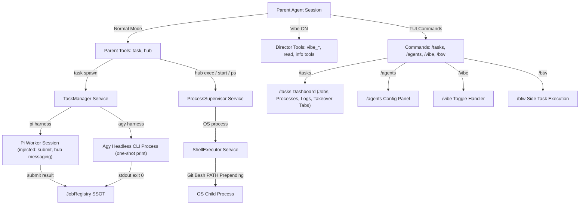

# Harbor Monorepo Package Product Design & Specification

> **Package Name**: `@nielpattin/pi-harbor`  
> **Package Path**: `packages/pi-harbor`  
> **Effect Version**: `effect@4.0.0-beta.101`  
> **Architecture**: Standalone all-in-one Effect v4 monorepo package for agent task execution, process supervision, inter-agent messaging, and director mode management.

---

## 1. Identity, Scope & Hard Constraints

`@nielpattin/pi-harbor` is a greenfield publishable monorepo package located in `packages/pi-harbor/` (following the same local package pattern as `packages/pi-permission-system` and `packages/pi-station`). It provides complete infrastructure for subagent spawning, background OS process supervision, shell execution, inter-agent message routing, agent definition management, vibe/director workflows, and side-task execution.

### 1.1 Local Package Registration Pattern

Local monorepo packages are registered in the agent root `settings.json` (or `.pi/settings.json`) under the `packages` array:

```json
{
  "packages": [
    "./packages/pi-permission-system",
    "./packages/pi-station",
    "./packages/pi-harbor"
  ]
}
```

The agent loader loads `@nielpattin/pi-harbor` directly from `packages/pi-harbor` on startup.

### 1.2 Greenfield Framing & Reference Codebases

This package is a **greenfield product design**, not a migration guide. Existing legacy extension locations (`extensions/tasks` and `extensions/background-terminals`) serve strictly as **reference implementations**:
- **Pi Extensions Reference**: `C:/Users/niel/.cache/checkouts/github.com/earendil-works/pi/packages/coding-agent/docs/extensions.md`
- **Oh-My-Pi Reference**: `C:/Users/niel/.cache/checkouts/github.com/can1357/oh-my-pi/packages/coding-agent/src/tools/hub/` and `.../src/task/`

### 1.3 Hard Architectural Constraints

1. **Zero External Extension Imports**: `packages/pi-harbor` imports zero code from `extensions/shared/**` or any other `extensions/` directory. All utilities (`shell-env`, `output-buffer`, `kill-tree`, `ready-poller`) exist as local module copies under `packages/pi-harbor/src/utils/`.
2. **Monorepo Dependencies**: As a standard monorepo package, `@nielpattin/pi-harbor` may declare dependencies on `effect`, `@sinclair/typebox`, and `@earendil-works/pi-*` peer packages in its `package.json`.
3. **Unified UI Command Surface**: `/tasks` is the **ONLY** unified TUI dashboard command for monitoring agent jobs, bash tasks, named OS processes, stdio log tailing, and interactive session takeover tabs. The command names `/ps` and `/harbor` DO NOT exist anywhere. Separate helper commands are `/agents`, `/vibe`, and `/btw`.
4. **Pi API & Session Contracts**:
   - `createAgentSession` is **imported** directly from `@earendil-works/pi-coding-agent`, not invoked as a method on `pi`.
   - Child system prompt is supplied via `DefaultResourceLoader({ systemPrompt })` as `resourceLoader` (no fictional `customPrompt` field).
   - Child `ModelRuntime` is obtained directly from agent directory / auth configuration paths.
   - Child sessions include a **child-mode guard** (via env flag `HARBOR_CHILD_SESSION=1` or print mode / session reason) to skip re-registering parent harbor surfaces, preventing recursive harbor initialization.
5. **Structured Submit Validation**: `pi` workers submit results strictly via `{ result: { data: T } }` or `{ result: { error: string } }`. Validation evaluates `result.data` directly against the job's `outputSchema`.
6. **Durable Vibe State Restoration**:
   - Pre-vibe baseline tool snapshots are persisted using durable session entries: `pi.appendEntry("vibe-state", { savedTools })`.
   - Disabling Vibe Mode reads the **latest** `vibe-state` entry by iterating session entries, filtering for `customType === "vibe-state"`, and taking the last entry.
   - Tool restoration computes the **intersection of `savedTools` with `pi.getAllTools()` names** (`savedTools.filter(name => allToolNames.includes(name))`).
   - Harbor **NEVER** reads `getActiveTools()` while Vibe mode is ON as a fallback (removing any Algorithm D branch that reads active tools during active vibe mode).
   - While Vibe mode is ON, a hard `tool_call` hook block rejects execution of non-director tools.
   - Director mode tool surface includes: `vibe_*` tools + `read` + optional info tools (`describe_image`, `web_search_exa`, `deep_search_exa`, `web_fetch_exa`, `read_session`, `workflow`, `mcp`) matching the reference tasks extension.
7. **Concurrency & Uninterruptible Reservation Windows**:
   - Max 4 concurrent running agent jobs (`MAX_RUNNING_AGENTS = 4`) and max 8 concurrent background OS processes (`MAX_RUNNING_PROCESSES = 8`).
   - Reserve → spawn → register operations execute inside uninterruptible atomic reservation windows using `reservedAgentSlots` and `reservedProcessSlots`.
   - `JobRegistry` tracks `waitInterest` only (dropping the legacy `consumedByWait` counter).
   - Capacity pruning skips entries where `waitInterest > 0` or `killInterest > 0`.
8. **Task Tree Kill**: Cancelling an agent task or process tree triggers process tree termination using `taskkill /T /F` on Windows or POSIX process group signals (`kill -9 -pid`).
9. **Phase 1 `agy` Harness**: `agy` harness execution in Phase 1 is strictly **one-shot print CLI execution** (`agy --print <prompt>`).

### 1.4 Package Source Directory Layout

```text
packages/pi-harbor/
├── index.ts                     # Package entry point & pi extension registration export
├── package.json                 # Monorepo manifest (@nielpattin/pi-harbor)
├── tsconfig.json                # TypeScript build configuration
└── src/
    ├── domain.ts                # Domain interfaces & TypeScript types
    ├── runtime.ts               # Effect ManagedRuntime & Layer assembly
    ├── services/
    │   ├── TaskManager.ts       # Agent spawning & lifecycle execution service
    │   ├── JobRegistry.ts       # SSOT job state registry & event bus
    │   ├── ProcessSupervisor.ts # OS background process supervision service
    │   ├── ShellExecutor.ts     # Process spawning & Git Bash PATH pre-pending
    │   ├── MailBus.ts           # Inter-agent message router & mailbox bus
    │   ├── VibeState.ts         # Director mode state machine & tool locker
    │   ├── AgentsStore.ts       # Agent definition resolution & file loader
    │   └── SchemaValidator.ts   # TypeBox & JSON Schema validation engine
    ├── backends/
    │   ├── pi.ts                # Pi harness backend (imports createAgentSession)
    │   └── agy.ts               # Agy harness backend (one-shot print CLI process)
    ├── tools/
    │   ├── task.ts              # Parent task tool definition & handler
    │   ├── hub.ts               # Unified hub tool definition & handler
    │   ├── submit.ts            # Worker submit tool definition & handler
    │   └── vibe.ts              # Vibe director tools (vibe_spawn, etc.)
    ├── ui/
    │   ├── tasks-dashboard.ts   # Unified /tasks TUI dashboard overlay
    │   ├── agents-panel.ts      # /agents configuration TUI panel
    │   ├── log-viewer.ts        # Stdio log tailing terminal component
    │   └── takeover.ts          # Interactive session takeover component
    └── utils/
        ├── shell-env.ts         # Git Bash PATH detection & environment helpers (local copy)
        ├── output-buffer.ts     # Ring buffer & spill file logic (local copy)
        ├── kill-tree.ts         # Windows taskkill /T /F and POSIX tree kill (local copy)
        └── ready-poller.ts      # Log scanner & TCP port poller (local copy)
```

### 1.5 Surface Area Inventory

| Surface Category | Identification | Operational Role & Access Scope |
| --- | --- | --- |
| **Package Location** | `packages/pi-harbor` | Publishable monorepo package tree. |
| **Parent Surface Tools (Normal Mode)** | `task`, `hub` | Registered on parent session for subagent spawning, job control, process supervision, and shell execution. |
| **Parent Surface Tools (Vibe Mode)** | `vibe_spawn`, `vibe_send`, `vibe_wait`, `vibe_kill`, `vibe_list`, `read`, info tools | Active when Vibe Director mode is ON. Hard `tool_call` block rejects standard editing/execution tools. |
| **Worker Surface Tool** | `submit` | Injected into `pi` child sessions via `createAgentSession` `customTools` for structured result returns. |
| **Worker Messaging Operations** | `hub op: "send"`, `"inbox"`, `"list"`, `"wait-from"` | Injected into `pi` child sessions via `customTools` for inter-agent communication. |
| **Interactive TUI Commands** | `/tasks`, `/agents`, `/vibe`, `/btw` | Unified dashboard (`/tasks`), agent configuration (`/agents`), mode toggle (`/vibe`), side task (`/btw`). |

---

## 2. Product Surface Map & Architecture

Harbor consolidates subagent execution, shell tasks, background process control, and TUI overlays into a single Effect-driven system.



### 2.1 Parent Session Surface
- **Normal Mode**: Parent agents access `task` (batch and flat spawning) and `hub` (job monitoring, wait, cancellation, shell execution, process start/stop/logs, and messaging).
- **Vibe Mode**: When active, director tools lock strictly to `vibe_spawn`, `vibe_send`, `vibe_wait`, `vibe_kill`, `vibe_list`, `read`, plus optional read-only info tools (`describe_image`, `web_search_exa`, `deep_search_exa`, `web_fetch_exa`, `read_session`, `workflow`, `mcp`). All non-director tools are blocked at the `tool_call` hook layer.

### 2.2 Worker Session Surface (`pi` Harness)
- **Injected Tools**: `pi` workers receive `submit` for result delivery and `hub` restricted strictly to messaging (`send`, `inbox`, `list`, `wait-from`).
- **Excluded Tools**: `task` and stock `bash` are removed via `excludeTools`. Shell execution routes through `hub op: "exec"`.
- **Child Recursion Guard**: Child sessions set `HARBOR_CHILD_SESSION=1`. When `@nielpattin/pi-harbor` initializes inside a child session, it skips registering parent harbor tools/commands.

### 2.3 Worker Session Surface (`agy` Harness)
- **One-shot CLI Process**: `agy --print <prompt>` executes one-shot prompts.
- **Zero Tool Injection**: `agy` processes do not receive `submit`, `hub`, or custom tools. Results parse directly from process exit codes and stdout.

### 2.4 Interactive TUI Command Surface
- **`/tasks`**: The **ONLY** unified TUI dashboard for all jobs and processes. Contains sub-tabs for Agent Jobs, Background Processes, Stdio Log Viewer, and Live Session Takeover.
- **`/agents`**: Configuration editor for file-based agent definitions (`agents/*.md`), built-in definitions (`scout`, `task`), and Vibe profiles (`fast`, `good`).
- **`/vibe`**: Director mode state toggle. Updates tool locks, persists baseline tool snapshots via `pi.appendEntry`, and toggles status widgets.
- **`/btw`**: Side-task execution interface. Runs one-off prompts asynchronously and appends `btw-result` log entries with `registerEntryRenderer` without altering LLM context.

---

## 3. Operational Modes: Normal vs Director (Vibe) Mode

Harbor maintains two explicit operating states: Normal Mode and Director Mode.

### 3.1 Normal Mode (Vibe OFF)
- **Tool Catalog**: `task`, `hub`, and registered workspace tools (`read`, `write`, `edit`, `grep`, `find`, etc.).
- **Agent Selection**: Spawns built-in agents (`scout`, `task`), file-based agents (`high-task`, `reviewer`), or custom project agents.
- **Execution Flow**: Parent delegates work, monitors via `hub op: "wait"` or `hub op: "jobs"`, and receives `harbor-result` messages via `pi.sendMessage`.

### 3.2 Director Mode (Vibe ON)
- **Activation**: Toggled via `/vibe`.
- **Tool Catalog**: Director tool surface includes `vibe_spawn`, `vibe_send`, `vibe_wait`, `vibe_kill`, `vibe_list`, `read`, and optional info tools (`describe_image`, `web_search_exa`, `deep_search_exa`, `web_fetch_exa`, `read_session`, `workflow`, `mcp`).
- **Hard `tool_call` Block**: In addition to `setActiveTools`, Harbor registers a `tool_call` hook that intercepts and aborts any attempt to execute non-director tools (e.g. `write`, `edit`, `bash`, `task`, `hub`).
- **System Prompt Guard**: Appends `VIBE_DIRECTOR_SYSTEM_PROMPT` to every turn.
- **Profile Restriction**: Spawns restrict to profile keys: `vibe_spawn({ cli: "fast" | "good" })`. Spawning raw agent names is disallowed.

### 3.3 Vibe Director System Prompt

```markdown
# VIBE DIRECTOR MODE ACTIVE

You are operating as a Vibe Director. You possess access strictly to director tools:
- `vibe_spawn({ cli: "fast" | "good", prompt: "..." })` to spawn subagents.
- `vibe_send({ session: "...", message: "..." })` to send follow-up instructions to active workers.
- `vibe_wait({ sessions: [...], timeout: N })` to block until worker subagents complete.
- `vibe_kill({ session: "..." })` to cancel active subagents.
- `vibe_list()` to inspect running and completed subagents.
- `read` and informational inspection tools.

## Directives
1. Direct work exclusively through worker subagents. Do not attempt direct tool calls for file edits or shell execution.
2. Use `fast` profile for quick research and light edits. Use `good` profile for complex implementation tasks.
3. Call `vibe_wait` after spawning subagents to receive their structured outputs before issuing next instructions.
```

### 3.4 Vibe State Persistence & Restoration Specification

To resolve the tool loss bug during Vibe OFF restoration:

#### Restoration Read Path & Algorithm:
1. **Durable Snapshotting (Entering Vibe ON)**:
   - Read existing session entries via `pi.getSessionEntries()`.
   - Extract current active tool names before Vibe mode activation: `savedTools = pi.getActiveTools().map(t => t.name).filter(name => !name.startsWith("vibe_"))`.
   - Persist snapshot into session history:
     ```typescript
     pi.appendEntry("vibe-state", { savedTools, timestamp: Date.now() });
     ```
2. **Durable Restoration (Disabling Vibe OFF)**:
   - Iterate session entries obtained via `pi.getSessionEntries()`.
   - Filter for custom entries with `customType === "vibe-state"`.
   - Select the **LATEST (last)** entry in the array.
   - Compute restored tools by taking the **intersection of `savedTools` with `pi.getAllTools()` names**:
     ```typescript
     const registeredNames = pi.getAllTools().map(t => t.name);
     const restored = latestVibeStateEntry
       ? latestVibeStateEntry.data.savedTools.filter(name => registeredNames.includes(name))
       : registeredNames.filter(name => !name.startsWith("vibe_"));
     ```
   - Harbor **NEVER** reads `getActiveTools()` while Vibe mode is active as a fallback.
3. **Hard Hook Guard**:
   - Register `tool_call` hook:
     ```typescript
     pi.on("tool_call", (event) => {
       if (VibeState.isVibeActive() && !isDirectorTool(event.toolName)) {
         return { block: true, reason: `Tool '${event.toolName}' is disabled in Vibe Director mode.` };
       }
     });
     ```

---

## 4. Agent Resolution & Profile System

Harbor resolves agents across built-in definitions, markdown files, and Vibe profiles.

### 4.1 Built-in Agents (`scout` & `task`)

1. **`scout`**
   - **Role**: Read-only codebase research and dependency mapping.
   - **Tools**: `read`, `grep`, `find`, `web_search_exa`.
   - **Harness**: `pi`.
2. **`task`**
   - **Role**: Implementation worker for delegated file edits and execution.
   - **Tools**: `read`, `write`, `edit`, `grep`, `find`, `hub`.
   - **Harness**: `pi`.

### 4.2 File-based Agents (`agents/*.md`)

Loaded from `~/.pi/agent/agents/*.md` and `<workspace>/.pi/agents/*.md`:
- **`high-task`**: Complex multi-step implementation agent (`gemini-3.6-flash-medium`, harness `agy` or `pi`).
- **`reviewer`**: Code review agent (`cpit/gpt-5.6-sol`, harness `pi`).

*Precedence Invariant*: Project-local agents override global agents by name, which override built-in agents by name.

### 4.3 Vibe Profiles (`fast` & `good`)

Configured in `agents.json`:

```json
{
  "version": 1,
  "profiles": {
    "fast": {
      "harness": "pi",
      "pi": {
        "model": "proxy/cfai/@cf/moonshotai/kimi-k2.7-code",
        "reasoning_effort": "low",
        "tools": ["read", "write", "edit", "grep", "find"]
      },
      "agy": {
        "model": "gemini-3.6-flash-medium",
        "reasoning_effort": "low"
      }
    },
    "good": {
      "harness": "pi",
      "pi": {
        "model": "cpit/gpt-5.6-sol",
        "reasoning_effort": "high",
        "tools": ["read", "write", "edit", "grep", "find", "hub"]
      },
      "agy": {
        "model": "gemini-3.6-flash-medium",
        "reasoning_effort": "high"
      }
    }
  }
}
```

### 4.4 Harness vs Agent Profile Distinction
- **Harness**: Defines execution mechanics. `pi` creates a child agent session via `createAgentSession` with tool injection (`submit`, messaging) and stateful turn loops. `agy` executes a one-shot process (`agy --print <prompt>`) capturing stdout/exit codes.
- **Agent Profile**: Configures system prompt directives, guidance, reasoning effort, and model overrides.

---

## 5. Tool Specifications & Schemas

### 5.1 `task` Tool (Parent Only, Normal Mode)

Spawns worker subagents in batch or flat format.

#### TypeBox Schemas

```typescript
import { Type } from "@sinclair/typebox";

export const TaskSpecSchema = Type.Object({
  task: Type.String({ description: "Detailed instruction prompt for the subagent worker." }),
  name: Type.Optional(Type.String({ description: "Unique display name handle for the job." })),
  agent: Type.Optional(Type.String({ description: "Target agent profile name (scout, task, high-task, reviewer)." })),
  model: Type.Optional(Type.String({ description: "Model identifier override for child session." })),
  outputSchema: Type.Optional(Type.Record(Type.String(), Type.Unknown(), { description: "JSON Schema validating submit payload." })),
  schemaMode: Type.Optional(Type.Union([Type.Literal("strict"), Type.Literal("permissive")], { default: "permissive" })),
  async: Type.Optional(Type.Boolean({ default: true, description: "True runs background job; false blocks parent until settled." }))
});

export const TaskToolParamsSchema = Type.Union([
  Type.Object({
    context: Type.Optional(Type.String({ description: "Shared background context prepended to all batch task prompts." })),
    tasks: Type.Array(TaskSpecSchema, { minItems: 1, maxItems: 4, description: "Array of 1 to 4 task specifications." })
  }),
  TaskSpecSchema
]);
```

### 5.2 `submit` Tool (`pi` Workers Only)

Injected into `pi` child sessions for returning outcomes.

#### TypeBox Schema

```typescript
export const SubmitToolParamsSchema = Type.Object({
  result: Type.Union([
    Type.Object({
      data: Type.Record(Type.String(), Type.Unknown(), { description: "Structured result data object matching outputSchema." })
    }),
    Type.Object({
      error: Type.String({ description: "Error explanation string if task failed." })
    })
  ])
});
```

- Workers MUST call `submit` to conclude execution.
- Validation checks `result.data` against `outputSchema`.
- Missing submit calls trigger up to 3 automated reminders before job failure.

### 5.3 `hub` Tool (Parent & `pi` Workers)

Unified tool using `op` discriminator.

#### TypeBox Schema

```typescript
export const HubToolParamsSchema = Type.Object({
  op: Type.Union([
    Type.Literal("jobs"),
    Type.Literal("wait"),
    Type.Literal("cancel"),
    Type.Literal("exec"),
    Type.Literal("start"),
    Type.Literal("ps"),
    Type.Literal("logs"),
    Type.Literal("stop"),
    Type.Literal("restart"),
    Type.Literal("describe"),
    Type.Literal("send"),
    Type.Literal("inbox"),
    Type.Literal("list"),
    Type.Literal("wait-from")
  ]),
  target: Type.Optional(Type.Union([Type.Literal("jobs"), Type.Literal("process"), Type.Literal("message")])),
  ids: Type.Optional(Type.Array(Type.String())),
  name: Type.Optional(Type.String()),
  command: Type.Optional(Type.String()),
  cwd: Type.Optional(Type.String()),
  env: Type.Optional(Type.Record(Type.String(), Type.String())),
  async: Type.Optional(Type.Boolean()),
  timeoutMs: Type.Optional(Type.Number()),
  signal: Type.Optional(Type.Union([Type.Literal("SIGTERM"), Type.Literal("SIGKILL")])),
  ready: Type.Optional(Type.Object({
    log: Type.Optional(Type.String()),
    port: Type.Optional(Type.Number()),
    timeoutSec: Type.Optional(Type.Number())
  })),
  to: Type.Optional(Type.String()),
  from: Type.Optional(Type.String()),
  message: Type.Optional(Type.String()),
  replyTo: Type.Optional(Type.String()),
  peek: Type.Optional(Type.Boolean()),
  lines: Type.Optional(Type.Number()),
  grep: Type.Optional(Type.String())
});
```

#### Operations Access Matrix
- **Parent Session**: Full access to all `op` values.
- **Worker Sessions**: Restricted strictly to messaging ops (`send`, `inbox`, `list`, `wait-from`) and execution (`exec`).

### 5.4 Vibe Director Tools (Parent Only, Vibe Mode ON)

```typescript
export const VibeSpawnParamsSchema = Type.Object({
  cli: Type.Union([Type.Literal("fast"), Type.Literal("good")]),
  prompt: Type.String({ description: "Instruction prompt for profile worker." }),
  name: Type.Optional(Type.String())
});

export const VibeSendParamsSchema = Type.Object({
  session: Type.String({ description: "Target session ID handle." }),
  message: Type.String({ description: "Follow-up message text." })
});

export const VibeWaitParamsSchema = Type.Object({
  sessions: Type.Optional(Type.Array(Type.String())),
  timeout: Type.Optional(Type.Number())
});

export const VibeKillParamsSchema = Type.Object({
  session: Type.String({ description: "Session ID to cancel." })
});

export const VibeListParamsSchema = Type.Object({});
```

### 5.5 Mixed Sync/Async Batch Response Specification

When `task` is called with a batch array containing a mix of `async: true` and `async: false` tasks:

```json
{
  "ok": true,
  "batchId": "batch-108",
  "count": 2,
  "jobs": [
    {
      "id": "task-1",
      "name": "lint-check",
      "agent": "scout",
      "status": "completed",
      "async": false,
      "result": { "data": { "clean": true } },
      "errorText": null,
      "schemaWarning": null
    },
    {
      "id": "task-2",
      "name": "deep-refactor",
      "agent": "task",
      "status": "running",
      "async": true,
      "result": null,
      "errorText": null,
      "schemaWarning": null
    }
  ],
  "syncSettled": true,
  "timedOut": false,
  "aborted": false
}
```

---

## 6. Wire Contracts & Message Payload Schemas

### 6.1 Child Session Spawning Contract

Child sessions are constructed using authoritative Pi APIs:

```typescript
import { createAgentSession, DefaultResourceLoader } from "@earendil-works/pi-coding-agent";

// 1. Resource Loader with Child System Prompt
const resourceLoader = new DefaultResourceLoader({
  systemPrompt: workerAgentDefinition.body
});

// 2. Obtain ModelRuntime from auth/config path
const modelRuntime = await resolveModelRuntime(agentProfile.model);

// 3. Create Child Session
const childSession = await createAgentSession({
  resourceLoader,
  modelRuntime,
  customTools: [submitTool, hubMessagingTool],
  excludeTools: ["task", "bash"]
});
```

### 6.2 Custom Session Entries & Wire Messages

#### `harbor-result` Parent Notification
Delivered to parent session via `pi.sendMessage`:
```json
{
  "customType": "harbor-result",
  "content": "┌─ Harbor Task Completed: audit-security (task-1) ────────────────────────────┐\n│ Agent: scout | Status: completed | Time: 2.8s                               │\n├─────────────────────────────────────────────────────────────────────────────┤\n│ {\n│   \"vulnerabilities\": []\n│ }\n└─────────────────────────────────────────────────────────────────────────────┘",
  "display": true,
  "details": {
    "id": "task-1",
    "title": "audit-security",
    "status": "completed",
    "agent": "scout",
    "schemaWarning": null
  }
}
```

#### `btw-result` Non-Transcript Custom Entry
Appended via `pi.appendEntry` with custom renderer registered via `registerEntryRenderer`:
```json
{
  "type": "btw-result",
  "data": {
    "id": "task-4",
    "title": "What is Effect Layer?",
    "status": "completed",
    "prompt": "What is Effect Layer?",
    "answer": "Effect Layer represents modular dependency construction...",
    "sessionFilePath": "C:/Users/niel/.pi/agent/sessions/session-456.json"
  }
}
```

---

## 7. Business Logic & Control-Flow Algorithms

### 7.1 Algorithm A: `task.execute` Normalization & Concurrency Reservation Window

```text
1. INPUT PARSING & NORMALIZATION
   a. Normalize batch vs flat payload format into a uniform TaskSpec array (1 to 4 items).
   b. Prepend optional shared context string to each prompt.
   c. Resolve agent profile for each task item.

2. UNINTERRUPTIBLE CONCURRENCY RESERVATION WINDOW
   a. Acquire atomic lock on TaskManager state.
   b. Query active running agent jobs count in JobRegistry: runningCount.
   c. Query active reservedAgentSlots count.
   d. Compute total required = runningCount + reservedAgentSlots + incomingCount.
   e. If total required > MAX_RUNNING_AGENTS (4):
      - Release atomic lock.
      - Return { ok: false, error: "Concurrency limit exceeded. Maximum 4 concurrent agent jobs allowed." }
   f. Atomically increment reservedAgentSlots += incomingCount.
   g. Release atomic lock.

3. JOB SPANNING & REGISTRATION
   a. For each task item:
      - Allocate job ID (e.g. task-1).
      - Register entry in JobRegistry with status "pending".
      - Branch execution based on profile harness:
        * HARNESS === "pi":
          - Import createAgentSession from @earendil-works/pi-coding-agent.
          - Construct DefaultResourceLoader({ systemPrompt: agentDef.body }).
          - Pass customTools: [submitTool, hubMessagingTools], excludeTools: ["task", "bash"].
          - Set HARBOR_CHILD_SESSION=1 environment flag.
          - Attach background Effect fiber. Update status to "running".
        * HARNESS === "agy":
          - Spawn detached child process: agy --print <prompt>.
          - Update status to "running".
   b. Acquire atomic lock on TaskManager state.
   c. Decrement reservedAgentSlots -= incomingCount.
   d. Release atomic lock.

4. RESUMPTION RESOLUTION
   a. If all tasks have async === true:
      - Return immediate spawn response array.
   b. If any task has async === false:
      - Await settlement handle for synchronous tasks (timeout 600,000 ms).
      - Compile mixed sync/async settlement response.
```

### 7.2 Algorithm B: Missing-Submit Reminder Loop (`pi` Workers Only)

```text
1. ON CHILD AGENT TURN END:
   a. Query JobRegistry for job ID.
   b. If job status !== "running" or submit call was executed: exit hook.
   c. If turn concluded without calling submit:
      - Increment missingSubmitCount for job ID.
      - If missingSubmitCount <= SUBMIT_REMINDER_CAP (3):
        * Inject system prompt message to child session:
          "[SYSTEM REMINDER]: Task incomplete. You MUST call submit({ result: { data: ... } }) to return your final result."
        * Trigger next worker turn.
      - If missingSubmitCount > SUBMIT_REMINDER_CAP (3):
        * Transition job status to "failed" in JobRegistry.
        * Record errorText: "Worker failed to invoke submit tool within 3 turn reminders."
        * Execute job settlement pipeline.
```

### 7.3 Algorithm C: Submit Validation, Settlement & Result De-duplication

```text
1. WORKER CALLS submit({ result }):
   a. If result contains 'error':
      - Mark job status "failed", errorText = result.error.
      - Execute job settlement immediately.
   b. If result contains 'data':
      - Set target object dataObj = result.data.
      - If outputSchema is defined on job:
        * Validate dataObj against outputSchema.
        * If valid: proceed to settlement.
        * If invalid and schemaMode === "strict":
          - Increment schemaRetryCount.
          - If schemaRetryCount <= 3:
            * Return tool error to worker detailing schema validation errors.
          - If schemaRetryCount > 3:
            * Mark job "failed", errorText = "Strict output schema validation failed after 3 retries."
            * Proceed to settlement.
        * If invalid and schemaMode === "permissive":
          - If permissiveWarned === false:
            * Set permissiveWarned = true.
            * Return warning tool result to worker requesting schema correction.
          - If permissiveWarned === true:
            * Accept dataObj. Attach schemaWarning string to job entry.
            * Proceed to settlement.

2. SETTLEMENT & DE-DUPLICATION PIPELINE:
   a. Update job status to "completed" or "failed". Set settledAt timestamp.
   b. Close child Effect scope and release concurrency slot.
   c. DE-DUPLICATION & RESULT DELIVERY CHECK:
      - Query waitInterest counter for job ID in JobRegistry:
        * If waitInterest > 0:
          - Resolve pending hub op: "wait" Deferred handle.
          - DO NOT emit harbor-result transcript message (caller receives result via wait response).
        * If waitInterest === 0:
          - Buffer result payload in DeferredDelivery queue.
          - On parent agent idle event (agent_settled / turn_end): flush DeferredDelivery queue and emit pi.sendMessage({ customType: "harbor-result" }).
```

### 7.4 Algorithm D: Vibe Mode Locking & Tool Restoration (Durable Storage Specification)

```text
1. ENTERING VIBE MODE (/vibe ON):
   a. Read session history entries via pi.getSessionEntries().
   b. Extract currently active registered tool names.
   c. Filter out any vibe director tool names: baseline = activeToolNames.filter(name => !name.startsWith("vibe_")).
   d. Persist baseline to session history:
      pi.appendEntry("vibe-state", { savedTools: baseline, timestamp: Date.now() });
   e. Set active tools catalog: pi.setActiveTools(directorToolNames).
   f. Enable hard tool_call hook guard blocking non-director tools.
   g. Set status widget: "🎬 vibe".

2. LEAVING VIBE MODE (/vibe OFF):
   a. Read session history entries via pi.getSessionEntries().
   b. Filter entries for customType === "vibe-state".
   c. Select the LAST (latest) vibe-state entry in the array.
   d. Extract savedTools from latest entry:
      - If latest entry exists: savedList = latestEntry.data.savedTools.
      - If no entry exists: savedList = allRegisteredToolNames.filter(name => !name.startsWith("vibe_")).
   e. Compute restored catalog using INTERSECTION with all registered tools:
      restored = savedList.filter(name => allRegisteredToolNames.includes(name));
   f. Invoke pi.setActiveTools(restored).
   g. Disable hard tool_call hook guard.
   h. Clear status widget.
   i. Terminate running vibe worker sessions.
```

### 7.5 Algorithm E: Unified `hub op: "wait"` Race Resolution

```text
1. CALL TO hub op: "wait":
   a. Extract target discriminator: target = params.target ?? "jobs".
   b. Branch execution by target discriminator:
      * TARGET === "jobs":
        - Identify watched job IDs (params.ids ?? all running jobs owned by session).
        - Increment waitInterest counter on watched jobs in JobRegistry.
        - Create Deferred handle for job settlement.
        - Race: job settlement Deferred vs timeoutMs timer vs caller abort signal.
        - On resolution: decrement waitInterest counter. Return jobs snapshot array.
      * TARGET === "process":
        - Validate params.name presence. Query ProcessSupervisor for process entry.
        - Create Deferred handle for process exit.
        - Race: process exit Deferred vs timeoutMs timer vs caller abort signal.
        - On resolution: return process status snapshot.
      * TARGET === "message":
        - Register bus waiter in MailBus for params.from sender.
        - Race: incoming message Deferred vs timeoutMs timer vs caller abort signal.
        - On resolution: return message content or timeout result.
```

### 7.6 Algorithm F: Process Supervision & Tree Termination

```text
1. COMMAND EXECUTION (ShellExecutor):
   a. Detect platform OS.
   b. If OS platform is Windows:
      - Prepend Git binaries to process environment PATH:
        "C:\\Program Files\\Git\\bin;C:\\Program Files\\Git\\usr\\bin;C:\\Program Files\\Git\\cmd;" + env.PATH
   c. Spawn OS child process.

2. PROCESS TREE TERMINATION (ProcessSupervisor.stop & Task Cancel):
   a. If OS platform is POSIX:
      - Send SIGTERM to process group (-pid).
      - Schedule 2,000 ms timer. If process remains active, send SIGKILL (-pid).
   b. If OS platform is Windows:
      - Execute command: taskkill /pid <pid> /T /F
      - If taskkill returns non-zero code, fall back to childProcess.kill().

3. READINESS SCANNING:
   a. If hub op: "start" specifies ready condition ({ log, port, timeoutSec }):
      - Fork background readiness scanner fiber.
      - Log Scanner: Evaluate stdout/stderr stream chunks against ready.log regex.
      - Port Poller: Execute TCP socket connection to 127.0.0.1:port every 50 ms.
      - Transition readyState to { ready: true } when both conditions pass before timeoutSec.
      - If timeoutSec elapses before conditions pass: transition readyState to { ready: false, timedOut: true }. Process continues running.
```

---

## 8. Domain Model, Caps & Effect Services Stack

### 8.1 TypeScript Domain Types

```typescript
export type JobKind = "agent" | "bash";
export type JobStatus = "pending" | "running" | "completed" | "failed" | "cancelled";
export type HarnessName = "pi" | "agy";

export interface Job {
  readonly id: string;
  readonly name: string | null;
  readonly kind: JobKind;
  readonly harness?: HarnessName;
  readonly agent?: string;
  readonly origin?: "standard" | "vibe" | "btw";
  readonly promptOrCommand: string;
  status: JobStatus;
  readonly createdAt: number;
  startedAt?: number;
  settledAt?: number;
  pid?: number;
  exitCode?: number;
  signal?: string;
  resultData?: unknown;
  errorText?: string;
  rawText?: string;
  schemaWarning?: string;
  waitInterest: number;
}

export interface ProcessReadyState {
  ready: boolean;
  logMatched: boolean;
  portMatched: boolean;
  timedOut?: boolean;
  error?: string;
}

export interface ProcessEntry {
  readonly id: string;
  readonly name: string | null;
  readonly command: string;
  readonly cwd: string;
  readonly pid: number;
  status: "starting" | "running" | "exited" | "failed";
  readonly readyCondition?: { log?: string; port?: number; timeoutSec?: number };
  readyState: ProcessReadyState;
  readonly spawnTime: number;
  settledAt?: number;
  exitCode?: number;
  signal?: string;
  readonly stdoutBytes: number;
  readonly stderrBytes: number;
}

export interface MailboxMessage {
  readonly id: string;
  readonly senderId: string;
  readonly recipientId: string;
  readonly payload: string;
  readonly replyTo?: string;
  readonly timestamp: number;
  readonly consumed: boolean;
}

export interface AgentDefinition {
  readonly name: string;
  readonly display_name?: string;
  readonly description: string;
  readonly tools: readonly string[];
  readonly guidance?: string;
  readonly harness: HarnessName;
  readonly enabled: boolean;
  readonly source: "builtin" | "global" | "project";
  readonly body: string;
  readonly model?: string;
  readonly thinking?: string;
}
```

### 8.2 Caps & System Invariants

| System Threshold | Quantitative Cap | Enforcement Layer & Action |
| --- | --- | --- |
| `MAX_RUNNING_AGENTS` | 4 concurrent | Enforced by `TaskManager` reservation window. Spawns exceeding 4 are rejected. |
| `MAX_TRACKED_JOBS` | 64 entries | `JobRegistry` in-memory limit. Settled jobs pruned beyond 64 (skipping `waitInterest > 0` / `killInterest > 0`). |
| `MAX_RUNNING_PROCESSES` | 8 concurrent | Enforced by `ProcessSupervisor` reservation window. Processes exceeding 8 are rejected. |
| `MAX_TRACKED_PROCESSES` | 32 entries | `ProcessSupervisor` in-memory limit. Exited processes pruned beyond 32. |
| `MAX_MAILBOX_SIZE` | 100 messages | Enforced by `MailBus`. Oldest messages dropped beyond 100 per agent. |
| `RETAINED_STREAM_BYTES` | 2,097,152 (2 MB) | Stdio ring-buffer limit per process in `ProcessSupervisor`. |
| `SUBMIT_REMINDER_CAP` | 3 reminders | `TaskManager` reminder loop limit before failing missing-submit workers. |
| `SYNC_TASK_TIMEOUT_MS` | 600,000 ms (10 m) | Timeout for synchronous parent `task` invocations. |
| `COMMAND_EXEC_TIMEOUT_MS` | 60,000 ms (1 m) | Timeout for synchronous `hub op: "exec"`. |

### 8.3 Effect v4 Service Stack Hierarchy

```text
HarborRuntime.Live (ManagedRuntime)
├── TaskManager.Live
│   ├── JobRegistry.Live (SSOT for agent/bash jobs)
│   ├── BackendRegistry.Live [piBackend, agyBackend]
│   ├── SchemaValidator.Live
│   └── AgentsStore.Live (file loader + built-in registry)
├── ProcessSupervisor.Live
│   └── ShellExecutor.Live (Windows PATH prepending & tree kill)
├── MailBus.Live (Inter-agent message routing)
└── VibeState.Live (Director mode state & durable session storage)
```

#### Effect Service Signatures (TypeScript)

```typescript
import { Context, Effect, Layer } from "effect";

export class JobRegistryService extends Context.Tag("harbor/JobRegistry")<
  JobRegistryService,
  {
    readonly register: (job: Omit<Job, "status" | "createdAt" | "waitInterest">) => Effect.Effect<Job>;
    readonly get: (id: string) => Effect.Effect<Job | undefined>;
    readonly list: (filter?: { kind?: JobKind; status?: JobStatus }) => Effect.Effect<readonly Job[]>;
    readonly updateStatus: (id: string, status: JobStatus, patch?: Partial<Job>) => Effect.Effect<Job>;
    readonly incrementWaitInterest: (ids: readonly string[]) => Effect.Effect<void>;
    readonly decrementWaitInterest: (ids: readonly string[]) => Effect.Effect<void>;
    readonly awaitSettlement: (ids: readonly string[], timeoutMs?: number) => Effect.Effect<readonly Job[]>;
  }
>() {}

export class ProcessSupervisorService extends Context.Tag("harbor/ProcessSupervisor")<
  ProcessSupervisorService,
  {
    readonly start: (params: { name: string; command: string; cwd?: string; env?: Record<string, string>; ready?: { log?: string; port?: number; timeoutSec?: number } }) => Effect.Effect<ProcessEntry>;
    readonly stop: (name: string, signal?: "SIGTERM" | "SIGKILL") => Effect.Effect<ProcessEntry>;
    readonly restart: (name: string) => Effect.Effect<ProcessEntry>;
    readonly ps: () => Effect.Effect<readonly ProcessEntry[]>;
    readonly logs: (name: string, options?: { lines?: number; head?: boolean; grep?: string; cursor?: number; follow?: boolean; timeoutSec?: number }) => Effect.Effect<{ lines: readonly string[]; cursor: number }>;
    readonly awaitExit: (name: string, timeoutMs?: number) => Effect.Effect<ProcessEntry>;
  }
>() {}

export class MailBusService extends Context.Tag("harbor/MailBus")<
  MailBusService,
  {
    readonly send: (message: Omit<MailboxMessage, "id" | "timestamp" | "consumed">) => Effect.Effect<MailboxMessage>;
    readonly inbox: (recipientId: string, options?: { peek?: boolean; limit?: number }) => Effect.Effect<readonly MailboxMessage[]>;
    readonly listPeers: () => Effect.Effect<readonly string[]>;
    readonly awaitFrom: (recipientId: string, senderId: string, timeoutMs?: number) => Effect.Effect<MailboxMessage>;
  }
>() {}
```

---

## 9. Inter-Agent Messaging Subsystem (`pi` Harness Only)

Inter-agent messaging operates over `MailBus` exclusively for `pi` harness sessions:
- `hub op: "send"`: Posts message payload to target mailbox (`"parent"`, `task-N`, or `"all"`).
- `hub op: "inbox"`: Retrieves queued messages from caller mailbox.
- `hub op: "list"`: Queries active messaging peers.
- `hub op: "wait-from"`: Suspends fiber until a message arrives from target sender.

*Harness Restriction*: Messaging operations executed by `agy` backend processes are rejected with:
`{ ok: false, error: "Inter-agent messaging operations are unsupported on agy harness processes." }`.

---

## 10. Interactive TUI Commands & Unified Dashboard

Harbor registers 4 explicit interactive commands.

### 10.1 `/tasks` — Unified Task & Process Dashboard

`/tasks` is the **ONLY** unified TUI dashboard command in Harbor. Commands `/ps` and `/harbor` DO NOT exist.
Sub-tabs inside `/tasks`:
- **Agent Jobs Tab**: Displays active and settled agent jobs, status indicators, assigned models, turn counters, and execution durations.
- **Bash Jobs Tab**: Displays background bash execution tasks started via `hub op: "exec"`.
- **Background Processes Tab**: Displays active OS processes, PIDs, commands, uptimes, readiness states, and stdio byte counts.
- **Stdio Terminal Log Viewer Tab**: Read-only log viewer with stdout/stderr toggling, grep filtering, and cursor pagination.
- **Session Takeover Tab**: Interactive takeover view allowing real-time inspection of worker session turns, prompts, and outputs.

#### Keybindings in `/tasks`
- `Tab` / `Shift+Tab`: Switch sub-tab views.
- `j` / `k` or `Down` / `Up`: Navigate items in active table.
- `Enter`: Open interactive takeover view for highlighted agent job, or log viewer for highlighted process.
- `c`: Cancel highlighted running job or stop highlighted background process.
- `r`: Restart highlighted background process.
- `Esc` / `q`: Close `/tasks` dashboard overlay.

### 10.2 `/agents` — Agents & Profiles Configuration Editor

Interactive panel for managing agent definitions:
- View built-in, global, and project-local agent frontmatter and system prompt bodies.
- Edit tool access lists, default models, reasoning effort levels, and harness selections.
- Configure `fast` and `good` Vibe profile mappings.

### 10.3 `/vibe` — Director Mode State Toggle

- Toggles Director mode ON and OFF.
- Updates TUI status bar widget (`🎬 vibe`).
- Persists baseline tool snapshots via `pi.appendEntry("vibe-state", { savedTools })` and enforces hard tool locks.

### 10.4 `/btw` — Side-Question Launcher

- Launches one-off side questions without interrupting parent conversation state.
- Appends results into non-transcript `btw-result` log entries with `registerEntryRenderer` upon completion.

---

## 11. Agent Definition Prompt Updates (`agents/*.md`)

Updates required for agent markdown definitions under Harbor contracts:

### 11.1 `agents/task.md`

```markdown
---
name: task
display_name: task
description: General-purpose worker for delegated implementation tasks with full tool access.
tools:
  - read
  - write
  - edit
  - grep
  - find
  - hub
guidance: Use for delegated implementation work that needs full tools and hyperfocus on a single assigned task.
harness: pi
enabled: true
---

# TASK AGENT

You are an implementation worker agent for delegated coding tasks.

You possess access to tools (read, write, edit, grep, find, hub) and you MUST call them as required to complete your assigned task.

You MUST maintain hyperfocus on the assigned task.

## Directives
- Execute requested file modifications, create code files, and run shell commands via `hub op: "exec"`.
- When work is complete, you MUST call the `submit` tool: `submit({ result: { data: { ... } } })`.
- Do not conclude execution without calling `submit`.
```

### 11.2 `agents/high-task.md`

```markdown
---
name: high-task
display_name: high-task
description: Specialized worker for complex delegated implementation tasks requiring multi-step planning.
tools:
  - read
  - write
  - edit
  - grep
  - find
  - hub
guidance: High-capability worker for complex multi-file refactors and deep root-cause debugging.
harness: pi
enabled: true
---

# HIGH-TASK AGENT

You are a specialized worker for hard implementation challenges.

## Directives
1. Explore codebase and verify dependencies before editing code.
2. Formulate step-by-step plan and execute changes.
3. Verify modifications via `hub op: "exec"`.
4. Call `submit({ result: { data: { ... } } })` upon task completion.
```

### 11.3 `agents/scout.md`

```markdown
---
name: scout
display_name: scout
description: Read-only codebase research agent for rapid exploration and analysis.
tools:
  - read
  - grep
  - find
  - web_search_exa
guidance: Read-only research scout returning compressed context.
harness: pi
enabled: true
---

# SCOUT AGENT

Investigate codebase rapidly. Return structured findings.

## Directives
- Operate strictly read-only.
- Call `submit({ result: { data: { summary, files, architecture } } })` upon completing research.
```

### 11.4 `agents/reviewer.md`

```markdown
---
name: reviewer
display_name: reviewer
description: Code review agent that evaluates git changes and PR diffs.
tools:
  - read
  - hub
guidance: Review agent evaluating code diffs and safety boundaries.
harness: pi
enabled: true
---

# REVIEWER AGENT

Evaluate code changes and pull request diffs.

## Directives
- Inspect git diffs via `hub op: "exec"({ command: "git diff" })`.
- Audit implementation correctness.
- Call `submit({ result: { data: { findings, approved } } })` upon review conclusion.
```

---

## 12. Test Plan & Quality Assurance Strategy

Tests reside in `packages/pi-harbor/tests/`:

### 12.1 Unit Tests
- **`job-registry.test.ts`**: Verify SSOT state transitions, capacity pruning (64 jobs), `waitInterest` reference counting, and pruning retention when `waitInterest > 0`.
- **`process-supervisor.test.ts`**: Test Windows Git Bash PATH prepending, process tree termination (`taskkill /T /F`), and log/port readiness polling.
- **`mail-bus.test.ts`**: Validate message queuing, capacity caps (100 messages), and `wait-from` fiber suspension.
- **`vibe-state.test.ts`**: Test durable baseline snapshotting via `pi.appendEntry`, hard `tool_call` hook guard, session history iteration for latest `vibe-state` entry, and exact catalog intersection restoration.

### 12.2 Integration Tests
- **`task-execute.test.ts`**: Test batch/flat payload normalization, uninterruptible reservation windows (4 agents cap), and mixed sync/async batch resolution.
- **`submit-pipeline.test.ts`**: Validate `result.data` schema validation (strict and permissive modes), schema warning generation, and missing-submit reminder loop.
- **`hub-ops.test.ts`**: Test unified `hub op: "wait"` race conditions across target discriminators (`jobs`, `process`, `message`).

---

## 13. Phased Implementation Plan

### Phase 1 — MVP Core Infrastructure & Unified Dashboard
- [ ] Create `packages/pi-harbor/` directory and add `package.json` with name `@nielpattin/pi-harbor`, `effect@4.0.0-beta.101`, `@sinclair/typebox`, and peer dependency on `@earendil-works/pi-coding-agent`.
- [ ] Add `packages/pi-harbor/tsconfig.json` extending the monorepo TypeScript configuration.
- [ ] Add `packages/pi-harbor/index.ts` as the package entry point that exports the Effect runtime registration function for the agent loader.
- [ ] Register `./packages/pi-harbor` in the agent root `settings.json` `packages` array.
- [ ] Write `packages/pi-harbor/src/domain.ts` containing all TypeScript domain types (`Job`, `ProcessEntry`, `MailboxMessage`, `AgentDefinition`, etc.).
- [ ] Write `packages/pi-harbor/src/utils/shell-env.ts` as a standalone local copy that detects Git Bash on Windows and prepends `C:\Program Files\Git\bin;C:\Program Files\Git\usr\bin;C:\Program Files\Git\cmd;` to `PATH`.
- [ ] Write `packages/pi-harbor/src/utils/output-buffer.ts` as a standalone local copy implementing the ring buffer and spill-file logic with a 2 MB cap per stream.
- [ ] Write `packages/pi-harbor/src/utils/kill-tree.ts` as a standalone local copy implementing Windows `taskkill /pid <pid> /T /F` and POSIX process-group `SIGTERM` followed by `SIGKILL` after a timeout.
- [ ] Write `packages/pi-harbor/src/utils/ready-poller.ts` as a standalone local copy implementing log-regex scanning and TCP port polling against `127.0.0.1`.
- [ ] Implement `packages/pi-harbor/src/services/SchemaValidator.ts` for TypeBox output schema validation in strict and permissive modes.
- [ ] Implement `packages/pi-harbor/src/services/AgentsStore.ts` loading built-in `scout` and `task` agent definitions and resolving global/project `agents/*.md` overrides.
- [ ] Implement `packages/pi-harbor/src/services/JobRegistry.ts` as the SSOT for agent/bash jobs, enforcing `MAX_TRACKED_JOBS = 64`, tracking `waitInterest`, and pruning only entries where `waitInterest === 0` and `killInterest === 0`.
- [ ] Implement `packages/pi-harbor/src/services/ShellExecutor.ts` using the local `utils/shell-env` and `utils/output-buffer` to spawn OS children with Git Bash PATH prepending.
- [ ] Implement `packages/pi-harbor/src/services/ProcessSupervisor.ts` with uninterruptible `reservedProcessSlots` reservation window capped at `MAX_RUNNING_PROCESSES = 8`, tree kill via local `utils/kill-tree`, and readiness scanning via local `utils/ready-poller`.
- [ ] Implement `packages/pi-harbor/src/services/TaskManager.ts` with uninterruptible `reservedAgentSlots` reservation window capped at `MAX_RUNNING_AGENTS = 4`, missing-submit reminder loop capped at 3 reminders, and mixed sync/async batch settlement.
- [ ] Implement `packages/pi-harbor/src/backends/pi.ts` importing `createAgentSession` and `DefaultResourceLoader` from `@earendil-works/pi-coding-agent`, constructing `DefaultResourceLoader({ systemPrompt: agentDef.body })`, injecting `submit` and messaging `hub` tools, excluding `task` and `bash`, and setting `HARBOR_CHILD_SESSION=1` on child environments.
- [ ] Implement `packages/pi-harbor/src/backends/agy.ts` as a one-shot print CLI harness that spawns `agy --print <prompt>` and parses stdout/exit code.
- [ ] Implement `packages/pi-harbor/src/tools/submit.ts` validating `result.data` against the job `outputSchema` and driving settlement in strict or permissive mode.
- [ ] Implement `packages/pi-harbor/src/tools/task.ts` for the parent surface, normalizing batch and flat payloads, resolving agents, and invoking the `TaskManager` reservation window.
- [ ] Implement `packages/pi-harbor/src/tools/hub.ts` parent operations: `jobs`, `wait`, `cancel`, `exec`, `start`, `ps`, `logs`, `stop`, `restart`, and `describe`.
- [ ] Implement `packages/pi-harbor/src/runtime.ts` assembling the Effect `ManagedRuntime` and `Layer` stack (`HarborRuntime.Live`).
- [ ] Implement `packages/pi-harbor/src/ui/tasks-dashboard.ts` as the **ONLY** unified `/tasks` TUI dashboard; explicitly verify no `/ps` command and no `/harbor` dashboard command are registered anywhere in the package.
- [ ] Add `packages/pi-harbor/tests/job-registry.test.ts` covering SSOT transitions, 64-entry pruning, and `waitInterest` retention.
- [ ] Add `packages/pi-harbor/tests/process-supervisor.test.ts` covering PATH prepending, `taskkill /T /F` fallback, and readiness polling.
- [ ] Add `packages/pi-harbor/tests/task-execute.test.ts` covering batch/flat normalization, the 4-agent reservation window, and sync/async settlement.
- [ ] Add `packages/pi-harbor/tests/submit-pipeline.test.ts` covering strict/permissive schema validation and missing-submit reminders.

### Phase 2 — Inter-Agent Messaging, Vibe Mode & UI Commands
- [ ] Implement `packages/pi-harbor/src/services/MailBus.ts` with 100-message cap, peer listing, and `wait-from` Deferred suspension for `pi` harness sessions only.
- [ ] Extend `packages/pi-harbor/src/tools/hub.ts` with messaging operations `send`, `inbox`, `list`, and `wait-from`; reject these operations when invoked from an `agy` harness.
- [ ] Implement `packages/pi-harbor/src/services/VibeState.ts` tracking active director state and the baseline tool snapshot.
- [ ] Implement `/vibe` interactive command toggling Director mode ON and OFF.
- [ ] Implement vibe baseline snapshotting on enter: read active tool names, filter out `vibe_*` names, and call `pi.appendEntry("vibe-state", { savedTools, timestamp: Date.now() })`.
- [ ] Implement vibe restoration on exit: iterate `pi.getSessionEntries()`, find the latest entry with `customType === "vibe-state"`, compute `savedTools.filter(name => pi.getAllTools().map(t => t.name).includes(name))`, and call `pi.setActiveTools(restored)`; never call `getActiveTools()` while Vibe mode is active.
- [ ] Register a hard `tool_call` hook that blocks any non-director tool when Vibe mode is active and returns `{ block: true, reason: "..." }`.
- [ ] Implement `packages/pi-harbor/src/tools/vibe.ts` with director tools `vibe_spawn`, `vibe_send`, `vibe_wait`, `vibe_kill`, and `vibe_list` restricted to `cli: "fast" | "good"` profile keys.
- [ ] Implement `packages/pi-harbor/src/ui/agents-panel.ts` for the `/agents` TUI configuration panel.
- [ ] Implement `packages/pi-harbor/src/ui/btw-handler.ts` for the `/btw` side-task command and register a `btw-result` renderer via `registerEntryRenderer`.
- [ ] Add child recursion guard checks using `HARBOR_CHILD_SESSION=1` so Harbor skips parent tool/command registration inside child sessions.
- [ ] Update `agents/task.md` with Harbor directives and `submit` requirements.
- [ ] Update `agents/high-task.md` with Harbor directives and `submit` requirements.
- [ ] Update `agents/scout.md` with read-only Harbor directives and `submit` requirements.
- [ ] Update `agents/reviewer.md` with Harbor directives and `submit` requirements.
- [ ] Add `packages/pi-harbor/tests/mail-bus.test.ts` covering queuing, capacity, and `wait-from` suspension.
- [ ] Add `packages/pi-harbor/tests/vibe-state.test.ts` covering durable `appendEntry` snapshot, latest-entry restoration, `getAllTools` intersection, and the hard `tool_call` guard.
- [ ] Add `packages/pi-harbor/tests/hub-ops.test.ts` covering `wait` races across `jobs`, `process`, and `message` discriminators.

### Phase 3 — Advanced Process Supervision & Telemetry
- [ ] Implement stdin stream piping and forwarding for interactive background processes in `ProcessSupervisor`/`ShellExecutor`.
- [ ] Implement multi-process regex log tailing with live grep filter views inside the `/tasks` dashboard log viewer tab.
- [ ] Implement live CPU and memory telemetry collection and render it in the `/tasks` dashboard process tab.
- [ ] Add `packages/pi-harbor/tests/process-stdin.test.ts` covering interactive stdin piping.
- [ ] Add `packages/pi-harbor/tests/log-tailing.test.ts` covering multi-process regex filtering and cursor pagination.

## 14. Success Criteria & Non-Goals

### 14.1 Success Criteria
- [x] Harbor is designed as a standalone publishable monorepo package under `packages/pi-harbor/` with package name `@nielpattin/pi-harbor`.
- [x] Zero external extension imports from `extensions/shared/**` or other `extensions/` directories.
- [x] Loaded via agent root `settings.json` local package path (`"./packages/pi-harbor"`).
- [x] `/tasks` is the single unified TUI dashboard command. Commands `/ps` and `/harbor` DO NOT exist anywhere.
- [x] Vibe Mode tool restoration uses durable session entries (`pi.appendEntry("vibe-state", ...)`), iterates session history for the latest entry, performs intersection with `pi.getAllTools()`, and NEVER calls `getActiveTools()` while vibe mode is active.
- [x] Hard `tool_call` hook guard implemented to reject non-director tool execution during Vibe Mode.
- [x] Director tool surface includes `vibe_*` tools, `read`, and read-only info tools.
- [x] `createAgentSession` is imported from `@earendil-works/pi-coding-agent` with `DefaultResourceLoader({ systemPrompt })`.
- [x] Child session recursion guard (`HARBOR_CHILD_SESSION=1`) prevents recursive package loading.
- [x] Concurrency bounds enforced via uninterruptible reservation windows (`reservedAgentSlots`, `reservedProcessSlots`).
- [x] Task tree kill executed via `taskkill /T /F` on Windows and process groups on POSIX.
- [x] Phase 1 `agy` harness specified as one-shot print execution (`agy --print`).

### 14.2 Non-Goals
- No container or VM sandbox isolation in Phase 1 or Phase 2.
- No distributed multi-host job broker.
- No nested subagent spawning (`task`) from child worker sessions.
- No inter-agent messaging support for `agy` harness processes.
