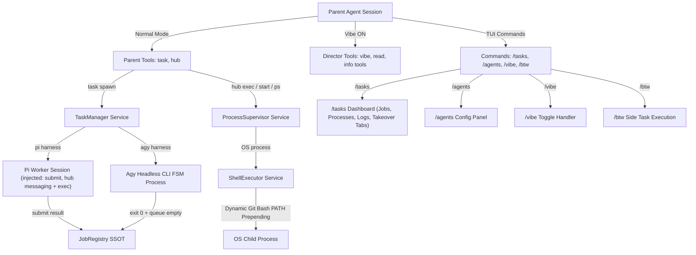

# Harbor Monorepo Package Product Design & Specification

> **Package Name**: `@nielpattin/pi-harbor`  
> **Package Path**: `packages/pi-harbor`  
> **Effect Version**: `effect@4.0.0-beta.101`  
> **Architecture**: Standalone all-in-one Effect v4 monorepo package for agent task execution, process supervision, inter-agent messaging, and director mode management.

---

## 0. Current Product Contract and Corrective Work

> **Normative precedence:** This section supersedes every conflicting statement later in this document. Older sections remain as historical implementation notes until they are rewritten. A checked box in an older phase does not override an open corrective item here.

### 0.1 Observed failures that reopened the design

A real fresh-session run exposed these product failures:

1. The `task` renderer displayed `task worker`, even though `worker` was not an agent name, harness, mode, or status. It was renderer filler and had no user-facing meaning.
2. A job row displayed `coder (pi)` without labels. `coder` was an agent profile name, but the UI did not identify it as the agent. `(pi)` was the recorded harness, but the UI did not identify it as the harness.
3. `/tasks` displayed `standard`, which is an internal origin enum value. It communicated no useful action or state to the user.
4. A child produced a final assistant answer visible in takeover, but the job remained `running` for several minutes. The parent tool had already returned, and no visible reminder or settlement transition occurred.
5. Pi live output inserted synthetic lines such as `[tool] read started` and `[tool] read done`. These lines discard the actual tool arguments and tool result content.
6. A job expected to use `agy` displayed `(pi)`. Harbor did not expose enough resolution metadata to distinguish a wrong agent lookup from a wrong backend selection or a stale dashboard snapshot.
7. The model attempted `hub({ op: "status", id: "task-1" })`. Because `hub` used one flat object with `op` as a union of literals, validation emitted repeated `op must equal constant` errors instead of one actionable operation error.
8. The plan still described five `vibe_*` tools, `agents.json`, hard-coded model identifiers, and submit-only completion despite those contracts having changed or failed in real use.

These are specification defects, not cosmetic polish. Harbor is not complete while any item above remains reproducible.

### 0.2 Vocabulary and display contract

Harbor uses these terms only:

| Concept           | Meaning                                                                             | User-facing rendering                                          |
| ----------------- | ----------------------------------------------------------------------------------- | -------------------------------------------------------------- |
| **Job ID**        | Unique runtime handle, for example `task-1`                                         | Always shown as `task-1`                                       |
| **Name**          | Required short title generated by the parent AI, for example `investigate-copy-all` | Primary row title; always separate from agent and job ID       |
| **Agent**         | Resolved Markdown or built-in agent definition, for example `coder`                 | Shown only as `agent coder`                                    |
| **Harness**       | Effective execution backend, exactly `pi` or `agy`                                  | Shown only as `via pi` or `via agy`                            |
| **Status**        | `pending`, `running`, `completed`, `failed`, or `cancelled`                         | Semantic status glyph plus full word                           |
| **Launch source** | Why the job exists: normal task, Vibe, or btw                                       | Hidden for normal tasks; show `vibe` or `btw` only when useful |
| **Mode**          | Parent mode: normal or Vibe Director                                                | Never rendered as `standard`                                   |

The parent AI must provide `name` as a short human-readable description of the work, for example `investigate-copy-all`. Harbor accepts that supplied title and never parses the prompt or substitutes the agent profile name. The runtime separately assigns the immutable `task-N` job ID.

Forbidden user-facing standalone labels:

- `worker` when it is only renderer filler.
- `standard` for a normal task origin.
- Bare agent names adjacent to bare harness parentheses, such as `coder (pi)`.
- Internal enum or implementation names without a visible label.

Canonical task call rendering:

```text
task
  investigate-copy-all-extension · agent coder
  Investigate what the extension at extensions/copy-all does
```

Canonical job row rendering:

```text
● investigate-copy-all-extension · agent coder · via agy · task-1 · 2m 11s · running
```

Canonical completed row rendering:

```text
✓ investigate-copy-all-extension · agent coder · via agy · task-1 · 18s · completed
```

### 0.3 Agent resolution and effective harness contract

`TaskManager` must resolve the agent definition before registering a job. The registered job is an immutable audit snapshot of that resolution, not a later UI guess.

Each agent job must persist:

```typescript
interface ResolvedAgentSnapshot {
    agentName: string;
    agentSource: "builtin" | "global" | "project";
    agentFilePath?: string;
    harness: "pi" | "agy";
    model?: string;
    thinking?: string;
}
```

Rules:

1. Precedence remains built-in < global Markdown < project Markdown.
2. Disk overrides must beat in-memory built-ins after reload.
3. `TaskManager` must receive the same `AgentsStore` and backend service instances as the public runtime. `Effect.serviceOption` must not silently erase required dependencies.
4. If a requested agent name cannot be resolved, spawn fails with an actionable error. It must not silently fall back to the built-in `task` profile.
5. If the resolved harness is `agy` but `AgyBackend` is unavailable, spawn fails. It must not silently run through Pi.
6. The dashboard reads `job.harness` from the persisted resolved snapshot. It never infers harness from model, agent name, or current Markdown files.
7. Expanded job detail shows `agent source` and `agent file` so a wrong `coder` resolution can be diagnosed immediately.
8. Parent Task execution forwards `ctx.modelRegistry`, `ctx.model` as the inherited model, and `ctx.cwd` through `handleTask` and `TaskManager` into the Pi backend. A configured provider/model must be resolved and passed to `createAgentSession`; Harbor must never omit it and silently use Pi's default model.
9. Tests must cover built-in, global override, project override, missing agent, missing backend, exact provider/model propagation, provider IDs containing slashes, reload persistence, and `agy` selection through the real `HarborLive` layer.

### 0.4 Job settlement contract

#### Pi harness

A Pi job settles on the first terminal event:

1. `submit({ result: { data } })`: complete with structured data after schema validation when `outputSchema` is present.
2. `submit({ result: { error } })`: fail with the submitted error.
3. `agent_end` without a successful `submit` is not a settlement; `PiSessionRunner` queues up to three submit-only reminders, then fails the job. Ordinary final assistant prose never settles the job.
4. A provider-side turn that stops with `stopReason: "aborted"` settles the job as `cancelled`.
5. A provider-side turn that stops with `stopReason: "error"` settles the job as `failed` with the captured error message.
6. Provider or backend terminal error: fail.
7. User cancellation: cancel.

`submit` is mandatory for every Pi worker. Its `result.data` must be complete and self-contained; it cannot refer to text “above,” previous prose, or the worker transcript. The low-level worker `submit` handler validates `outputSchema` but does **not** mutate `JobRegistry`; `PiSessionRunner` performs the single authoritative settlement after capturing the final transcript.

For jobs with `outputSchema`, child-session termination is allowed only after `submit.result.data` validates successfully. Validation failures are returned to the worker as a normal tool result with a precise error message; the worker may correct and resubmit the same `submit` tool any number of times with no fixed per-session cap. The submit handler leaves the child session and job unsettled on failure, and the runner enters corrective-submit mode so schema-validation failures never consume missing-submit reminders. Settlement proceeds only after valid data, explicit cancellation, or a terminal provider failure. Strict `outputSchema` tasks preserve only the validated submitted value. Non-schema tasks use the submitted value directly; if the submitted text is only a short or referential summary while the same turn contains a substantially more detailed final assistant answer, Harbor uses that detailed answer (or augments a small object with `details`).

A background `task` call (`background: true`) returns a running-job acknowledgement immediately. It does not mean the child completed. The job transitions when it reaches one of the terminal conditions above. `hub({ op: "wait", target: "jobs", ids: [...] })` is the explicit blocking interface.

#### Agy harness

An Agy job settles when the current FSM reaches a terminal state:

- Exit 0 with no queued follow-up or steer: `completed` with stdout.
- Non-zero terminal exit: `failed` with stderr and partial stdout.
- Cancel: `cancelled`.
- Internal steer or follow-up process transitions do not settle the parent job.

#### Lifecycle acceptance criteria

- Final Pi assistant prose without `submit` queues another submit-only turn and cannot be mistaken for successful settlement.
- `settledAt` is written exactly once per job.
- Late output events cannot move a settled job back to `running`.
- The task tool result, `hub jobs`, `/tasks`, takeover, and deferred result delivery all read the same `JobRegistry` state.
- Tests reproduce the screenshot case: final answer visible, no `submit` call, job receives submit reminders and eventually fails; it must never become `completed`.

### 0.5 Semantic transcript contract

`rawText` is insufficient for Pi workers. Harbor must preserve a typed event transcript:

```typescript
export type JobTranscriptContent =
    { readonly type: "text"; readonly text: string } | { readonly type: "image"; readonly mimeType: string };

export type JobTranscriptEntry =
    | { readonly type: "user"; readonly text: string; readonly timestamp?: number }
    | { readonly type: "thinking"; readonly text: string; readonly timestamp?: number }
    | { readonly type: "assistant"; readonly text: string; readonly timestamp?: number }
    | {
          readonly type: "tool-call";
          readonly toolCallId: string;
          readonly toolName: string;
          readonly arguments: unknown;
          readonly raw?: unknown;
          readonly timestamp?: number;
      }
    | {
          readonly type: "tool-result";
          readonly toolCallId: string;
          readonly toolName: string;
          readonly content: ReadonlyArray<JobTranscriptContent>;
          readonly isError: boolean;
          readonly raw?: unknown;
          readonly timestamp?: number;
      };
```

Rules:

1. Pi event capture stores actual tool name and arguments on `tool_execution_start` or the assistant tool-call message.
2. Pi event capture stores actual tool result content on `tool_execution_end` or finalized tool-result message.
3. Never synthesize `[tool] <name> started`, `[tool] <name> done`, or similar pseudo-log text.
4. Takeover collapsed tool rendering shows `→ read path/to/file` or another tool-specific compact call summary.
5. Expanded tool rendering shows bounded, pretty-printed arguments and the actual result text. It must preserve errors and image metadata.
6. Assistant markdown remains markdown. Tool calls and tool results remain separate semantic rows.
7. Agy DB-poll events map into the same transcript entry union where data is available. Raw stdout remains a fallback for Agy assistant output only.
8. Transcript writes are throttled without discarding the final event in a burst.
9. Transcript entries have real UTF-8 byte and count bounds. Truncation is explicit and never emits invalid JSON or broken ANSI.

### 0.6 Tool schemas and custom rendering

#### `task`

The model-facing description and schema must make both valid shapes explicit:

```typescript
{ task: "prompt", name: "short-title", agent?, model?, background? }
{ tasks: [{ task: "prompt", name: "short-title", agent?, model?, background? }], context? }
```

The renderer must not add the word `worker`. A flat call renders `task <name> · <agent>  1 job <status-indicator>` followed by the prompt. A batch renders `task <N> job` followed by one status, name, agent, and prompt-preview row per task. Running indicators animate through `⠋ ⠙ ⠹ ⠸ ⠼ ⠴ ⠦ ⠧ ⠇ ⠏`. Foreground batch calls receive partial row updates while any foreground job in the batch is still running; the renderer updates per-job indicators immediately. The result slot stays hidden until output exists, then starts with `---`; collapsed mode shows summaries and expanded mode shows bounded structured output. A default batch returns only after every task settles.

#### `hub`

`HubToolParamsSchema` must become a discriminated union of operation-specific objects rather than one flat object with an `op` literal union. Each branch owns only its valid required and optional fields.

Examples:

```typescript
{ op: "jobs" }
{ op: "wait", target: "jobs", ids: ["task-1"], timeoutMs? }
{ op: "describe", id: "task-1" }
{ op: "describe", name: "api" }
{ op: "exec", command: "pnpm check", cwd?, env?, async?, timeoutMs? }
{ op: "logs", name: "api", lines?, grep? }
```

Unknown `op` validation must produce one concise message listing allowed operations. `status` is not an operation. The nearest valid operation for one job is `describe`; for all jobs it is `jobs`.

#### `vibe`

There is exactly one registered `vibe` tool, active only while Vibe mode is on:

```typescript
{ op: "spawn", cli: "fast" | "good", prompt: string, name? }
{ op: "send", session: string, message: string, mode?: "steer" | "followUp" }
{ op: "wait", sessions?: string[], timeout?: number }
{ op: "kill", session: string }
{ op: "list" }
```

The five legacy `vibe_*` tools are removed. Vibe workers cannot receive `task`, `vibe`, or stale `vibe_*` tools.

#### Model-facing tool metadata

Custom rendering teaches the human what happened. It does not teach the model how to call a tool. Every Harbor tool registration must provide all model-facing metadata supported by Pi 0.82.1:

```typescript
pi.registerTool({
    name: "tool_name",
    label: "Human label",
    description: "Provider-facing operational description.",
    promptSnippet: "One-line entry in the system prompt's Available tools section.",
    promptGuidelines: ["Tool-specific instruction that explicitly names tool_name."],
    parameters: OperationSpecificSchema,
    renderCall,
    renderResult,
    execute
});
```

Pi behavior that Harbor must account for:

1. `description` is sent with the provider tool definition. It must explain the tool's purpose and main payload forms, not only name broad categories.
2. `promptSnippet` opts a custom tool into Pi's `Available tools` system-prompt section. Without it, an active custom tool can remain absent from that human-readable section.
3. `promptGuidelines` adds flat bullets to Pi's default `Guidelines` section while the tool is active.
4. Every guideline must explicitly name its tool. Pi does not add a tool-name prefix to guideline bullets.
5. `parameters` and nested property descriptions are provider-facing documentation. Required relationships must be encoded in the schema rather than left to runtime validation whenever possible.
6. `renderCall` and `renderResult` affect only the TUI. They cannot replace `description`, `promptSnippet`, `promptGuidelines`, or schema descriptions.
7. `pi.setActiveTools()` rebuilds the system prompt. Vibe-specific snippets and guidelines therefore appear only while `vibe` is active.
8. `pi.getAllTools()` exposes `description`, `parameters`, and `promptGuidelines`. Registration tests must inspect this metadata, not only test whether a tool name exists.

##### `task` metadata contract

Base registration shape (loaded before the session cwd is known):

```typescript
{
    name: "task",
    label: "Task",
    description:
        'Spawn one or more subagent jobs. Flat: { task: "prompt", name: "short-title", agent?, model?, background? }. Batch: { tasks: [...], context? }. The agent field selects an /agents profile; model only overrides that selected agent model.',
    promptSnippet:
        'Spawn subagents with { task, name, agent?, background? } or a batch { tasks: [...] }.',
    promptGuidelines: [
        'Use task.agent when the user names an agent profile such as high-task. task.model is only a model override and never selects an agent.',
        'Omit task.model unless the user explicitly requests a model override; otherwise inherit the selected agent or parent model.',
        'A background task returns only a concise running-job acknowledgement; Harbor delivers the completed result automatically. Do not call hub wait or describe unless automatic delivery fails or manual inspection is requested.',
        'When the user explicitly asks to delegate to an agent, call task before reading, searching, or investigating the target yourself.',
        'Use task with a flat { task: "prompt", ... } payload for one job or { tasks: [{ task: "prompt", ... }], context? } for a batch.'
    ]
}
```

At `session_start`, Harbor re-registers the `task` tool with dynamic metadata for the current workspace: enabled agent profile names and descriptions are appended to the provider-facing description (capped at 16 agents and 200 characters per description), and one additional guideline bullet is added per enabled agent. Disabled agents, agent bodies, and implementation details are never exposed.

Required parameter semantics:

- `task`: Detailed worker instruction. State expected outcome, scope, whether edits are allowed, and any stop condition.
- `name`: Required short title generated by the parent AI from the assigned work. It does not select an agent and is separate from the generated `task-N` job ID.
- `agent`: Agent profile name resolved through the unified `/agents` store. If the user says `high-task`, the call must contain `agent: "high-task"`. Omitting `agent` selects the default `task` profile.
- `model`: Optional model override for the already selected agent. It never selects an agent. Omit it for normal inheritance.
- `background`: Defaults to `false` (foreground). `false` or omitted keeps the tool call open until terminal settlement so its output renders once in the same collapsible task row. `true` returns only a concise running-job acknowledgement; Harbor later injects exactly one `harbor-result` steering message into the parent session. It never exposes internal synchronization fields or null result placeholders. `hub describe` and `hub wait` are manual recovery/inspection paths, not the normal background result flow.
- `outputSchema`: Raw JSON Schema for structured result validation.
- `context`: Batch-only shared context prepended to every task prompt.

The system prompt must include at least these valid examples:

```typescript
{ task: "Inspect extensions/copy-all and report its purpose.", name: "inspect-copy-all", agent: "high-task", background: true }
{ task: "Run the focused tests.", name: "run-focused-tests", agent: "task" }
{
    context: "Do not modify files.",
    tasks: [
        { task: "Inspect the implementation.", agent: "scout" },
        { task: "Review the tests.", agent: "reviewer" }
    ]
}
```

##### Parent `hub` metadata contract

Parent Hub must expose job monitoring, process supervision, synchronous/asynchronous shell execution, and parent mailbox operations. Its metadata must teach those as separate concepts.

Required registration shape:

```typescript
{
    name: "hub",
    label: "Hub",
    description:
        'Monitor agent jobs, wait for task results, supervise named OS processes, run shell commands, and exchange mailbox messages. Use jobs/describe/wait/cancel for agent jobs; ps/start/logs/stop/restart for named processes; send/inbox/list/wait-from for messages.',
    promptSnippet:
        'Monitor task jobs, supervise named processes, execute shell commands, and exchange messages.',
    promptGuidelines: [
        'Use hub { op: "jobs" } to list agent jobs.',
        'Use hub { op: "describe", id: "task-1" } to inspect one agent job or hub { op: "describe", name: "api" } for a process; describe is a manual recovery/inspection path.',
        'Background task results arrive automatically. Use hub { op: "wait", target: "jobs", ids: ["task-1"] } only for manual recovery or explicitly requested blocking; the wait result returns bounded per-job output directly and suppresses the automatic harbor-result steering message.',
        'Use hub process operations with process names. hub logs, stop, restart, and process describe do not accept task job ids.',
        'Use hub { op: "ps" } to list supervised OS processes. hub { op: "list" } lists mailbox peers, not jobs or processes.',
        'Hub has no status, get-status, peek, message, or log operation. Use jobs, describe, wait, send, or logs as documented.'
    ]
}
```

Parent Hub must use a top-level union of complete operation objects. Because provider function schemas must have a root `type: "object"`, the TypeBox union must retain its `anyOf` operation branches while explicitly carrying `type: "object"` at the root. It must not use one broad object containing every optional field:

```typescript
const ParentHubToolParamsSchema = Type.Union([
    Type.Object({
        op: Type.Literal("jobs", { description: "List all tracked agent jobs." })
    }),
    Type.Object({
        op: Type.Literal("describe"),
        id: Type.String({ description: "Agent job ID, for example task-1." })
    }),
    Type.Object({
        op: Type.Literal("describe"),
        name: Type.String({ description: "Supervised process name, for example api." })
    }),
    Type.Object({
        op: Type.Literal("wait"),
        target: Type.Literal("jobs"),
        ids: Type.Array(Type.String(), {
            minItems: 1,
            description: "Exact agent job IDs to wait for."
        }),
        timeoutMs: Type.Optional(Type.Number({ description: "Maximum wait time in milliseconds." }))
    })
    // Separate complete branches for process wait, message wait, cancel,
    // exec, start, ps, logs, stop, restart, send, inbox, list, and wait-from.
]);
```

Every operation branch must document:

- What resource it operates on: agent job, OS process, shell command, or mailbox.
- Required identifiers and whether each is a job ID, process name, or mailbox peer ID.
- Optional fields and units, especially milliseconds versus seconds.
- Whether the operation blocks.
- What result shape it returns.
- One valid payload example in either the description or prompt guidelines.

Required parent operation table:

| Operation   | Resource     | Required fields                     | Meaning                                                                    |
| ----------- | ------------ | ----------------------------------- | -------------------------------------------------------------------------- |
| `jobs`      | Agent jobs   | none                                | List tracked jobs and their current state.                                 |
| `describe`  | Agent job    | `id`                                | Inspect one job by job ID.                                                 |
| `describe`  | OS process   | `name`                              | Inspect one supervised process by name.                                    |
| `wait`      | Agent jobs   | `target: "jobs"`, non-empty `ids`   | Wait for the listed jobs to settle.                                        |
| `wait`      | OS process   | `target: "process"`, `name`         | Wait for one process to exit.                                              |
| `wait`      | Mailbox      | `target: "message"`, `from`         | Wait for a message from one peer.                                          |
| `cancel`    | Agent job    | `id`                                | Cancel one running job.                                                    |
| `exec`      | Shell        | `command`; optional `async`, `name` | Run synchronously unless `async: true`; `name` names the retained process. |
| `start`     | OS process   | `name`, `command`                   | Start and retain a named process.                                          |
| `ps`        | OS processes | none                                | List supervised processes.                                                 |
| `logs`      | OS process   | `name`                              | Read retained process logs. Never accepts a task ID.                       |
| `stop`      | OS process   | `name`                              | Stop a named process.                                                      |
| `restart`   | OS process   | `name`                              | Restart a named process.                                                   |
| `send`      | Mailbox      | `to`, `message`                     | Send a message to one peer.                                                |
| `inbox`     | Mailbox      | recipient inferred or `to`          | Read queued messages.                                                      |
| `list`      | Mailbox      | none                                | List known message peers. It does not list jobs.                           |
| `wait-from` | Mailbox      | `from`                              | Wait for a message from a named peer.                                      |

For `target: "jobs"`, omitting `ids` is invalid. Harbor must not accept an empty all-jobs wait that immediately returns `jobs: []` after a task supplied a specific job ID.

##### Worker `hub` metadata contract

Parent and worker Hub registrations must not share the same exposed schema. Pi workers may use only:

```text
exec, send, inbox, list, wait-from
```

Harbor may share internal branch constants, but it must register a separate `WorkerHubToolParamsSchema` containing only those operations. Worker metadata must not advertise `jobs`, `wait`, `cancel`, `start`, `ps`, `logs`, `stop`, `restart`, or `describe`.

Required worker guidelines:

```typescript
promptGuidelines: [
    "Use hub exec for synchronous shell commands in Pi worker sessions; async execution is unavailable to workers.",
    "Use hub send, inbox, list, and wait-from only for worker mailbox communication.",
    "Worker hub list returns mailbox peers. It does not return parent task jobs or OS processes."
];
```

##### `vibe` metadata contract

Vibe already uses operation-specific schema branches, but it must also provide Pi system-prompt metadata:

```typescript
{
    name: "vibe",
    label: "Vibe",
    description:
        'Control Vibe Director workers with spawn, send, wait, kill, and list operations. Use fast or good for spawn and reuse returned session handles for later operations.',
    promptSnippet:
        'Control Vibe workers with spawn, send, wait, kill, and list operations.',
    promptGuidelines: [
        'Use vibe { op: "spawn", cli: "fast" | "good", prompt: "..." } to delegate work and retain the returned session handle.',
        'Use vibe { op: "wait", sessions: ["session-id"] } before depending on a worker result.',
        'Use vibe send mode steer to interrupt current work and followUp to queue instructions after the current turn.',
        'Use vibe kill only for an active returned session handle.'
    ]
}
```

Because `vibe` is inactive in normal mode, its snippet and guidelines must also be absent from the normal-mode system prompt. Tests must verify both activation and removal.

##### Metadata validation and regression tests

Metadata tests must inspect actual registered definitions through `pi.getAllTools()` or the extension registration spy. Assertions must cover:

1. Parent `task`, `hub`, and `vibe` definitions include non-empty `description`, `promptSnippet`, and `promptGuidelines`.
2. Every guideline explicitly includes its tool name.
3. Parent Hub and worker Hub use different parameter schemas.
4. Parent Hub schema rejects `status`, `get-status`, `peek`, `message`, and `log` with one concise allowed-operation error.
5. Parent Hub schema accepts documented payloads for `jobs`, job `describe`, process `describe`, job `wait`, process `wait`, and message `wait`.
6. Job wait rejects missing or empty `ids` when `target` is `jobs`.
7. Process operations reject task IDs where a process name is required with an actionable resource-specific message.
8. Worker Hub schema rejects every parent-only operation before execution.
9. Task metadata explicitly distinguishes `agent` from `model` and states the default agent behavior.
10. Task metadata explains automatic background result delivery, manual `hub describe`, and the exact optional blocking wait payload. Hub wait returns bounded per-job output directly and suppresses automatic steering.
11. Vibe metadata appears in system-prompt options only while Vibe mode is active.
12. A captured-system-prompt test verifies `Available tools` snippets and `Guidelines` bullets through `before_agent_start.systemPromptOptions`.
13. A regression prompt equivalent to `spawn high-task ... then hub` results in documented calls rather than guessed `status`, `peek`, or `message` operations. If deterministic model testing is unavailable, lock down the exact metadata and schemas that make the valid calls discoverable.

#### Pi-native renderers

`task`, `hub`, and `vibe` definitions must implement `renderCall` and `renderResult` with Pi TUI components. Requirements:

- Native theme colors and `Text`/`Container` components only.
- No raw JSON envelope in collapsed mode.
- No invented nouns or unlabeled metadata.
- Partial results show an operation-specific active state.
- Errors show the actionable error once.
- Expanded mode shows bounded structured details.
- Model-facing tool `content` is not the renderer payload. Harbor removes `rawText`, transcripts, and repeated prompts from model-facing Task/Hub results, caps strings and arrays, and enforces a 16,000-character final ceiling. Full job details may remain in `details` for TUI expansion but must never be serialized wholesale into the model context.

### 0.7 `/tasks` and takeover information architecture

The dashboard has two primary tabs:

- `Jobs`
- `Processes`

The dashboard may expose operational subviews for bash jobs, process logs, and session takeover while preserving those two primary resource tabs. A selected job opens one detail/takeover screen. The row and detail screen use the vocabulary in §0.2.

#### Native terminal-screen and bounded-render contract

`/tasks` and job takeover are standalone full-screen views, not Pi overlays. Harbor temporarily replaces the Pi `TUI` root children with the screen component, rather than only replacing `editorContainer`, so chat history, status widgets, and the parent footer cannot push the screen header out of view. It restores the exact root children after the view closes. On interactive TTYs Harbor enters the terminal alternate screen buffer (`CSI ? 1049 h`) before mounting each view and leaves it (`CSI ? 1049 l`) after the view closes. The transition uses Pi's `TUI.terminal` writer and forces a full TUI redraw on both sides so Pi's differential renderer never compares the screen view against stale parent-buffer lines.

Every full-screen view must return no more than `terminal.rows` rendered lines. Viewport calculations reserve the actual wrapped header, multiline input, footer, and border rows rather than assuming a fixed `rows - N` value. Live transcript or job updates therefore remain inside the bounded viewport and cannot push the native terminal into scrollback. Transcript takeover follows the tail only while the user is already at the bottom; manual scroll position is absolute and new output is represented by a new-lines indicator.

Job row order:

```text
status glyph | name or prompt preview | agent label | harness label | job id | elapsed | status
```

Rules:

1. Hide normal launch source. Show `vibe` or `btw` only when the distinction affects behavior.
2. Do not show `standard`.
3. Do not show `kind: agent`; being in the Jobs tab already establishes that.
4. Show `agent coder`, never bare `coder` when adjacent to other metadata.
5. Show `via agy`, never `(agy)`.
6. A completed job uses fixed elapsed time from `settledAt`; a running job uses live elapsed time.
7. Takeover header and dashboard row must agree on status, agent, harness, and elapsed time.
8. Takeover output is rendered from semantic transcript entries, not `rawText` with synthetic markers.
9. Steering controls are enabled only for running jobs with a backend capability that supports the selected mode.
10. Agy takeover must not claim Pi capabilities. If live control is unavailable, explain the unavailable operation in the footer.

### 0.8 Agent storage and Vibe profiles

All agents, including `fast` and `good`, use Markdown definitions and normal precedence:

```text
built-in < ~/.pi/agent/agents/<name>.md < <project>/.pi/agents/<name>.md
```

Vibe agents use `kind: vibe`. Empty `model`, `thinking`, and body mean inherit from the parent session. No personal model identifier is present in built-in source or default Markdown.

`agents.json` is obsolete. A one-time migration may read it, write Markdown safely, and remove it only after successful migration. Runtime reads and writes Markdown only.

### 0.9 Persistence, recovery, and parent A/B isolation contract

Harbor persists the job registry for each parent session so that jobs survive parent restarts, crashes, and switches between parent sessions.

#### Persistence layout

- The active parent Pi session file is at `<dir>/<timestamp>_<id>.jsonl` and is **never moved** by Harbor.
- Child Pi sessions for that parent live in a sibling directory named exactly as the parent JSONL basename: `<dir>/<timestamp>_<id>/`.
- `/btw` forwards `parentSessionFile` into the same child-session setup, so its child JSONL is stored in that parent-basename sibling folder.
- Harbor's recovered manifest for the parent is `<dir>/<timestamp>_<id>/harbor-jobs.json`.
- The manifest is versioned (`version: 1`) and bounded (`HARBOR_JOB_MANIFEST_LIMITS`):
    - `maxTrackedJobs`: 64
    - `maxTerminalAgeMs`: 30 days
    - `maxPersistedTranscriptEntries`: 5 most recent transcript entries
    - `maxPersistedRawTextChars`: 1,024 trailing characters of live raw text
    - `maxPersistedStringChars`: 8,192 per string
    - `maxPersistedArrayLength`: 64 items
    - `maxPersistedNestingDepth`: 8 levels
    - `maxPersistedJobBytes`: 65,536 bytes per normalized job
    - `maxPersistedManifestBytes`: 1 MiB
    - `persistDebounceMs`: 50 ms

The helper `deriveChildSessionDirectory(parentSessionFile)` returns the sibling directory for a valid JSONL parent, or `undefined` for missing, empty, or non-JSONL ephemeral parents.

#### Atomic, Windows-safe replacement

`HarborJobPersistence` writes the manifest with:

1. A temp file `harbor-jobs.json.tmp-<nonce>` created with the exclusive `wx` flag in the same directory.
2. `fsync` when supported.
3. `rename(tmp, final)` on POSIX.
4. On Windows `EPERM`/`EBUSY` sharing violations, a safe two-step replacement: rename the existing manifest to `harbor-jobs.json.bak-<nonce>`, rename the temp into place, and restore the backup if the second rename fails. The backup is preserved only as a last-known-good artifact.
5. Exponential backoff retries (5 attempts, base 5 ms, cap 80 ms) for `EPERM`, `EACCES`, and `EBUSY`.
6. Cleanup of leftover temp/backup files on `configure` and in the success path.

Concurrent `persist` calls serialize through a promise chain so the last write wins.

#### JSON-safe normalization

`HarborJobManifest.toPersistableValue` normalizes arbitrary result data to JSON-safe values:

- Cycles are replaced with explicit `__truncated` markers.
- `undefined`, `BigInt`, `Symbol`, and `Function` values are removed and marked.
- Dates become ISO strings.
- Strings, arrays, and nesting depth are bounded with explicit truncation markers.
- Each normalized job is measured as its serialized UTF-8 JSON and reduced deterministically to at most `maxPersistedJobBytes` (65,536 bytes); oversized jobs collapse optional result, raw-text, transcript, and prompt content while retaining parser-valid identity and lifecycle fields.
- The complete manifest is measured as its serialized UTF-8 JSON and is always at most `maxPersistedManifestBytes` (1 MiB). Deterministic reductions run in order: remove previews, compact result/error/prompt summaries, reduce each job to its minimal recovery form, then drop jobs by protected-interest, terminal-state, age, timestamp, and ID priority. If necessary, the final fallback is an empty parser-valid index that preserves `reservedTaskSeq`. The manifest `summary` records `totalJobs`, `truncatedJobs`, dropped string characters, dropped array items, dropped transcript entries, and `droppedJobs`.

Transcript previews keep only the most recent entries; `rawText` keeps only the trailing window. Normalization is lossy by design but never emits invalid JSON.

#### Recovery semantics

`parsePersistedIndex` is fail-closed for the closed `version: 1` schema. Recovery rejects and quarantines any manifest whose serialized UTF-8 total exceeds `maxPersistedManifestBytes` or whose serialized job exceeds `maxPersistedJobBytes`, or that violates closed nested bounds, unknown-field rules, array/string/depth limits, or a `reservedTaskSeq` that is not a non-negative integer. It validates the complete nested transcript and summary structures, JSON-safe result data, required job fields, supported enums, finite numbers, and unique job IDs. Any malformed nested entry or duplicate ID rejects the entire manifest; recovery quarantines the rejected file as `harbor-jobs.json.corrupt-<nonce>` instead of loading a partial index.

`HarborJobRecovery.activateParentSession` is the single transition point between parent sessions. It is serialized through `ParentSessionGate.runExclusive` and `markBusy`/`markReady`:

1. Unsubscribe the previous registry change listener and flush the previous coalescing writer.
2. Configure persistence to the new parent's child directory.
3. Load `harbor-jobs.json`; if the file is missing, start with an empty index.
4. If a loaded file is corrupt/unparseable, rename it to `harbor-jobs.json.corrupt-<nonce>` and start empty.
5. **Pending and running jobs are converted to `failed` with the error** "Harbor parent session restarted before this job settled. The job was not resumed to avoid duplicating work." Harbor does **not** auto-resume unfinished work.
6. Terminal jobs (`completed`/`failed`/`cancelled`) are restored with `waitInterest` and `killInterest` zeroed.
7. The registry is replaced atomically; no per-job partial notifications are emitted.
8. `TaskManager` reserves task IDs from `index.reservedTaskSeq` so the next `task-N` continues above all recovered IDs.
9. The recovered manifest is persisted once.
10. Exactly one coalescing `registry.onChange` listener is installed for the new parent.

Recovery gates spawns: `TaskManager.spawnBatch` awaits `ParentSessionGate.awaitReady()` before registering jobs.

#### Parent A/B isolation

Switching from parent A to parent B:

- Flushes A's pending writes.
- Loads B's manifest into the registry.
- Registers new jobs against B.
- A's manifest file is not modified again until A becomes active.
- Each parent has its own `harbor-jobs.json` and child session folder.

#### Lazy session-file capture

The parent's session file may be unavailable at extension registration time (in-memory or not yet flushed). Recovery re-runs on each `session_start` and each task spawn via `ensureParentSessionRecovery`. An invalid, empty, or non-JSONL parent path explicitly disables persistence, clears the previous persistence target and registry, and runs as an isolated ephemeral parent. That disabled state remains in effect until a valid JSONL parent appears, at which point Harbor activates and loads that parent's manifest.

#### Deferred delivery after recovery

Recovered `completed`/`failed`/`cancelled` jobs reappear in `/tasks` and `hub op: "jobs"` immediately. They do not re-emit `harbor-result` steering messages; those are only produced for newly terminal background jobs while the parent is active and not already consuming the result through `hub wait`.

### 0.10 Pi child auto-compaction, context overflow, and survival contract

Harbor child Pi sessions run with Pi's automatic context compaction enabled by default.

#### Settings and defaults

`ensureAutoCompactionEnabled(settingsManager)` inspects global and project settings:

- If compaction is explicitly disabled (`compaction.enabled === false`) at either scope, Harbor respects the user's explicit choice and leaves it disabled.
- Otherwise it calls `settingsManager.applyOverrides({ compaction: { enabled: true } })` so long-running workers do not silently inherit a disabled default.

#### Auto-compaction JSONL events

Pi may emit these events during a child session, either as in-memory events or as JSONL `CompactionEntry` records:

- `compaction_start` — the session is summarizing/trimming context to recover window.
- `compaction_end` — compaction finished. The turn usually continues automatically.
- `auto_retry_start` — the provider is retrying after a transient context-window or rate error.
- `auto_retry_end` — retry completed; may include `success: false` and a terminal `finalError`.

Harbor's injected `submit` and `hub` worker tools must survive compaction unchanged:

- Compaction does not remove the worker guidance block from the system prompt.
- Compaction does not alter the worker tool registrations.
- A `submit` call in flight when compaction starts is still observed via `tool_execution_end` after compaction ends.

#### Avoiding false settlement during compaction

`PiSessionRunner.handleEvent` guards `agent_end` settlement while Pi is managing its own recovery:

- If `event.type === "compaction_start"`, set an internal `compacting` flag; ignore intermediate `agent_end`.
- If `event.type === "compaction_end"`, clear the flag and wait for the next real `agent_end`.
- If `event.type === "auto_retry_start"`, set a `retrying` flag.
- If `event.type === "auto_retry_end"` with `success: false` and `finalError`, fail the job with that error.
- If `agent_end.willRetry === true`, do not treat it as terminal.
- If the last assistant message matches a context-overflow pattern (`isContextOverflow`), do not queue a missing-submit reminder; Pi is continuing automatically.
- A schema-validation failure enters corrective-submit mode, so the worker can correct and resubmit within the same session and a subsequent ordinary `agent_end` does not consume a missing-submit reminder.

This prevents false "missing submit" failures and false terminal errors whenever Pi recovers through compaction or retry.

### 0.11 Corrective implementation sequence

Current acceptance checklist:

- [x] `submit` is the only valid Pi worker completion path; final assistant prose without `submit` queues up to three reminders and then fails the job.
- [x] `outputSchema` validation failures return a precise tool error, do not terminate the child session, do not settle the job, and do not count toward the missing-submit reminder cap. Same-session retries have no fixed limit until valid, cancelled, or a terminal provider failure occurs.
- [x] Synthetic `[tool]` transcript strings are replaced with typed `tool-call` and `tool-result` entries showing real arguments and bounded result content.
- [x] Agent and harness are rendered as `agent <name>` and `via <harness>`; `worker`, `standard`, and bare agent/harness labels do not appear.
- [x] Agent resolution fails closed for missing agents or missing harness backends; it never silently falls back.
- [x] Task `name` is required and parent-generated; Harbor uses the supplied title and never parses prompts or substitutes the agent profile name.
- [x] `task.background` is the provider-facing field; the internal `Job.async` flag is kept for registry/serialization compatibility and is never advertised to the model.
- [x] Parent and worker Hub schemas are operation-discriminated unions with no overlapping broad object. Parent-only ops are blocked for workers.
- [x] `hub op: "wait" target: "jobs"` requires a non-empty `ids` array and returns bounded per-job output directly, suppressing automatic `harbor-result` delivery.
- [x] `hub op: "cancel"` accepts a single job `id`; `hub op: "exec" async: true` accepts an optional retained `name`.
- [x] `task` tool metadata injects enabled agent names/descriptions at `session_start` and explains background delivery, manual `hub describe`, and optional blocking wait.
- [x] Persistence: child Pi sessions live in a sibling folder named exactly as the parent JSONL basename; `/btw` forwards `parentSessionFile` and stores its child JSONL there; the active parent JSONL is never moved; `harbor-jobs.json` is versioned, normalized, and replaced atomically with Windows-safe fallback. Nested transcript/summary validation is fail-closed, duplicate IDs reject and quarantine the manifest, and deterministic reductions keep each serialized UTF-8 job at or below 65,536 bytes and the complete manifest at or below 1 MiB with drop metadata.
- [x] Recovery: pending/running jobs become interrupted `failed`; terminal jobs survive with IDs/results; manifests exceeding the UTF-8 total/per-job limits or violating closed version-1 nested bounds, unknown-field rules, array/string/depth limits, or non-negative-integer `reservedTaskSeq` are rejected and quarantined; `task-N` IDs continue above the recovered `reservedTaskSeq`; completed/failed/cancelled jobs reappear in `/tasks`.
- [x] Corrupt manifests are quarantined to `harbor-jobs.json.corrupt-<nonce>`.
- [x] Recovery readiness gates spawns through `ParentSessionGate`.
- [x] Parent A/B isolation: switching parents flushes the old manifest, loads the new one, and never leaks jobs between sessions.
- [x] Pi child auto-compaction is enabled by default (respecting explicit user disable); `submit` and `hub` survive compaction; `PiSessionRunner` does not false-settle during compaction or context-overflow continuation.
- [x] No test launches a real provider; all integration tests use fake backends and mocked `AgentSession` factories.
- [x] `/tasks` and takeover use a TTY alternate screen with forced TUI redraws and bounded terminal-height rendering; tests cover viewport sizing and the terminal transition boundary.
- [x] `pnpm check` from the repository root is run to validate the package after documentation changes.

## 1. Identity, Scope & Hard Constraints

`@nielpattin/pi-harbor` is a greenfield publishable monorepo package located in `packages/pi-harbor/` (following the same local package pattern as `packages/pi-permission-system` and `packages/pi-station`). It provides complete infrastructure for subagent spawning, background OS process supervision, shell execution, inter-agent message routing, agent definition management, vibe/director workflows, and side-task execution.

### 1.1 Local Package Registration Pattern & Manifest Requirements

Local monorepo packages declare their entry points via the package `package.json` `"pi"` field:

```json
{
    "name": "@nielpattin/pi-harbor",
    "version": "0.1.0",
    "dependencies": {
        "effect": "4.0.0-beta.101",
        "typebox": "1.3.8"
    },
    "peerDependencies": {
        "@earendil-works/pi-coding-agent": "^0.82.1"
    },
    "pi": {
        "extensions": ["./index.ts"]
    }
}
```

In user settings (`settings.json`), local packages are registered in the `packages` array. Extension paths use `+path` to force-include extensions or omit filter arrays when relying on the package manifest. Prefixes with `-` force-exclude matching extensions.

When Harbor is enabled, legacy extensions (`extensions/tasks` and `extensions/background-terminals`) **must** be explicitly disabled in `settings.json` via `-` paths to avoid command and tool name collisions (`task`, `/tasks`, `/ps`). The user must set force-exclude entries:

```json
{
    "extensions": ["-extensions/tasks/index.ts", "-extensions/background-terminals/index.ts"]
}
```

At parent `session_start` Harbor runs this concrete cutover check before registering parent tools or commands:

```typescript
function pathFrom(item: { sourceInfo?: { path?: string } }): string {
    return item.sourceInfo?.path ?? "";
}

const NAME_COLLISION_TOOLS = [
    "task",
    "task_spawn",
    "task_spawn_batch",
    "task_wait",
    "task_cancel",
    "task_check",
    "task_list",
    "bg_start",
    "bg_kill",
    "bg_status",
    "bg_list",
    "bg_logs"
];
const NAME_COLLISION_COMMANDS = ["/ps", "/tasks", "/agents", "/vibe", "/btw"];

// At session_start:
// 1. Prefer path-based detection: any tool/command path containing
//    "extensions/tasks" or "extensions/background-terminals" without settings force-exclude
//    of "-extensions/tasks/index.ts" and "-extensions/background-terminals/index.ts".
// 2. Fallback if path empty: if any registered tool name is in NAME_COLLISION_TOOLS
//    or any command name is in NAME_COLLISION_COMMANDS AND settings still lists
//    those legacy extensions without '-', fail closed.
// 3. On collision: log hard error, refuse parent tool/command registration.
```

Harbor refuses to register parent tools/commands until the legacy extensions are force-excluded.

```json
{
    "packages": [
        {
            "source": "./packages/pi-permission-system",
            "extensions": ["+src/index.ts"]
        },
        {
            "source": "./packages/pi-station",
            "extensions": ["+dist/index.js"]
        },
        {
            "source": "./packages/pi-harbor",
            "extensions": ["+index.ts"]
        }
    ],
    "extensions": ["-extensions/tasks/index.ts", "-extensions/background-terminals/index.ts"]
}
```

The agent loader loads `@nielpattin/pi-harbor` directly from `packages/pi-harbor` on startup.

### 1.2 Greenfield Framing & Reference Codebases

This package is a **greenfield product design**, not a migration guide. Existing legacy extension locations (`extensions/tasks` and `extensions/background-terminals`) serve strictly as **reference implementations**:

- **Pi Extensions Reference**: `C:/Users/niel/.cache/checkouts/github.com/earendil-works/pi/packages/coding-agent/docs/extensions.md`
- **Oh-My-Pi Reference**: `C:/Users/niel/.cache/checkouts/github.com/can1357/oh-my-pi/packages/coding-agent/src/tools/hub/` and `.../src/task/`
- **Tasks Backend Reference**: `extensions/tasks/src/backends/pi.ts`

### 1.3 Hard Architectural Constraints

1. **Zero External Extension Imports**: `packages/pi-harbor` imports zero code from `extensions/shared/**` and zero code from any other `extensions/` directory. All utilities (`shell-env.ts`, `output-buffer.ts`, `kill-tree.ts`, `ready-poller.ts`, `stream-close.ts`, `acp-decoder.ts`) exist as local module copies under `packages/pi-harbor/src/utils/`.
2. **Monorepo Dependencies**:
    - Depends on `effect@4.0.0-beta.101` (exact pin).
    - Depends on `typebox@1.3.8` (root monorepo resolved version after `pnpm up --latest`) for Pi tool parameter JSON Schema surfaces.
    - Peer `@earendil-works/pi-coding-agent` ^0.82.1. Monorepo root already pins `^0.82.1` (resolved `0.82.1`).
    - Harbor internal domain models and tagged errors use Effect `Schema`; output-schema submit validation uses `Schema.decodeUnknownPromise` after the JSON Schema conversion pipeline (`Schema.Class`, `Schema.TaggedErrorClass`).
    - Idioms follow `docs/effect-v4-cheatsheet.md` and `repos/effect/LLMS.md`.
3. **Unified UI Command Surface**: `/tasks` is the **ONLY** unified TUI dashboard command for monitoring agent jobs, bash tasks, named OS processes, stdio log tailing, and interactive session takeover tabs. Harbor package registers no `/ps`; legacy bg-terminals `/ps` must be force-disabled at cutover. Separate helper commands are `/agents`, `/vibe`, and `/btw`.
4. **Pi API & Session Contracts**:
    - `createAgentSession` and `DefaultResourceLoader` are imported directly from `@earendil-works/pi-coding-agent`.
    - `DefaultResourceLoader` takes `{ cwd, agentDir, settingsManager, systemPrompt: <agent body + worker guidance> }`. Call `await loader.reload()` before passing as `resourceLoader`. The worker guidance block is appended to the agent body so every child session receives the current Harbor completion and persistence contracts. `CreateAgentSessionOptions` does NOT include `customPrompt` or `modelRegistry`.
    - Model resolution uses `resolvePiModel(registry, model, inheritedModel)` in `packages/pi-harbor/src/backends/pi-model.ts`. Reasoning effort maps to Pi `thinkingLevel`. Pi SDK 0.82 `ThinkingLevel` may include `"max"`. Harbor maps parent `reasoning_effort: "max"` to `thinkingLevel: "max"` when the SDK type accepts it. If the selected model clamp rejects `"max"`, Harbor falls back to `"xhigh"`. Agy `--effort` maps `"off"`, `"minimal"`, `"low"` → `"low"`; `"medium"` → `"medium"`; `"high"`, `"xhigh"`, `"max"` → `"high"`.
    - Child sessions are created via `const { session: childSession } = await createAgentSession({ cwd, agentDir, sessionManager, settingsManager, resourceLoader: loader, model, thinkingLevel, customTools: [submitTool, hubWorkerTools], excludeTools: ["task", "bash"] })`. If parent can provide `modelRuntime`, pass it; if omitted, `createAgentSession` creates a fresh runtime.
    - Child sessions execute `await childSession.bindExtensions({ mode: "print" })`.
    - Child tool surface: requested profile tools are intersected with `childSession.getAllTools().map(t => t.name)` and set via `childSession.setActiveToolsByName(allowedTools)` on the `AgentSession` instance. Parent ExtensionAPI methods remain `pi.setActiveTools(string[])` and `pi.getActiveTools(): string[]`.
    - Child recursion guard: in package factory `session_start`, if `ctx.mode === "print"` || `ctx.hasUI === false`, register only worker surfaces (`submit` tool and hub worker ops: `send`, `inbox`, `list`, `wait-from`, `exec`) and skip parent tools (`task`, parent `hub`), commands (`/tasks`, `/agents`, `/vibe`, `/btw`), and dashboard. Set `HARBOR_CHILD_SESSION=1` on OS environment for `agy` process spawns.
    - Result capture: subscribe to child session `tool_execution_end` events to observe `submit` tool calls.
5. **Structured Submit Validation**: `pi` workers may submit results via `{ result: { data: T } }` or `{ result: { error: string } }`. Jobs with an `outputSchema` require `result.data` to validate against it before the job can complete. Tasks without `outputSchema` continue to accept any complete self-contained result. `outputSchema` is accepted as a raw JSON Schema document via `Type.Unknown()` from tool params. At spawn time `SchemaValidator` checks that it can convert the document through the full Effect JSON Schema pipeline. The current implementation then converts the document again for each submit attempt rather than caching the converted schema on the job:

    ```typescript
    const document = JsonSchema.fromSchemaDraft2020_12(outputSchema);
    const representation = SchemaRepresentation.fromJsonSchemaDocument(document);
    const schema = SchemaRepresentation.toSchema(representation);
    ```

    The conversion is wrapped in `Effect.try`; failure produces a spawn-time `SchemaConversionError`. At `submit` time the same conversion pipeline runs before `Schema.decodeUnknownPromise(schema)(result.data)` validates the payload; failure produces a tool-time `SchemaValidationError`. Conversion errors are never conflated with validation errors.

6. **Durable Vibe State Restoration**:
    - Pre-vibe baseline tool snapshots are persisted using durable session entries: `pi.appendEntry("vibe-state", { savedTools })`.
    - `pi.getActiveTools()` returns a `string[]` array of active tool names. Baseline snapshot excludes `vibe` and defensive legacy `vibe_*` names.
    - Disabling Vibe Mode reads session entries via `ctx.sessionManager.getEntries()`, filters entries for `customType === "vibe-state"`, and selects the LAST entry in the array.
    - Tool restoration computes the intersection of `savedTools` with `pi.getAllTools().map(t => t.name)` names (`savedTools.filter(name => registeredNames.includes(name))`).
    - Fallback when no `vibe-state` entry exists: all registered tools except `vibe` and defensive legacy `vibe_*` names.
    - Harbor NEVER calls `getActiveTools()` while Vibe mode is active.
    - While Vibe mode is ON, a hard `tool_call` hook block rejects execution of non-director tools.
    - Director mode tool surface is definitive: the single `vibe` tool, `read`, plus read-only info tools (`describe_image`, `web_search_exa`, `deep_search_exa`, `web_fetch_exa`, `read_session`, `workflow`, `mcp`).
7. **Concurrency & Uninterruptible Reservation Windows**:
    - Max 4 concurrent running agent jobs (`MAX_RUNNING_AGENTS = 4`) and max 8 concurrent background OS processes (`MAX_RUNNING_PROCESSES = 8`).
    - Reservation, spawn, registration, and setting status to `"running"` execute inside an `Effect.uninterruptible` critical section using `reservedAgentSlots` and `reservedProcessSlots`. The uninterruptible window ends immediately after the entry is registered and status is set to `"running"`; the `reserved--` decrement runs in the `Effect.ensuring` of that uninterruptible block. `Effect.uninterruptible` may span async `Effect` operations such as `createAgentSession`; it is not a mutex. Counter updates remain synchronous. Never hold a mutex across async spawn.
    - Capacity pruning selects terminal candidates where `status` is `completed`, `failed`, or `cancelled`, with `waitInterest === 0` and `killInterest === 0`. Candidates are sorted by `settledAt` ascending, then `createdAt` ascending. Entries are dropped from the front until the registry is under `MAX_TRACKED_JOBS` (64). Only if `MAX_TRACKED_JOBS` (64) remains full after pruning are new registrations **rejected** with `CapacityError`.
    - `JobRegistry` tracks both `waitInterest` and `killInterest`. Capacity pruning skips entries where `waitInterest > 0` || `killInterest > 0` || status === "running".
8. **Dual Cancellation & Tree Kill Paths**:
    - Canonical Pi harness cancellation sequence: `session.clearQueue()` then `session.abort()` followed by a bounded 5,000 ms timeout before forcing scope closure (`Scope.close`), matching the tasks backend manager pattern (never `session.interrupt`).
    - Agy harness and OS process cancellation invokes process tree termination via `taskkill /pid <pid> /T /F` on Windows and POSIX process group signals (`SIGTERM` followed by `SIGKILL` after 2,000 ms).
9. **Phased `agy` Harness Evolution**: Phase 1a ships one-shot print-mode execution only (no FSM, no DB poll). Phase 2a adds full agy control FSM (`steer` kill+resume, `followUp` queue+chain, SQLite DB poll for mid-turn tool events; messaging tools remain unsupported on agy). Full CLI argv matches reference: `--model <model>`, `--effort <effort>`, `--mode accept-edits`, `--dangerously-skip-permissions`, `--add-dir <cwd>`, `--print-timeout 15m`, `--print <prompt>`. Process spawning routes through `buildChildEnv` and `ShellExecutor` PATH logic.

### 1.4 Package Source Directory Layout

```text
packages/pi-harbor/
├── index.ts                     # Package entry point & pi extension registration export
├── package.json                 # Monorepo manifest (@nielpattin/pi-harbor with pi.extensions)
├── tsconfig.json                # TypeScript build configuration
└── src/
    ├── domain.ts                # Domain types & Schema.TaggedErrorClass errors
    ├── runtime.ts               # Effect ManagedRuntime & HarborLive Layer assembly
    ├── extension.ts             # Pi ExtensionAPI wiring (tools, commands, renderers, recovery)
    ├── cutover.ts               # Legacy extension collision detection
    ├── services/
    │   ├── TaskManager.ts       # Agent spawning & lifecycle execution service
    │   ├── JobRegistry.ts       # SSOT job state registry & event bus
    │   ├── ProcessSupervisor.ts # OS background process supervision service
    │   ├── ShellExecutor.ts     # Process spawning & dynamic Git Bash PATH detection
    │   ├── MailBus.ts           # Inter-agent message router & mailbox bus
    │   ├── VibeState.ts         # Director mode state machine & tool locker
    │   ├── AgentsStore.ts       # Agent definition resolution & file loader
    │   ├── SchemaValidator.ts   # Effect Schema validation engine (not TypeBox-only)
    │   ├── HarborJobManifest.ts # Bounded JSON-safe manifest normalization & retention
    │   ├── HarborJobPersistence.ts # Atomic manifest I/O, coalescing writer, Windows-safe replace
    │   ├── HarborJobRecovery.ts    # Parent session activation, recovery, and persistence listener
    │   └── ParentSessionGate.ts    # Recovery readiness gate that serializes activation
    ├── backends/
    │   ├── pi.ts                # Pi harness backend (imports createAgentSession, PiSessionRunner)
    │   ├── pi-model.ts          # ModelRegistry resolver helper & thinking level mapper
    │   └── agy.ts               # Agy harness backend (FSM, process spawning & DB poller)
    ├── tools/
    │   ├── task.ts              # Parent task tool definition & handler
    │   ├── hub.ts               # Unified parent/worker hub tool definition & handler
    │   ├── submit.ts            # Worker submit tool definition & handler
    │   └── vibe.ts              # Single operation-discriminated Vibe director tool
    ├── ui/
    │   ├── tasks-dashboard.ts   # Unified /tasks full-screen TUI dashboard
    │   ├── alternate-screen.ts  # TTY alternate-screen lifecycle and forced redraw boundary
    │   ├── agents-panel.ts      # /agents configuration TUI panel
    │   ├── log-viewer.ts        # Stdio log tailing terminal component
    │   ├── takeover.ts          # Interactive session takeover component
    │   ├── async-task-widget.ts # Above-editor background-job widget
    │   ├── tool-renderers.ts    # Native Pi TUI renderCall/renderResult implementations
    │   ├── formatters.ts        # Plain-text /tasks row formatters
    │   └── telemetry.ts         # Process telemetry snapshots
    ├── commands/
    │   ├── vibe.ts              # /vibe toggle handler
    │   └── btw.ts               # /btw side-task command handler
    └── utils/
        ├── shell-env.ts         # Git Bash PATH detection & environment helpers (local copy)
        ├── output-buffer.ts     # Ring buffer & spill file logic (local copy)
        ├── kill-tree.ts         # Windows taskkill /T /F and POSIX tree kill (local copy)
        ├── ready-poller.ts      # Log scanner & TCP port poller (local copy)
        ├── stream-close.ts      # Stream closure listener & timeout helper (local copy)
        ├── acp-decoder.ts       # Protobuf step decoder for agy DB poll (local copy)
        ├── child-session-dir.ts # Parent JSONL -> sibling child session directory derivation
        └── process-telemetry.ts # CPU/memory telemetry helpers
```

### 1.5 Surface Area Inventory

| Surface Category                       | Identification                                                           | Operational Role & Access Scope                                                                                       |
| -------------------------------------- | ------------------------------------------------------------------------ | --------------------------------------------------------------------------------------------------------------------- |
| **Package Location**                   | `packages/pi-harbor`                                                     | Publishable monorepo package tree.                                                                                    |
| **Parent Surface Tools (Normal Mode)** | `task`, `hub`                                                            | Registered on parent session for subagent spawning, job control, process supervision, shell execution, and messaging. |
| **Parent Surface Tools (Vibe Mode)**   | `vibe`, `read`, info tools                                               | Active when Vibe Director mode is ON. Hard `tool_call` block rejects normal editing/execution tools.                  |
| **Worker Surface Tool**                | `submit`                                                                 | Injected into `pi` child sessions via `createAgentSession` `customTools` for structured result returns.               |
| **Worker Surface Operations**          | `submit`, `hub op: "send"`, `"inbox"`, `"list"`, `"wait-from"`, `"exec"` | Injected into `pi` child sessions via `customTools` for inter-agent communication and synchronous shell execution.    |
| **Interactive TUI Commands**           | `/tasks`, `/agents`, `/vibe`, `/btw`                                     | Unified dashboard (`/tasks`), agent configuration (`/agents`), mode toggle (`/vibe`), side task (`/btw`).             |

---

## 2. Product Surface Map & Architecture

Harbor consolidates subagent execution, shell tasks, background process control, and TUI overlays into a single Effect-driven system.



### 2.1 Parent Session Surface

- **Normal Mode**: Parent agents access `task` (batch and flat spawning) and `hub` (job monitoring, wait, cancellation, shell execution, process start/stop/logs, and messaging).
- **Vibe Mode**: When active, director tools lock strictly to the single `vibe` tool, `read`, plus read-only info tools (`describe_image`, `web_search_exa`, `deep_search_exa`, `web_fetch_exa`, `read_session`, `workflow`, `mcp`). All non-director tools are blocked at the `tool_call` hook layer.

### 2.2 Worker Session Surface (`pi` Harness)

- **Injected Tools**: `pi` workers receive `submit` for result delivery and `hub` restricted to messaging (`send`, `inbox`, `list`, `wait-from`) and synchronous shell execution (`exec`).
- **Excluded Tools**: `task` and stock `bash` are removed via `excludeTools`. Shell execution routes through `hub op: "exec"`.
- **Child Recursion Guard**: Package factory `session_start` checks if `ctx.mode === "print"` || `ctx.hasUI === false`. When true, it registers only worker surfaces (`submit` and worker `hub`) and skips parent harbor tools, commands, and dashboard. OS environment sets `HARBOR_CHILD_SESSION=1` for `agy` child processes.
- **Child Initialization**: Calls `await childSession.bindExtensions({ mode: "print" })`. Intersects agent profile tools with `childSession.getAllTools().map(t => t.name)` and calls `childSession.setActiveToolsByName(allowedTools)`.
- **Result Capture**: Subscribes to child session `tool_execution_end` events to observe `submit` tool calls.

### 2.3 Worker Session Surface (`agy` Harness)

- Primary execution routes via `agy --print` process with full argv (`--model`, `--effort`, `--mode accept-edits`, `--dangerously-skip-permissions`, `--add-dir`, `--print-timeout`).
- Implements the definitive agy control state machine (`steer` interrupt+resume via process tree kill and `--conversation <id>` re-spawn, `followUp` queue+chain across exit 0 runs).
- Mid-turn tool events monitored via SQLite DB polling and local `acp-decoder.ts`.
- Zero injected `submit`/`hub` tools; final answer is stdout after queues drain.

### 2.4 Interactive TUI Command Surface

- **`/tasks`**: The **ONLY** unified TUI dashboard for all jobs and processes. Contains sub-tabs for Agent Jobs, Background Processes, Stdio Log Viewer, and Live Session Takeover. Harbor package registers no `/ps`; legacy bg-terminals `/ps` must be force-disabled at cutover.
- **`/agents`**: Configuration editor for file-based agent definitions (`agents/*.md`), built-in definitions (`scout`, `task`), and Vibe profiles (`fast`, `good`).
- **`/vibe`**: Director mode state toggle. Updates tool locks, persists baseline tool snapshots via `pi.appendEntry`, and toggles status widgets.
- **`/btw`**: Side-task execution interface. Uses built-in `task` agent profile, inherits parent model, sets `origin: "btw"`, and runs in the background without consuming an agent slot from `MAX_RUNNING_AGENTS` (side-channel; max 1 concurrent btw). Results append via `btw-result` entry using `pi.registerEntryRenderer("btw-result", ...)` (primary path on 0.82.0; fallback renderer otherwise) without altering LLM context.

---

## 3. Operational Modes: Normal vs Director (Vibe) Mode

Harbor maintains two explicit operating states: Normal Mode and Director Mode.

### 3.1 Normal Mode (Vibe OFF)

- **Tool Catalog**: `task`, `hub`, and registered workspace tools (`read`, `write`, `edit`, `grep`, `find`).
- **Agent Selection**: Spawns built-in agents (`scout`, `task`), file-based agents (`high-task`, `reviewer`), and custom project agents.
- **Execution Flow**: Parent delegates work, monitors via `hub op: "wait"` || `hub op: "jobs"`, and receives `harbor-result` messages via `pi.sendMessage`.

### 3.2 Director Mode (Vibe ON)

- **Activation**: Toggled via `/vibe`. The registered `vibe` tool is inactive before activation, active while Vibe mode is on, and removed from the active tool set when Vibe mode turns off.
- **Tool Catalog**: Director tool surface includes `vibe`, `read`, and read-only info tools (`describe_image`, `web_search_exa`, `deep_search_exa`, `web_fetch_exa`, `read_session`, `workflow`, `mcp`).
- **Hard `tool_call` Block**: In addition to `setActiveTools`, Harbor registers a `tool_call` hook that intercepts and aborts any attempt to execute non-director tools (for example `write`, `edit`, `bash`, `task`, and `hub`).
- **System Prompt Guard**: Appends `VIBE_DIRECTOR_SYSTEM_PROMPT` to every turn.
- **Profile Restriction**: Spawn operations restrict `cli` to `fast | good`. Spawning arbitrary agent names through `vibe` is disallowed.

### 3.3 Vibe Director System Prompt

```markdown
# VIBE DIRECTOR MODE ACTIVE

You are operating as a Vibe Director. You possess access strictly to director tools:

- `vibe({ op: "spawn", cli: "fast" | "good", prompt: "..." })` to spawn subagents.
- `vibe({ op: "send", session: "...", message: "..." })` to send follow-up instructions to active workers.
- `vibe({ op: "wait", sessions: [...], timeout: N })` to block until worker subagents complete.
- `vibe({ op: "kill", session: "..." })` to cancel active subagents.
- `vibe({ op: "list" })` to inspect running and completed subagents.
- `read` and informational inspection tools.

## Directives

1. Direct work exclusively through worker subagents. Do not attempt direct tool calls for file edits and shell execution.
2. Use `fast` profile for quick research and light edits. Use `good` profile for complex implementation tasks.
3. Call `vibe({ op: "wait", ... })` after spawning subagents to receive their outputs before issuing dependent instructions.
```

### 3.4 Vibe State Persistence & Restoration Specification

To resolve tool loss during Vibe OFF restoration:

#### Restoration Read Path & Algorithm:

1. **Durable Snapshotting (Entering Vibe ON)**:
    - Read active tool names via `pi.getActiveTools()` (which returns a `string[]` array of names).
    - Extract current active tool names before Vibe mode activation: `savedTools = pi.getActiveTools().filter(name => !name.startsWith("vibe_"))`.
    - Persist snapshot into session history:
        ```typescript
        pi.appendEntry("vibe-state", { savedTools, timestamp: Date.now() });
        ```
2. **Durable Restoration (Disabling Vibe OFF)**:
    - Read session history entries via `ctx.sessionManager.getEntries()`.
    - Filter entries for custom entries with `customType === "vibe-state"`.
    - Select the **LAST** entry in the array.
    - Compute restored tools by taking the **intersection of `savedTools` with `pi.getAllTools().map(t => t.name)`**:
        ```typescript
        const registeredNames = pi.getAllTools().map((t) => t.name);
        const restored = latestVibeStateEntry
            ? latestVibeStateEntry.data.savedTools.filter((name) => registeredNames.includes(name))
            : registeredNames.filter((name) => !name.startsWith("vibe_"));
        ```
    - Fallback when no `vibe-state` entry exists: all registered non-vibe tool names from `registeredNames.filter(name => !name.startsWith("vibe_"))`.
    - Harbor **NEVER** calls `getActiveTools()` while Vibe mode is active as a fallback.
3. **Hard Hook Guard**:
    - Register `tool_call` hook:
        ```typescript
        pi.on("tool_call", (event) => {
            if (VibeState.isVibeActive() && !isDirectorTool(event.toolName)) {
                return { block: true, reason: `Tool '${event.toolName}' is disabled in Vibe Director mode.` };
            }
        });
        ```
    - Director tool predicate:
        ```typescript
        const DIRECTOR_TOOLS = new Set([
            "vibe",
            "read",
            "describe_image",
            "web_search_exa",
            "deep_search_exa",
            "web_fetch_exa",
            "read_session",
            "workflow",
            "mcp"
        ]);

        function isDirectorTool(name: string): boolean {
            if (DIRECTOR_TOOLS.has(name)) return true;
            // MCP wrapper tools are named mcp_<server>_<tool>
            if (name === "mcp" || name.startsWith("mcp_")) return true;
            return false;
        }
        ```
    - Director mode allows `mcp` for read-only research use; the hard `tool_call` block still rejects write/edit/bash/task/hub tools.

---

## 4. Agent Resolution, Profile System & Control FSM

Harbor resolves agents across built-in definitions, markdown files, and Vibe profiles.

### 4.1 Built-in Agents (`scout`, `task`, `reviewer`)

1. **`scout`**
    - **Role**: Read-only codebase research and dependency mapping.
    - **Tools**: `read`, `grep`, `find`, `web_search_exa`, `web_fetch_exa`.
    - **Harness**: `pi`.
2. **`task`**
    - **Role**: Implementation worker for delegated file edits and execution.
    - **Tools**: `read`, `write`, `edit`, `bash`, `grep`, `find`, `hub`, `web_search_exa`, `web_fetch_exa`.
    - **Harness**: `pi`.
3. **`reviewer`**
    - **Role**: Code review agent evaluating code diffs and safety boundaries.
    - **Tools**: `read`, `grep`, `find`, `hub`.
    - **Harness**: `pi`.

### 4.2 File-based Agents (`agents/*.md`)

Agent markdown definitions are loaded from global `~/.pi/agent/agents/*.md` and project `<workspace>/.pi/agents/*.md` per existing `AgentsStore` rules:

- **`high-task`**: Complex multi-step implementation agent (`gemini-3.6-flash-medium`, harness `agy` / `pi`).
- **`reviewer`**: Code review agent (`cpit/gpt-5.6-sol`, harness `pi`).

_Precedence Invariant_: Project-local agents override global agents by name, which override built-in agents by name. Task `name` values are required, parent-generated short titles describing the work; they are not agent selectors and are separate from the generated `task-N` job IDs.

### 4.3 Vibe Agents (`fast` & `good`)

`fast` and `good` are normal Markdown agent definitions with `kind: vibe`. They appear in the unified `/agents` list and use the same built-in < global Markdown < project Markdown precedence as every other agent.

```markdown
---
description: Vibe profile for quick delegated work
kind: vibe
harness: pi
enabled: true
tools: read, write, edit, grep, find, hub, submit
---
```

The corresponding `good.md` may use a different prompt and tool list, but neither built-in nor disk default contains a hard-coded model or thinking level. Missing `model`, `thinking`, and body fields inherit the parent session's effective values. Markdown overrides render as `[vibe] (override)`. `agents.json` is migration input only and is never an active persistence source.

### 4.4 Harness vs Agent Profile & Reasoning Effort Mapping

- **Harness Mechanics**: `pi` creates a child agent session via `createAgentSession` with `DefaultResourceLoader({ cwd, agentDir, settingsManager, systemPrompt: <agent body + worker guidance> })`, calling `await loader.reload()`, resolving model via `resolvePiModel` in `pi-model.ts`, invoking `await childSession.bindExtensions({ mode: "print" })`, injecting worker tools (`submit`, messaging + `exec`), intersecting requested tools with `childSession.getAllTools().map(t => t.name)`, and invoking `childSession.setActiveToolsByName(allowedTools)`. Note that `createAgentSession` options do NOT include `customPrompt` or `modelRegistry`. `agy` executes a CLI process (`agy --print <prompt>`) managed via the agy control FSM.
- **Reasoning Effort to Pi `thinkingLevel` Mapping**:

| `reasoning_effort` | Pi `thinkingLevel`                                          |
| ------------------ | ----------------------------------------------------------- |
| `"off"`            | `"off"`                                                     |
| `"minimal"`        | `"minimal"`                                                 |
| `"low"`            | `"low"`                                                     |
| `"medium"`         | `"medium"`                                                  |
| `"high"`           | `"high"`                                                    |
| `"xhigh"`          | `"xhigh"`                                                   |
| `"max"`            | `"max"` (fallback `"xhigh"` if model clamp rejects `"max"`) |

Pi SDK 0.82 `ThinkingLevel` may include `"max"`. Harbor maps parent `reasoning_effort: "max"` to `thinkingLevel: "max"` when the SDK type accepts it. If the selected model clamp rejects `"max"`, Harbor falls back to `"xhigh"`.

`agy --effort` accepts only `low`, `medium`, `high`. Harbor maps:

- `"off"`, `"minimal"`, `"low"` → `"low"`
- `"medium"` → `"medium"`
- `"high"`, `"xhigh"`, `"max"` → `"high"`.

---

### 4.5 Run Lifecycle vs Job Settlement, `control(mode)` Contract & Agy Control FSM

#### 1. Separation of Run Lifecycle from Job Settlement (Pi Workers)

- Intermediate `agent_end` / `agent_settled` events do not settle a job when a continuation is pending.
- A terminal event settles the job exactly once. Terminal events are a valid structured `submit`, a submitted error, a provider `stopReason: "aborted"` or `"error"`, a provider/backend terminal failure, or user cancellation. Final assistant prose without `submit` is not a settlement.
- When `outputSchema` is present, `result.data` must validate against it before the worker can terminate or the job can settle completed. Validation failures return actionable errors through the submit tool; the worker must correct the data and submit again.
- Harbor runs a bounded missing-submit reminder path for normal Pi turns. A final assistant answer without a valid `submit` is never a result: up to three submit-only reminders are queued, then the job fails. Provider abort/error stops, compaction, auto-retry, and context-overflow continuation do not consume reminders. A final assistant answer becomes a result only in the separate transcript augmentation step after a valid non-schema `submit`.
- Late events cannot change a settled job or reset `settledAt`.

#### 2. Backend Capabilities & `control(mode)` Contract

Every backend adapter implements the unified `control(mode)` signature and exposes explicit capability flags:

```typescript
export interface BackendCapabilities {
    readonly steering: boolean; // Mid-run interrupt + resume
    readonly followUp: boolean; // Queue until current turn / run completes
    readonly midTurnTools: boolean; // Live tool execution event stream
    readonly modelSelection: boolean; // Dynamic model override
    readonly reasoningEffort: boolean; // Thinking level selection
}

export type ControlMode = "steer" | "followUp";

export interface BackendSession {
    readonly capabilities: BackendCapabilities;
    readonly control: (text: string, mode: ControlMode) => Effect.Effect<void, ControlError>;
    readonly abort: () => Effect.Effect<void, CancelError>;
}
```

- **Pi Harness Capabilities**: `steering: true`, `followUp: true`, `midTurnTools: true`, `modelSelection: true`, `reasoningEffort: true`.
    - `control(text, "steer")` while streaming invokes `session.steer(text)`.
    - `control(text, "followUp")` while streaming invokes `session.followUp(text)`.
    - `control(text, mode)` while idle starts `session.prompt(text)`.
    - Interactive Takeover / `TaskReadModel`: `requestControl(id, text, mode)` routes Enter → `"steer"` and Alt+Enter → `"followUp"`.
    - Cancellation: `session.clearQueue()` then `session.abort()`, wait up to 5,000 ms before forcing scope closure (`Scope.close`).

#### 3. Agy Control FSM (Definitive State Machine)

The `agy` backend harness operates a strict single-fiber FSM per session.

##### FSM States:

- `idle`: Session initialized, process not yet spawned.
- `running`: Active agy process executing.
- `resumePending`: Steering request has been accepted and any required kill is in flight or complete; awaiting process exit to spawn continuation.
- `chainingFollowUp`: Natural exit 0 occurred with non-empty `pendingFollowUps`; preparing continuation spawn.
- `settled`: Job finished (`Completed`, `Failed`).
- `cancelled`: User cancelled job (`Interrupted`).

```mermaid
stateDiagram-v2
    [*] --> idle
    idle --> running: spawn agy --print
    running --> resumePending: control steer (kill tree)
    chainingFollowUp --> resumePending: control steer (clear pendingFollowUps; no kill)
    resumePending --> running: exit + spawn agy --conversation <id>
    running --> chainingFollowUp: exit 0 + pendingFollowUps non-empty
    chainingFollowUp --> running: spawn agy --conversation <id>
    running --> settled: exit 0 + pendingFollowUps empty (Completed)
    running --> settled: exit non-zero + queue empty (Failed)
    running --> settled: exit non-zero + queue non-empty (clear queue & Failed)
    running --> cancelled: user cancel (clear queue, kill tree)
    resumePending --> cancelled: user cancel
    chainingFollowUp --> cancelled: user cancel
```



##### CLI argv lock (verified agy 1.1.7):

- `-p` is a short alias for `--print`. `--prompt` is also an alias for `--print`.
- Harbor always uses the long form `--print <prompt>` as the last argv token for initial spawn, follow-up chain, and steer resume. Do not mix `-p` and `--print` in the same spawn path.
- Full print argv shape: `agy --model <model> --effort <low|medium|high> --mode accept-edits --dangerously-skip-permissions --add-dir <cwd> --print-timeout 15m [--log-file <path>] [--conversation <id>] --print <prompt>`.

##### FSM Transitions & Definitive Rules:

1. **Slot Ownership**: Capacity is `JobRegistry` status, not a long-lived `reservedAgentSlots` hold. `reservedAgentSlots` is only a spawn-window guard: increment before spawn, set status `"running"`, then decrement in `Effect.ensuring` of that uninterruptible window. Between chain/resume steps the job stays `status: "running"`, so it continues to count toward `MAX_RUNNING_AGENTS` via `runningCount` with no second reservation. Chain/resume spawns do not re-increment `reservedAgentSlots`. The capacity slot is released only when the job leaves `running` (`settled` Completed/Failed or `cancelled`).
2. **Initial Spawn**: Spawn `agy --print <prompt>` with full argv (long form `--print` only). Capture `conversationId` from the `--log-file` private output line (`Print mode: conversation=`) / from the new `.db` stem under `$AGY_CONVERSATIONS_DIR` / `$ANTIGRAVITY_CLI_HOME/conversations`, defaulting to `~/.gemini/antigravity-cli/conversations`. Transition → `running` only after the process has started and the conversation id is recovered / accepted as pending. If initial spawn fails, settle the job `Failed`, clear all queues, release the agent slot, and close the job Scope.
3. **DB Poller Lifecycle**: Start the poller only after `conversationId` is known. Each agy process spawn creates a child Scope under the job Scope. One DB-poll fiber is `forkScoped` inside that child Scope when the process is `running` **and** `conversationId` is set. If the process is running but the id is not yet known, do not open a poller; start it when the id is recovered. The poller stops when the child Scope closes. A new child Scope and new poller are created for every `--conversation` chain/resume spawn. Polling interval is 200 ms. The poller reads `$AGY_CONVERSATIONS_DIR/<id>.db`, decodes protobuf step records with local `packages/pi-harbor/src/utils/acp-decoder.ts`, and maps `in_progress` → `ToolStart`, completed → `ToolEnd`, stdout deltas → `AssistantDelta`.
4. **Natural Exit 0 + Empty Queue**: `pendingFollowUps` is empty. Settle job `Completed` with final stdout text. Transition → `settled`.
5. **Natural Exit 0 + Non-Empty Queue**: `pendingFollowUps` has items. Transition → `chainingFollowUp`. Shift the next prompt from FIFO `pendingFollowUps`. Do NOT emit parent `Completed` settlement. Spawn:
   `agy --conversation <id> --model <model> --effort <effort> --mode accept-edits --dangerously-skip-permissions --add-dir <cwd> --print-timeout 15m --print <nextPrompt>`
   Transition → `running`.
6. **Natural Exit Non-Zero + Empty Queue**: Settle job `Failed` with partial stdout / error text. Transition → `settled`.
7. **Natural Exit Non-Zero + Non-Empty Queue**: **Clear `pendingFollowUps` queue**, settle job `Failed` with partial text and error code. Transition → `settled`.
8. **Control `followUp` while `running`**: Enqueue the text into FIFO `pendingFollowUps`. Emit `QueueChanged` event. Session remains `running`.
   8a. **Control `followUp` while `resumePending`**: Append to FIFO `pendingFollowUps` (do not start a second process). After the in-flight kill+resume spawn enters `running`, the queued follow-ups remain pending for the next natural exit chain.
   8b. **Control `followUp` while `chainingFollowUp`**: Append to FIFO `pendingFollowUps` after any already-shifted next prompt. The serial queue processes the currently scheduled spawn first; newly appended follow-ups run on later chain steps.
   8c. **Control `followUp` between natural exit and chain handler**: Because all control and exit handlers share one per-session serial queue, the exit handler and the follow-up enqueue cannot interleave. Order is FIFO: whichever effect is enqueued first runs first. If exit runs first, rule 5/7 applies with the queue state after prior enqueues. If followUp runs first, it is already in `pendingFollowUps` when exit runs.
9. **Control `steer` while `running`**:
    - **Clear `pendingFollowUps`** when accepting a steer (same policy as steer during chaining). Steer replaces deferred follow-ups for this turn chain.
    - If `conversationId` is not yet captured, enqueue the text as `pendingSteer` instead of failing. When `conversationId` becomes available:
        - If the process is still running, apply the normal kill+resume using `pendingSteer` text.
        - If the process has already exited / the FSM has entered `chainingFollowUp`, treat the queued `pendingSteer` as a `steer` during `chainingFollowUp` per the unified rule.
    - If `conversationId` is never recovered, drop `pendingSteer` and settle the job `Failed`.
    - If `conversationId` is present, transition → `resumePending`. Suppress parent-facing `Interrupted` status during the internal kill.
    - Execute process tree kill (POSIX group SIGTERM/SIGKILL / Windows `taskkill /pid <pid> /T /F`).
    - Await process exit. Do NOT emit parent settlement.
    - Spawn continuation:
      `agy --conversation <id> --model <model> --effort <effort> --mode accept-edits --dangerously-skip-permissions --add-dir <cwd> --print-timeout 15m --print <steerText>`
    - Transition → `running`.
10. **Steer during `chainingFollowUp` (unified rule)**: All `control(text, "steer")` requests are serialized through the per-session FSM queue. If current state is `chainingFollowUp`:
    1. Clear `pendingFollowUps`.
    2. Set `pendingSteerText = text`.
    3. Transition to `resumePending`.
    4. The chain exit handler, before spawning the next follow-up process, checks `pendingSteerText`. If set, spawn the steer continuation (`agy --conversation <id> --model <model> --effort <effort> --mode accept-edits --dangerously-skip-permissions --add-dir <cwd> --print-timeout 15m --print <steerText>`) instead of the follow-up.
    5. Because no active child exists, no process tree kill is performed.
11. **Double `steer` while `resumePending`**: **Replace** the pending steer text (latest steer text wins). Do NOT launch a second kill process. If the first kill is still in progress, the replacement text is used for the subsequent continuation spawn.
12. **Any Spawn Failure**: Any spawn failure (initial, chain, resume) settles the job `Failed`, clears all queues, releases the agent slot, and closes the job Scope. The reserved slot decrement runs if still held; `runningCount` drops via status change.
13. **Natural Crash During `resumePending` Kill**: If the agy process crashes naturally during the kill window, treat it as an induced exit and proceed with the resume spawn if `conversationId` is known; otherwise transition to `settled` `Failed`.
14. **User Cancel**: Clear `pendingFollowUps` and any pending steer text, execute tree kill, settle job `cancelled` (`Interrupted`). Transition → `cancelled`.

##### Concurrency & Serial Queue:

All `control` requests and process exit handlers for a session run through a single per-session Effect queue / mutex. Concurrent state mutations of `activeRun`, `pendingFollowUps`, `pendingSteer`, and `pendingSteerText` are structurally impossible. Exit handlers and control effects are enqueued on the same serial queue, so micro-window races between natural exit and followUp/steer are ordered FIFO, not concurrent.

##### Mid-Turn DB Poller & Protobuf Decoder:

(See rule 3 above.)

---

## 5. Tool Specifications & Schemas

### 5.1 `task` Tool (Parent Only, Normal Mode)

Spawns worker subagents in batch and flat format.

#### TypeBox Schemas

```typescript
import { Type } from "typebox";

export const TaskSpecSchema = Type.Object({
    task: Type.String({
        description:
            "Detailed instruction prompt for the subagent. State the expected outcome, scope, whether edits are allowed, and any stop condition."
    }),
    name: Type.String({
        description:
            "Required AI-generated short human-readable task name describing the work, for example investigate-copy-all. This is separate from the generated task-N job ID and does not select an agent."
    }),
    agent: Type.Optional(
        Type.String({
            description:
                'Agent profile name resolved through /agents, for example "high-task". Use this when the user names an agent. Omitting agent selects the default "task" profile.'
        })
    ),
    model: Type.Optional(
        Type.String({
            description:
                "Optional model override for the selected agent. This does not select an agent. Omit it to inherit the selected agent or parent model."
        })
    ),
    outputSchema: Type.Optional(
        Type.Unknown({ description: "Raw JSON Schema document used to validate structured result data." })
    ),
    background: Type.Optional(
        Type.Boolean({
            default: false,
            description:
                "False or omitted blocks until settlement so the result appears in this task call. True starts the task in the background, returns only a job acknowledgement immediately, and delivers the completed result automatically. Do not call hub wait or describe unless manual inspection or recovery is needed."
        })
    )
});

export const TaskToolParamsSchema = Type.Union([
    Type.Object({
        context: Type.Optional(
            Type.String({ description: "Shared background context prepended to all batch task prompts." })
        ),
        tasks: Type.Array(TaskSpecSchema, {
            minItems: 1,
            maxItems: 4,
            description:
                "Array of 1 to 4 task specifications. When starting 2 to 4 independent background assignments at once, use one batch array with background: true on each item instead of repeated flat calls."
        })
    }),
    TaskSpecSchema
]);
```

### 5.2 `submit` Tool (`pi` Workers Only)

Injected into `pi` child sessions for returning outcomes.

#### TypeBox Schema

```typescript
export const SubmitToolParamsSchema = Type.Object({
    result: Type.Union([
        Type.Object({
            data: Type.Unknown({ description: "Structured result data matching the job outputSchema." })
        }),
        Type.Object({
            error: Type.String({ description: "Error explanation string if task failed." })
        })
    ])
});
```

- Workers must call `submit` as the final action for every task. A successful `submit({ result: { data } })` completes the job; `submit({ result: { error } })` fails it. Invalid schema submissions may be retried in the same session without a fixed attempt cap.
- The worker `submit` tool handler validates `outputSchema` when present. A validation failure returns a precise tool error and leaves the job unsettled; the worker corrects the data and calls `submit` again through the same tool. There is no fixed retry cap, and the runner enters corrective-submit mode so the failure does not consume the normal-turn reminder count.
- When validation succeeds, the tool result sets `terminate: true` so the child session can end.
- A job without `outputSchema` still requires `submit`. Final assistant prose alone never settles the job.

### 5.3 `hub` Tool (Parent & `pi` Workers)

**Runtime validation guards** (enforced before dispatch):

- `op: "wait"` requires `target` present; reject with an error if missing.
- `op: "wait-from"` requires `from` present; reject with an error if missing.
- `op: "describe"` requires a single identifier. Accept `id` alone. Accept `name` alone. Reject when both `id` and `name` are missing. Reject when both `id` and `name` are present. Reject when `ids[]` is used.

Unified tool using an operation-discriminated union. Each branch declares only the fields valid for that operation.

#### TypeBox Schema shape

```typescript
export const ParentHubToolParamsSchema = Type.Union([
    Type.Object({ op: Type.Literal("jobs", { description: "List all tracked agent jobs." }) }),
    Type.Object({
        op: Type.Literal("wait", { description: "Wait for one or more resources." }),
        target: Type.Literal("jobs", { description: "Wait for agent jobs." }),
        ids: Type.Array(JobIdSchema, { minItems: 1, description: "Exact agent job IDs to wait for." }),
        timeoutMs: TimeoutMsSchema
    }),
    Type.Object({
        op: Type.Literal("wait", { description: "Wait for one or more resources." }),
        target: Type.Literal("process", { description: "Wait for a supervised OS process." }),
        name: ProcessNameSchema,
        timeoutMs: TimeoutMsSchema
    }),
    Type.Object({
        op: Type.Literal("wait", { description: "Wait for one or more resources." }),
        target: Type.Literal("message", { description: "Wait for a mailbox message." }),
        from: PeerIdSchema,
        to: Type.Optional(PeerIdSchema),
        timeoutMs: TimeoutMsSchema
    }),
    Type.Object({
        op: Type.Literal("cancel", { description: "Cancel one agent job." }),
        id: JobIdSchema
    }),
    Type.Object({
        op: Type.Literal("exec", { description: "Execute a shell command." }),
        command: Type.String({ description: "Shell command to execute." }),
        cwd: Type.Optional(Type.String({ description: "Working directory. Defaults to the session directory." })),
        env: Type.Optional(
            Type.Record(Type.String(), Type.String(), { description: "Environment variables added to the command." })
        ),
        async: Type.Optional(
            Type.Boolean({ description: "Start a retained process instead of waiting for completion." })
        ),
        timeoutMs: TimeoutMsSchema,
        name: Type.Optional(ProcessNameSchema)
    }),
    Type.Object({
        op: Type.Literal("start", { description: "Start and retain a named OS process." }),
        name: ProcessNameSchema,
        command: Type.String({ description: "Shell command used to start the process." }),
        cwd: Type.Optional(Type.String({ description: "Working directory. Defaults to the session directory." })),
        env: Type.Optional(
            Type.Record(Type.String(), Type.String(), { description: "Environment variables added to the command." })
        ),
        ready: Type.Optional(
            Type.Object(
                {
                    log: Type.Optional(Type.String({ description: "Log text that marks the process ready." })),
                    port: Type.Optional(Type.Number({ description: "TCP port that marks the process ready." })),
                    timeoutSec: Type.Optional(Type.Number({ description: "Readiness timeout in seconds." }))
                },
                { description: "Optional process readiness condition." }
            )
        )
    }),
    Type.Object({ op: Type.Literal("ps", { description: "List supervised OS processes." }) }),
    Type.Object({
        op: Type.Literal("logs", { description: "Read retained logs for a supervised OS process." }),
        name: ProcessNameSchema,
        lines: Type.Optional(Type.Number({ description: "Maximum number of trailing lines." })),
        grep: Type.Optional(Type.String({ description: "Filter log lines by this text or pattern." }))
    }),
    Type.Object({
        op: Type.Literal("stop", { description: "Stop a supervised OS process." }),
        name: ProcessNameSchema,
        signal: Type.Optional(
            Type.Union([Type.Literal("SIGTERM"), Type.Literal("SIGKILL")], {
                description: "Signal used to stop the process."
            })
        )
    }),
    Type.Object({
        op: Type.Literal("restart", { description: "Restart a supervised OS process." }),
        name: ProcessNameSchema
    }),
    Type.Object({
        op: Type.Literal("describe", { description: "Inspect one agent job or supervised process." }),
        id: JobIdSchema
    }),
    Type.Object({
        op: Type.Literal("describe", { description: "Inspect one agent job or supervised process." }),
        name: ProcessNameSchema
    }),
    Type.Object({
        op: Type.Literal("send", { description: "Send a mailbox message to one peer." }),
        to: PeerIdSchema,
        message: Type.String({ description: "Message payload." }),
        from: Type.Optional(PeerIdSchema),
        replyTo: Type.Optional(Type.String({ description: "Message ID this message replies to." }))
    }),
    Type.Object({
        op: Type.Literal("inbox", { description: "Read queued mailbox messages." }),
        to: Type.Optional(PeerIdSchema),
        from: Type.Optional(PeerIdSchema),
        peek: Type.Optional(Type.Boolean({ description: "Keep returned messages unconsumed." }))
    }),
    Type.Object({
        op: Type.Literal("list", { description: "List mailbox peers. This does not list jobs or processes." })
    }),
    Type.Object({
        op: Type.Literal("wait-from", { description: "Wait for a mailbox message from one peer." }),
        from: PeerIdSchema,
        to: Type.Optional(PeerIdSchema),
        timeoutMs: TimeoutMsSchema
    })
]);

export const WorkerHubToolParamsSchema = Type.Union([
    Type.Object({
        op: Type.Literal("exec", { description: "Execute a synchronous shell command." }),
        command: Type.String({ description: "Shell command to execute synchronously." }),
        cwd: Type.Optional(Type.String({ description: "Working directory. Defaults to the worker directory." })),
        env: Type.Optional(
            Type.Record(Type.String(), Type.String(), { description: "Environment variables added to the command." })
        ),
        timeoutMs: TimeoutMsSchema
    }),
    Type.Object({
        op: Type.Literal("send", { description: "Send a mailbox message to one peer." }),
        to: PeerIdSchema,
        message: Type.String({ description: "Message payload." }),
        from: Type.Optional(PeerIdSchema),
        replyTo: Type.Optional(Type.String({ description: "Message ID this message replies to." }))
    }),
    Type.Object({
        op: Type.Literal("inbox", { description: "Read queued mailbox messages." }),
        to: Type.Optional(PeerIdSchema),
        from: Type.Optional(PeerIdSchema),
        peek: Type.Optional(Type.Boolean({ description: "Keep returned messages unconsumed." }))
    }),
    Type.Object({
        op: Type.Literal("list", { description: "List mailbox peers. This does not list jobs or processes." })
    }),
    Type.Object({
        op: Type.Literal("wait-from", { description: "Wait for a mailbox message from one peer." }),
        from: PeerIdSchema,
        to: Type.Optional(PeerIdSchema),
        timeoutMs: TimeoutMsSchema
    })
]);
```

Unknown operations must produce one concise allowed-operation error. Operation-specific missing fields must name the missing field once. `status` is not an alias. Models use `jobs` for the job list and `describe` for one job or process. Provider-facing TypeBox unions for `task`, parent/worker `hub`, and `vibe` must likewise carry a root `type: "object"`; an `anyOf`-only root serializes with no JSON Schema type and is rejected by provider APIs.

#### Operations Access Matrix & Operation Contracts

- **Parent Session**: Full access to all `op` values.
    - `op: "wait"` requires `target: "jobs" | "process" | "message"`. (`target: "jobs"` waits for job settlement; `target: "process"` waits for process exit; `target: "message"` waits for parent mailbox message from `from`).
    - `op: "describe"`: Returns detail snapshot for exactly one job ID (`id`) / exactly one process name (`name`). The request must include exactly one identifier: accept `id` alone; accept `name` alone. Reject when both are missing; reject when both are present; reject when `ids[]` is used.
- **Worker Sessions**: Restricted to messaging ops (`send`, `inbox`, `list`, `wait-from`) and synchronous shell execution (`exec`).
    - `op: "wait-from"`: Workers use `wait-from` exclusively for waiting on incoming messages from sender `from`; `from` is **required** (workers do NOT use parent `wait` with `target: "message"`).
    - `op: "exec"`: Workers execute shell commands synchronously. Rejects `async: true` with an error (workers sync exec only).

### 5.4 `vibe` Tool (Parent Only, Vibe Mode ON)

There is one operation-discriminated `vibe` tool. The send operation delivers the message to the target backend session through `control(text, mode)`. The default mode is `followUp`; callers may use `steer` to interrupt a running worker.

```typescript
export const VibeToolParamsSchema = Type.Union([
    Type.Object({
        op: Type.Literal("spawn"),
        cli: Type.Union([Type.Literal("fast"), Type.Literal("good")]),
        prompt: Type.String(),
        name: Type.Optional(Type.String())
    }),
    Type.Object({
        op: Type.Literal("send"),
        session: Type.String(),
        message: Type.String(),
        mode: Type.Optional(Type.Union([Type.Literal("steer"), Type.Literal("followUp")]))
    }),
    Type.Object({
        op: Type.Literal("wait"),
        sessions: Type.Optional(Type.Array(Type.String())),
        timeout: Type.Optional(Type.Number())
    }),
    Type.Object({ op: Type.Literal("kill"), session: Type.String() }),
    Type.Object({ op: Type.Literal("list") })
]);
```

The tool is registered so `/vibe` can activate it, but it is not active in normal mode. Legacy `vibe_*` names remain only in defensive worker and restoration filters.

### 5.5 Mixed Foreground/Background Batch Response Specification

When `task` is called with a batch containing both default foreground tasks and `background: true` tasks, the returned payload contains settled foreground results and concise background job acknowledgements. It omits internal batch and synchronization state. For default foreground batch tasks, Harbor emits a partial tool update each time one job settles while others are still running:

```json
{
    "ok": true,
    "count": 2,
    "jobs": [
        {
            "id": "task-1",
            "name": "lint-check",
            "agent": "scout",
            "status": "completed",
            "background": false,
            "result": { "data": { "clean": true } }
        },
        {
            "id": "task-2",
            "name": "deep-refactor",
            "agent": "task",
            "status": "running",
            "background": true
        }
    ],
    "message": "1 background task started. Results will be delivered automatically."
}
```

_Atomic Batch Reservation_: Before spawning any task in a batch, TaskManager checks inside an `Effect.uninterruptible` block if `runningCount + reservedAgentSlots + batch.length > 4`. If exceeded, the entire batch array is rejected synchronously without spawning any task.

---

## 6. Wire Contracts & Message Payload Schemas

### 6.1 Child Session Spawning Contract

Child sessions are constructed using authoritative Pi APIs.

#### Child session directory

Given the active parent Pi session file `<dir>/<timestamp>_<id>.jsonl`, Harbor derives the child session directory as `<dir>/<timestamp>_<id>/` via `deriveChildSessionDirectory(parentSessionFile)`. If the parent is missing, empty, or non-JSONL, recovery clears the prior persistence target and registry before Harbor falls back to an isolated in-memory session manager. A later valid JSONL parent re-enables persistence.

```typescript
import { SessionManager } from "@earendil-works/pi-coding-agent";
import { deriveChildSessionDirectory } from "../utils/child-session-dir.js";

const childSessionDir = deriveChildSessionDirectory(parentSessionFile);
const sessionManager = childSessionDir ? SessionManager.create(cwd, childSessionDir) : SessionManager.create(cwd);
```

The child session manager produces child JSONL files inside that sibling directory. The active parent JSONL is never moved.

#### Resource loader and worker guidance

```typescript
import {
    createAgentSession,
    DefaultResourceLoader,
    SettingsManager,
    getAgentDir
} from "@earendil-works/pi-coding-agent";
import { resolvePiModel, mapThinkingLevel } from "../backends/pi-model.js";

const agentDir = getAgentDir();
const settingsManager = SettingsManager.create(cwd, agentDir, { projectTrusted: true });

// Enable Pi auto-compaction unless the user explicitly disabled it.
ensureAutoCompactionEnabled(settingsManager);

const loader = new DefaultResourceLoader({
    cwd,
    agentDir,
    settingsManager,
    systemPrompt: `${workerAgentDefinition.body ?? ""}\n\n${PI_WORKER_TOOL_GUIDANCE}`
});
await loader.reload();
```

`PI_WORKER_TOOL_GUIDANCE` is appended to the agent body so every worker receives the mandatory Harbor completion contract, the native Pi find/path rules, and current persistence/result rules.

#### Model, thinking, and custom tools

```typescript
const model = modelRegistry
    ? resolvePiModel(modelRegistry, agentProfile.model ?? specModel, inheritedModel)
    : undefined;
const thinkingLevel = mapThinkingLevel(agentProfile.thinking ?? specThinking);

const submitTool = createWorkerSubmitTool(runEffect, jobId, outputSchema);
const hubTool = createWorkerHubTool(runEffect);

const createSessionOptions: any = {
    cwd,
    agentDir,
    sessionManager,
    settingsManager,
    resourceLoader: loader,
    customTools: [submitTool, hubTool],
    excludeTools: ["task", "bash"]
};
if (model) createSessionOptions.model = model;
if (thinkingLevel) createSessionOptions.thinkingLevel = thinkingLevel;
if (modelRuntime) createSessionOptions.modelRuntime = modelRuntime;

const { session: childSession } = await createAgentSession(createSessionOptions);
await childSession.bindExtensions({ mode: "print" });

// Intersect requested profile tools with available tools and always include submit + hub.
const registeredNames = childSession.getAllTools().map((t) => t.name);
const requested = [...(agentProfile.tools ?? ["read", "write", "edit", "grep", "find"]), "submit", "hub"];
const allowedTools = [...new Set(requested)].filter((name) => registeredNames.includes(name));
childSession.setActiveToolsByName(allowedTools);
```

`CreateAgentSessionOptions` does not take `customPrompt` or `modelRegistry`. `model` is resolved before the call and passed as `model`; `resourceLoader` carries the worker system prompt.

#### Session metadata capture

After `createAgentSession`, Harbor reads the session manager and child session for `sessionFile` and `sessionId` and writes them into the running `Job` (fields `sessionFile` and `sessionId`). This lets recovery re-attach child files and `/tasks` inspect persisted child sessions.

#### Settlement through PiSessionRunner

The child session's `subscribe` callback forwards events to both the live transcript builder and `PiSessionRunner.handleEvent`. `PiSessionRunner` (not the `submit` tool handler) is the single authority that calls `onSettle` for the job. It recognizes `compaction_start`, `compaction_end`, `auto_retry_start`, `auto_retry_end`, `willRetry`, and context-overflow messages so it does not false-settle while Pi recovers.

### 6.2 Custom Session Entries & Wire Messages

#### `harbor-result` Parent Notification

Background task results are delivered automatically to the parent session as a single steering message. The extension registers a message renderer (`pi.registerMessageRenderer("harbor-result", ...)`) and sends the message with `pi.sendMessage({ customType: "harbor-result" }, { deliverAs: "steer", triggerTurn: true })`. An entry renderer is registered as a fallback for hosts that consume custom entries instead of message-steering payloads.

The renderer draws a tool-style Box using the configured `toolSuccessBg` / `toolErrorBg` theme color, a `[bg]` badge, the job name and ID, the status text, and a status mark (`✓` / `✗` / `●`) placed after the status text. The body shows the bounded result output, truncated with a native `Ctrl+O` expand hint when collapsed. Example collapsed shape:

```text
[bg] task investigate-copy-all · task-1 · completed ✓
---
{ "summary": "copy-all is a find/rename helper extension." }
```

The message `content` is run through the same model-facing compaction used for other tool results: strings are capped at 2,000 characters, arrays at 8 items, nested depth at 5, omitted keys include `rawText`/`transcript`/`promptOrCommand`, and the final serialized message is capped at 16,000 characters. Full job records remain in `details` for TUI expansion and are not serialized into the model context.

#### `btw-result` Custom Entry

Appended via `pi.appendEntry` with renderer registered via `pi.registerEntryRenderer("btw-result", ...)` (primary path on 0.82.0). Fallback: `pi.registerMessageRenderer("btw-result", ...)` + `pi.sendMessage`:

```json
{
    "type": "btw-result",
    "data": {
        "id": "task-4",
        "title": "What is Effect Layer?",
        "status": "completed",
        "prompt": "What is Effect Layer?",
        "answer": "Effect Layer represents modular dependency construction...",
        "sessionFilePath": "C:/Users/niel/.pi/agent/sessions/session-456.json"
    }
}
```

#### Parent Idle Flush & Result De-duplication Trigger

When subagents settle, results buffer in a deferred delivery queue.
**De-duplication Suppression Rule**: If a job has `waitInterest > 0` OR `killInterest > 0` at settlement time, transcript `harbor-result` delivery is **suppressed** (the result was already returned directly to the caller via `hub op: "wait"` or `task` sync execution).
For background jobs with `waitInterest === 0` && `killInterest === 0`, Harbor listens for `agent_end` / `agent_settled` events. When `ctx.isIdle()` is `true`, it flushes deferred delivery messages to `pi.sendMessage`.

---

## 7. Business Logic & Control-Flow Algorithms

### 7.1 Algorithm A: `task.execute` Normalization, Recovery Gate & Uninterruptible Concurrency Window

```text
1. RECOVERY READINESS CHECK
   a. `handleTask` first awaits `ensureParentSessionRecovery(parentSessionFile)`.
   b. `ensureParentSessionRecovery` compares the requested parent file with the current
      persistence target. If they differ, call `activateParentSession(parentSessionFile)`.
   c. `ParentSessionGate.runExclusive` serializes activation; `markBusy` blocks spawns.
   d. `TaskManager.spawnBatch` awaits `ParentSessionGate.awaitReady()` before registering jobs.

2. INPUT PARSING & NORMALIZATION
   a. Normalize batch and flat payload format into a uniform TaskSpec array (1 to 4 items).
   b. Map the provider-facing `background` field to the internal `TaskSpec.async` flag.
   c. Prepend optional shared context string to each prompt.
   d. Resolve agent profile for each task item; fail closed if the agent or required backend is missing.

3. UNINTERRUPTIBLE CONCURRENCY RESERVATION WINDOW
   a. Wrap reservation, spawn, registration, and status setting to "running" in Effect.uninterruptible.
   b. Query active running agent jobs count in JobRegistry: runningCount.
   c. Query active reservedAgentSlots count.
   d. Compute total required = runningCount + reservedAgentSlots + incomingCount.
   e. If total required > MAX_RUNNING_AGENTS (4):
      - Return { ok: false, error: "Concurrency limit exceeded. Maximum 4 concurrent agent jobs allowed." }
   f. Increment reservedAgentSlots += incomingCount.
   g. Uninterruptible window ends immediately after entries are registered and status set to "running";
      reservedAgentSlots is decremented inside Effect.ensuring.

4. JOB SPAWNING & REGISTRATION
   a. For each task item inside Effect.ensuring(decrement reservedAgentSlots):
      - Allocate the next unique job ID (task-N) from TaskManager's monotonic counter,
        already reserved above the recovered `reservedTaskSeq`.
      - The provider schema requires a parent-generated task name; direct internal callers still receive the runtime's job-ID fallback when they omit it.
      - JobRegistry prunes terminal jobs under HARBOR_JOB_MANIFEST_LIMITS.maxTrackedJobs before register; foreground and background jobs use the same policy.
      - Register the entry, transition to "running", then hand off to the harness backend.
      - HARNESS === "pi":
        * Derive childSessionDir from parentSessionFile; call SessionManager.create(cwd, childSessionDir).
        * Build DefaultResourceLoader with agent body + PI_WORKER_TOOL_GUIDANCE; call loader.reload().
        * Call ensureAutoCompactionEnabled(settingsManager).
        * Resolve model/thinking via pi-model.ts.
        * Call createAgentSession with resourceLoader, model, thinkingLevel, customTools [submit, hub],
          excludeTools ["task", "bash"].
        * Call childSession.bindExtensions({ mode: "print" }).
        * Intersect profile tools + submit/hub with available tools; call setActiveToolsByName.
        * Capture child sessionFile/sessionId and patch the running Job.
      - HARNESS === "agy":
        * Spawn process via agy FSM adapter with HARBOR_CHILD_SESSION=1 in environment.

5. RESUMPTION RESOLUTION
   a. If all tasks have `background: true`:
      - Return an immediate spawn response with concise acknowledgements. Background jobs remain subject to the same finite terminal retention cap and age policy as foreground jobs.
   b. If any task has `background: false` (foreground):
      - Await settlement for foreground jobs (default timeout 600,000 ms);
        register an onSettled listener if onUpdate is provided so partial row updates fire.
      - Compile the final mixed foreground/background response.
```

### 7.2 Algorithm B: Missing-Submit Reminder Loop (`pi` Workers Only)

```text
1. PiSessionRunner subscribes to child session events.
2. ON tool_execution_end / agent_end / compaction / retry events:
   a. If the job is already settled, ignore.
   b. If event type is compaction_start / auto_retry_start, set internal guard flags
      so the next agent_end is not treated as terminal.
   c. If event type is compaction_end / auto_retry_end with success, clear flags.
   d. If event type is auto_retry_end with success: false and finalError, settle failed.
3. ON tool_execution_end for toolName === "submit":
   a. If the tool result details indicate an outputSchema validation failure, do NOT settle.
      The worker receives the precise validation error as a normal tool result and may
      call submit again without a fixed cap. The runner enters corrective-submit mode,
      so this failure does not increment missingSubmitCount on the next ordinary agent_end.
   b. If result.data validates (or no outputSchema) and details ok !== false,
      settle "completed" with result.data.
   c. If result.error is present, settle "failed" with the error text.
4. ON agent_end:
   a. If compacting || retrying || willRetry, ignore.
   b. If the last assistant message indicates context overflow, ignore; Pi is continuing.
   c. If stopReason === "aborted", settle "cancelled".
   d. If stopReason === "error", settle "failed" with errorMessage.
   e. Otherwise increment the missing-submit reminder counter.
      - If counter < 3: queue a submit-only continuation prompt (using the session follow-up queue when available) and keep job "running".
      - Otherwise settle "failed" with "Job ended with missing submit after 3 reminders".
```

### 7.3 Algorithm C: Submit Validation, Settlement & Result De-duplication

```text
1. Worker calls submit({ result }):
   a. If result contains 'error': the submit tool returns { ok: true, status: "failed" };
      PiSessionRunner settles the job "failed" with errorText = result.error.
   b. If result contains 'data':
      - If expectedSchema is present, convert the raw document and validate with `Schema.decodeUnknownPromise(schema)`.
      - If validation fails: return { ok: false, error: <precise validation message> } to the worker.
        Do not set terminate or settle. The same session may retry without a fixed cap.
        Corrective-submit mode prevents this event from counting toward missing-submit reminders.
      - If validation succeeds: return { ok: true, status: "completed", terminate: true };
        PiSessionRunner settles the job "completed" with resultData.
   c. Jobs without outputSchema still require submit; final assistant prose alone never settles.

2. Foreground batch handling:
   - `handleTask` calls registry.awaitSettlement(syncJobIds) and, when onUpdate is provided,
     uses registry.onSettled to emit a partial result summary each time a foreground job settles.
   - The summary uses buildResultSummary, which surfaces `result` for settled foreground jobs and
     omits result details for background jobs.

3. Hub wait direct delivery:
   - hub.handleHub for op "wait" target "jobs" calls registry.awaitSettlement(ids).
   - The extension layer consumes the ids so background de-duplication suppresses harbor-result,
     then returns asHubWaitResult(jobs), which surfaces each job's bounded output directly in the
     tool result content while keeping the full job records in details for the TUI.

4. Background delivery de-duplication:
   - When a job settles with waitInterest === 0 && killInterest === 0 and origin is a background task,
    the ResultDelivery service schedules a harbor-result steering message.
   - If waitInterest > 0 at settlement, delivery is consumed/suppressed.
```

### 7.4 Algorithm D: Vibe Mode Locking & Tool Restoration

```text
1. ENTERING VIBE MODE (/vibe ON):
   a. Read active tool names via pi.getActiveTools() (returns string[] array).
   b. Filter out any vibe director tool names: baseline = activeToolNames.filter(name => !name.startsWith("vibe_")).
   c. Persist baseline to session history:
      pi.appendEntry("vibe-state", { savedTools: baseline, timestamp: Date.now() });
   d. Set active tools catalog: pi.setActiveTools(directorToolNames).
   e. Enable hard tool_call hook guard blocking non-director tools.
   f. Set status widget: "🎬 vibe".

2. LEAVING VIBE MODE (/vibe OFF):
   a. Read session history entries via ctx.sessionManager.getEntries().
   b. Filter entries for customType === "vibe-state".
   c. Select the LAST (latest) vibe-state entry in the array.
   d. Extract savedTools from latest entry:
      - If latest entry exists: savedList = latestEntry.data.savedTools.
      - If no entry exists: savedList = allRegisteredToolNames.filter(name => !name.startsWith("vibe_")).
   e. Compute restored catalog using INTERSECTION with all registered tools:
      registeredNames = pi.getAllTools().map(t => t.name);
      restored = savedList.filter(name => registeredNames.includes(name));
   f. Invoke pi.setActiveTools(restored).
   g. Disable hard tool_call hook guard.
   h. Clear status widget.
   i. Terminate running vibe worker sessions.
```

### 7.5 Algorithm E: Unified `hub op: "wait"` Race Resolution

```text
1. CALL TO hub op: "wait":
   a. Extract required target discriminator: target = params.target (required: "jobs" | "process" | "message").
   b. Branch execution by target discriminator:
      * TARGET === "jobs":
        - Identify watched job IDs (params.ids ?? all running jobs owned by session).
        - Check already-settled jobs first. If all watched jobs are settled, return immediately.
        - Increment waitInterest counter on watched jobs in JobRegistry.
        - Register waiter / Deferred handle for job settlement using nextChange / onSettled pattern.
        - RECHECK settled state after Deferred registration before awaiting. If settled, resolve immediately.
        - Race: job settlement Deferred vs timeoutMs timer vs caller abort signal.
        - Release waitInterest counter inside Effect.ensuring block. Return jobs snapshot array.
      * TARGET === "process":
        - Validate params.name presence. Query ProcessSupervisor for process entry.
        - Check if process is already exited. If exited, return status immediately.
        - Increment processWaitInterest counter on process entry.
        - Register waiter / Deferred handle for process exit using nextChange / onSettled pattern.
        - RECHECK exited state after Deferred registration before awaiting. If exited, resolve immediately.
        - Race: process exit Deferred vs timeoutMs timer vs caller abort signal.
        - Release processWaitInterest inside Effect.ensuring block. Return process status snapshot.
      * TARGET === "message":
        - (Parent only; workers use wait-from exclusively). Register bus waiter in MailBus for params.from sender.
        - RECHECK inbox state after waiter registration before awaiting.
        - Race: incoming message Deferred vs timeoutMs timer vs caller abort signal.
        - Return message content on success and timeout result on timeout.
```

### 7.6 Algorithm F: Process Supervision, Dual Tree Termination & Dynamic Shell-env

```text
1. COMMAND EXECUTION & DYNAMIC PATH DETECTION (ShellExecutor):
   a. Detect platform OS.
   b. Detect Git Bash sh.exe location dynamically using buildChildEnv logic from background-terminals (gitPathPrefixes derived from sh.exe directory and sibling ..\..\bin).
   c. Prepend detected Git binaries to process environment PATH.
   d. hub op: "exec" slot usage:
      - Synchronous exec (async === false): executed inline via ShellExecutor, does NOT consume a MAX_RUNNING_PROCESSES slot.
      - Asynchronous exec (async === true): parent only; registered under ProcessSupervisor, DOES consume a MAX_RUNNING_PROCESSES slot. Workers requesting async exec are REJECTED with an error.
   e. Spawn OS child process with stdio: ["ignore", "pipe", "pipe"].

2. PROCESS TREE TERMINATION & CANCELLATION:
   a. Canonical Pi Harness Cancellation:
      - Call session.clearQueue().
      - Call session.abort().
      - Wait up to 5,000 ms; force-close entry Effect scope (Scope.close).
   b. ProcessSupervisor.stop, Agy Harness & Task Tree Cancel:
      - ProcessSupervisor tracks processKillInterest per process for stop de-duplication (mirroring killInterest on Job).
      - Windows: Execute command taskkill /pid <pid> /T /F. Fall back to child.kill() on failure.
      - POSIX: Send SIGTERM to process group (-pid). Schedule 2,000 ms timer. Send SIGKILL (-pid) if still running.

3. PROCESS PRUNING RULE:
   a. ProcessSupervisor retains exited processes up to MAX_TRACKED_PROCESSES (32).
   b. Pruning skips process entries where processWaitInterest > 0 || processKillInterest > 0 || status === "running".

4. READINESS SCANNING:
   a. If hub op: "start" specifies ready condition ({ log, port, timeoutSec }):
      - Fork background readiness scanner fiber.
      - Log Scanner: Evaluate stdout/stderr stream chunks against ready.log regex.
      - Port Poller: Execute TCP socket connection to 127.0.0.1:port every 50 ms.
      - Transition readyState to { ready: true } when specified conditions pass before timeoutSec: if only log is supplied -> log must pass; if only port is supplied -> port must pass; if both log and port are supplied -> BOTH log and port must pass before timeoutSec.
      - If timeoutSec elapses before required conditions pass: transition readyState to { ready: false, timedOut: true }. Process continues running.
```

---

## 8. Domain Model, Caps & Effect Services Stack

### 8.1 TypeScript Domain Types

```typescript
export type JobKind = "agent" | "bash";
export type JobStatus = "pending" | "running" | "completed" | "failed" | "cancelled";
export type HarnessName = "pi" | "agy";
export type ControlMode = "steer" | "followUp";

export interface BackendCapabilities {
    readonly steering: boolean;
    readonly followUp: boolean;
    readonly midTurnTools: boolean;
    readonly modelSelection: boolean;
    readonly reasoningEffort: boolean;
}

export interface Job {
    readonly id: string;
    readonly ownerSessionId: string;
    readonly name: string | null; // required parent-generated title; falls back to job ID if absent
    readonly kind: JobKind;
    readonly harness?: HarnessName;
    readonly agent?: string;
    readonly model?: string;
    readonly thinking?: string;
    readonly cwd?: string;
    /** Internal flag mirrored from the provider-facing `background` field. Foreground is default. */
    readonly async?: boolean;
    readonly origin?: "standard" | "vibe" | "btw";
    readonly promptOrCommand: string;
    status: JobStatus;
    readonly createdAt: number;
    startedAt?: number;
    settledAt?: number;
    pid?: number;
    exitCode?: number;
    signal?: string;
    resultData?: unknown;
    errorText?: string;
    rawText?: string;
    transcript?: ReadonlyArray<JobTranscriptEntry>;
    waitInterest: number;
    killInterest: number;
    /** Persisted child session file path, when available, for recovery and /tasks inspection. */
    sessionFile?: string;
    /** Persisted child session identity, when available, for recovery and /tasks inspection. */
    sessionId?: string;
}

export interface ProcessReadyState {
    ready: boolean;
    logMatched: boolean;
    portMatched: boolean;
    timedOut?: boolean;
    error?: string;
}

export interface ProcessEntry {
    readonly id: string;
    readonly name: string | null;
    readonly command: string;
    readonly cwd: string;
    readonly pid: number;
    status: "starting" | "running" | "exited" | "failed";
    readonly readyCondition?: { log?: string; port?: number; timeoutSec?: number };
    readyState: ProcessReadyState;
    readonly spawnTime: number;
    settledAt?: number;
    exitCode?: number;
    signal?: string;
    readonly stdoutBytes: number;
    readonly stderrBytes: number;
    processWaitInterest: number;
    processKillInterest: number;
}

export interface MailboxMessage {
    readonly id: string;
    readonly senderId: string;
    readonly recipientId: string;
    readonly payload: string;
    readonly replyTo?: string;
    readonly timestamp: number;
    readonly consumed: boolean;
}

export interface AgentDefinition {
    readonly name: string;
    readonly display_name?: string;
    readonly description: string;
    readonly tools: readonly string[];
    readonly guidance?: string;
    readonly harness: HarnessName;
    readonly enabled: boolean;
    readonly source: "builtin" | "global" | "project";
    /** Vibe director profiles (fast/good) live in the same agents list with a [vibe] tag. */
    readonly kind?: "agent" | "vibe";
    readonly body: string;
    readonly model?: string;
    readonly thinking?: string;
    readonly filePath?: string;
    readonly isOverride?: boolean;
    readonly scope?: "project" | "global" | "both" | "builtin";
    readonly scopes?: readonly ("project" | "global")[];
}
```

### 8.2 Caps, Capacity Rejection & System Invariants

| System Threshold             | Quantitative Cap  | Enforcement Layer & Action                                                                                                                                                                                                                                                                                                                                                                                                                                              |
| ---------------------------- | ----------------- | ----------------------------------------------------------------------------------------------------------------------------------------------------------------------------------------------------------------------------------------------------------------------------------------------------------------------------------------------------------------------------------------------------------------------------------------------------------------------- |
| `MAX_RUNNING_AGENTS`         | 4 concurrent      | Enforced by `TaskManager` uninterruptible `reservedAgentSlots` reservation window. Spawns exceeding 4 are rejected.                                                                                                                                                                                                                                                                                                                                                     |
| `MAX_TRACKED_JOBS`           | 64 entries        | `JobRegistry` in-memory limit; mirrored by `HARBOR_JOB_MANIFEST_LIMITS.maxTrackedJobs`. Prune candidates are terminal-status entries with `waitInterest === 0` AND `killInterest === 0`; background jobs are not special-cased for pruning. Candidates are sorted by `settledAt` ascending, then `createdAt` ascending, and dropped from the front until under 64. If the 64 limit remains full after pruning, new registrations are **rejected** with `CapacityError`. |
| `MAX_RUNNING_PROCESSES`      | 8 concurrent      | Enforced by `ProcessSupervisor` uninterruptible `reservedProcessSlots` reservation window. Processes exceeding 8 are rejected. Async `hub op: "exec"` consumes a slot; sync `exec` does NOT consume a slot.                                                                                                                                                                                                                                                             |
| `MAX_TRACKED_PROCESSES`      | 32 entries        | `ProcessSupervisor` in-memory limit. Exited processes pruned beyond 32 (skipping entries with `processWaitInterest > 0` \|\| status === "running").                                                                                                                                                                                                                                                                                                                     |
| `MAX_MAILBOX_SIZE`           | 100 messages      | Enforced by `MailBus`. Oldest messages dropped beyond 100 per agent.                                                                                                                                                                                                                                                                                                                                                                                                    |
| `RETAINED_STREAM_BYTES`      | 2,097,152 (2 MB)  | Stdio ring-buffer limit per process in `ProcessSupervisor`.                                                                                                                                                                                                                                                                                                                                                                                                             |
| `MODEL_TOOL_STRING_LIMIT`    | 2,000 characters  | Maximum length of a single string serialized into a model-facing tool result.                                                                                                                                                                                                                                                                                                                                                                                           |
| `MODEL_TOOL_ARRAY_LIMIT`     | 8 items           | Maximum number of array items serialized into a model-facing tool result before truncation.                                                                                                                                                                                                                                                                                                                                                                             |
| `MODEL_TOOL_CONTENT_LIMIT`   | 16,000 characters | Final ceiling for the serialized model-facing tool result text; exceeded results are replaced with a concise truncation notice. Omitted keys: `rawText`, `transcript`, `promptOrCommand`.                                                                                                                                                                                                                                                                               |
| `HARBOR_JOB_MANIFEST_LIMITS` | bounded manifest  | Versioned manifest bounds: 64 tracked jobs, 30-day terminal retention for foreground and background jobs, 5 transcript entries, 1,024 raw text chars, 8,192 chars per string, 64 array items, depth 8, 65,536 serialized UTF-8 bytes per job, 1 MiB serialized UTF-8 bytes for the complete manifest, deterministic reductions and job drops with truncation/drop metadata, 50 ms write debounce.                                                                       |
| `SUBMIT_REMINDER_CAP`        | 3 reminders       | `PiSessionRunner` reminder limit before failing a missing-submit worker. Schema-validation failures do not count toward this cap; the worker may resubmit indefinitely until valid, cancelled, or terminal provider failure.                                                                                                                                                                                                                                            |
| `SYNC_TASK_TIMEOUT_MS`       | 600,000 ms (10 m) | Timeout for synchronous parent `task` invocations.                                                                                                                                                                                                                                                                                                                                                                                                                      |
| `COMMAND_EXEC_TIMEOUT_MS`    | 60,000 ms (1 m)   | Timeout for synchronous `hub op: "exec"`.                                                                                                                                                                                                                                                                                                                                                                                                                               |

### 8.3 Effect v4 Architecture (HarborLive)

Idioms follow `docs/effect-v4-cheatsheet.md` and `repos/effect/LLMS.md`.

```text
makeHarborRuntime() -> ManagedRuntime.make(HarborLive)
└── HarborLive (Layer)
    ├── TaskManager.layer
    │   ├── JobRegistry.layer            # SSOT jobs + waitInterest/killInterest
    │   ├── BackendRegistry.layer        # pi + agy backends
    │   ├── SchemaValidator.layer        # Effect SchemaRepresentation conversion for outputSchema
    │   ├── AgentsStore.layer
    │   ├── ParentSessionGate.layer      # Recovery readiness gate
    │   └── HarborJobPersistence.layer   # Atomic manifest I/O
    ├── ProcessSupervisor.layer
    │   └── ShellExecutor.layer
    ├── MailBus.layer                    # Queue/PubSub mailboxes
    ├── VibeState.layer
    └── HarborJobRecovery (operations)   # Activation, listener wiring, flush
```

#### Coding rules (mandatory for all harbor services)

1. Define services as `Context.Service<Name, Shape>()("harbor/Name")` with `static readonly layer = Layer.effect(...)`.
2. Implement every service method with `Effect.fn("Name.method")(function* (...) { ... })`.
3. Domain errors use `Schema.TaggedErrorClass` (not ad-hoc `Error` strings inside the Effect layer).
4. Reservation: increment `reserved*` **synchronously before first yield** inside `Effect.uninterruptible`. End `Effect.uninterruptible` immediately after the entry is registered and status is set to `"running"`. Set status to `"running"` **before** `reserved--` decrements in `Effect.ensuring`. Never hold a mutex across async spawn.
5. Per job/process: own `Scope`; fork pumps with `Effect.forkScoped`; close scope on settle/cancel.
6. Interest counters (`waitInterest`, `killInterest`, `processWaitInterest`, `processKillInterest`) release only in `Effect.ensuring` paths.
7. Settlement waits: check already-settled first; then register waiter/Deferred; **recheck settled state after registration** before awaiting.
8. Canonical Pi cancel sequence: `session.clearQueue()` then `session.abort()` + ≤5s timeout + `Scope.close`. OS/agy cancel: tree kill via `utils/kill-tree` + await exit Deferred.
9. Tool handlers stay thin: `runTool(runtime, effect, { signal: ctx.signal })` only.
10. TUI (`/tasks`, panels) stays imperative; read snapshots via `runtime.runSync`/`runPromise` on pure query effects.

#### Canonical service shape

```typescript
import { Context, Effect, Layer, Schema } from "effect";

export class ConcurrencyLimitError extends Schema.TaggedErrorClass<ConcurrencyLimitError>()("ConcurrencyLimitError", {
    message: Schema.String,
    limit: Schema.Number
}) {}

export class CapacityError extends Schema.TaggedErrorClass<CapacityError>()("CapacityError", {
    message: Schema.String,
    limit: Schema.Number
}) {}

export interface JobRegistryShape {
    readonly register: (
        job: Omit<Job, "status" | "createdAt" | "waitInterest" | "killInterest">
    ) => Effect.Effect<Job, CapacityError>;
    readonly get: (id: string) => Effect.Effect<Job | undefined>;
    readonly list: (filter?: { kind?: JobKind; status?: JobStatus }) => Effect.Effect<ReadonlyArray<Job>>;
    readonly updateStatus: (id: string, status: JobStatus, patch?: Partial<Job>) => Effect.Effect<Job>;
    readonly incrementWaitInterest: (ids: ReadonlyArray<string>) => Effect.Effect<void>;
    readonly decrementWaitInterest: (ids: ReadonlyArray<string>) => Effect.Effect<void>;
    readonly incrementKillInterest: (ids: ReadonlyArray<string>) => Effect.Effect<void>;
    readonly decrementKillInterest: (ids: ReadonlyArray<string>) => Effect.Effect<void>;
    readonly awaitSettlement: (ids: ReadonlyArray<string>, timeoutMs?: number) => Effect.Effect<ReadonlyArray<Job>>;
}

export class JobRegistry extends Context.Service<JobRegistry, JobRegistryShape>()("harbor/JobRegistry") {
    static readonly layer = Layer.effect(
        JobRegistry,
        Effect.gen(function* () {
            const register = Effect.fn("JobRegistry.register")(function* (job) {
                return {} as Job;
            });
            const get = Effect.fn("JobRegistry.get")(function* (id) {
                return undefined as Job | undefined;
            });
            const list = Effect.fn("JobRegistry.list")(function* (_filter?) {
                return [] as ReadonlyArray<Job>;
            });
            const updateStatus = Effect.fn("JobRegistry.updateStatus")(function* (id, status, patch?) {
                return {} as Job;
            });
            const incrementWaitInterest = Effect.fn("JobRegistry.incrementWaitInterest")(function* (ids) {
                return;
            });
            const decrementWaitInterest = Effect.fn("JobRegistry.decrementWaitInterest")(function* (ids) {
                return;
            });
            const incrementKillInterest = Effect.fn("JobRegistry.incrementKillInterest")(function* (ids) {
                return;
            });
            const decrementKillInterest = Effect.fn("JobRegistry.decrementKillInterest")(function* (ids) {
                return;
            });
            const awaitSettlement = Effect.fn("JobRegistry.awaitSettlement")(function* (ids, timeoutMs?) {
                return [] as ReadonlyArray<Job>;
            });

            return JobRegistry.of({
                register,
                get,
                list,
                updateStatus,
                incrementWaitInterest,
                decrementWaitInterest,
                incrementKillInterest,
                decrementKillInterest,
                awaitSettlement
            });
        })
    );
}

export interface ProcessSupervisorShape {
    readonly start: (params: {
        name: string;
        command: string;
        cwd?: string;
        env?: Record<string, string>;
        ready?: { log?: string; port?: number; timeoutSec?: number };
    }) => Effect.Effect<ProcessEntry, ConcurrencyLimitError>;
    readonly stop: (name: string, signal?: "SIGTERM" | "SIGKILL") => Effect.Effect<ProcessEntry>;
    readonly restart: (name: string) => Effect.Effect<ProcessEntry, ConcurrencyLimitError>;
    readonly ps: Effect.Effect<ReadonlyArray<ProcessEntry>>;
    readonly logs: (
        name: string,
        options?: {
            lines?: number;
            head?: boolean;
            grep?: string;
            cursor?: number;
            follow?: boolean;
            timeoutSec?: number;
        }
    ) => Effect.Effect<{ lines: string[]; cursor: number }>;
    readonly awaitExit: (name: string, timeoutMs?: number) => Effect.Effect<ProcessEntry>;
}

export class ProcessSupervisor extends Context.Service<ProcessSupervisor, ProcessSupervisorShape>()(
    "harbor/ProcessSupervisor"
) {
    static readonly layer = Layer.effect(
        ProcessSupervisor,
        Effect.gen(function* () {
            return ProcessSupervisor.of({
                start: Effect.fn("ProcessSupervisor.start")(function* (_params) {
                    return {} as ProcessEntry;
                }),
                stop: Effect.fn("ProcessSupervisor.stop")(function* (_name, _signal?) {
                    return {} as ProcessEntry;
                }),
                restart: Effect.fn("ProcessSupervisor.restart")(function* (_name) {
                    return {} as ProcessEntry;
                }),
                ps: Effect.succeed([] as ReadonlyArray<ProcessEntry>),
                logs: Effect.fn("ProcessSupervisor.logs")(function* (_name, _options?) {
                    return { lines: [] as string[], cursor: 0 };
                }),
                awaitExit: Effect.fn("ProcessSupervisor.awaitExit")(function* (_name, _timeoutMs?) {
                    return {} as ProcessEntry;
                })
            });
        })
    );
}

export interface MailBusShape {
    readonly send: (message: Omit<MailboxMessage, "id" | "timestamp" | "consumed">) => Effect.Effect<MailboxMessage>;
    readonly inbox: (
        recipientId: string,
        options?: { peek?: boolean; limit?: number }
    ) => Effect.Effect<ReadonlyArray<MailboxMessage>>;
    readonly listPeers: Effect.Effect<ReadonlyArray<string>>;
    readonly awaitFrom: (recipientId: string, senderId: string, timeoutMs?: number) => Effect.Effect<MailboxMessage>;
}

export class MailBus extends Context.Service<MailBus, MailBusShape>()("harbor/MailBus") {
    static readonly layer = Layer.effect(
        MailBus,
        Effect.gen(function* () {
            return MailBus.of({
                send: Effect.fn("MailBus.send")(function* (_message) {
                    return {} as MailboxMessage;
                }),
                inbox: Effect.fn("MailBus.inbox")(function* (_recipientId, _options?) {
                    return [] as ReadonlyArray<MailboxMessage>;
                }),
                listPeers: Effect.succeed([] as ReadonlyArray<string>),
                awaitFrom: Effect.fn("MailBus.awaitFrom")(function* (_recipientId, _senderId, _timeoutMs?) {
                    return {} as MailboxMessage;
                })
            });
        })
    );
}
```

#### Runtime boundary

```typescript
// packages/pi-harbor/src/runtime.ts
import { Cause, Exit, ManagedRuntime, type Effect } from "effect";

export function makeHarborRuntime() {
    return ManagedRuntime.make(HarborLive);
}

export async function runTool<A, E>(
    runtime: ReturnType<typeof makeHarborRuntime>,
    effect: Effect.Effect<A, E>,
    options: { signal?: AbortSignal; interruptMessage?: string } = {}
) {
    const exit = await runtime.runPromiseExit(effect, options.signal ? { signal: options.signal } : undefined);
    if (Exit.isSuccess(exit)) return exit.value;
    if (Cause.hasInterruptsOnly(exit.cause)) {
        throw new Error(options.interruptMessage ?? "Operation was aborted.");
    }
    const [first] = Cause.prettyErrors(exit.cause);
    throw new Error(first?.message ?? Cause.pretty(exit.cause));
}
```

---

## 9. Inter-Agent Messaging Subsystem (`pi` Harness Only)

Inter-agent messaging operates over `MailBus` for `pi` harness worker sessions:

- `hub op: "send"`: Posts message payload to target mailbox (`"parent"`, `task-N`, `"all"`).
- `hub op: "inbox"`: Retrieves queued messages from caller mailbox.
- `hub op: "list"`: Queries active messaging peers.
- `hub op: "wait-from"`: Suspends fiber until a message arrives from target sender.
- `hub op: "exec"`: Executes a synchronous shell command via ShellExecutor.

_Harness Restriction_: Messaging operations executed by `agy` backend processes are rejected with:
`{ ok: false, error: "Inter-agent messaging operations are unsupported on agy harness processes." }`.

---

## 10. Interactive TUI Commands, Takeover & Unified Dashboard

Harbor registers 4 explicit interactive commands.

### 10.1 `/tasks` — Unified Task & Process Dashboard

`/tasks` is the **ONLY** unified TUI dashboard command in Harbor. Commands `/ps` and `/harbor` DO NOT exist. The dashboard opens in the terminal alternate screen buffer, uses `{ overlay: false }`, force-resets Pi's differential renderer when it opens and closes, and restores the previous Pi screen after exit.

The dashboard keeps its output within the terminal height. Its body height is computed after reserving the header, top and bottom borders, and footer. It never relies on an overlay max-height to prevent native terminal scrolling.

Sub-tabs inside `/tasks`:

- **Agent Jobs Tab**: Displays active and settled agent jobs, status indicators, assigned models, turn counters, and execution durations. Foreground and background jobs are both pruned by the same `MAX_TRACKED_JOBS` cap, zero-interest rule, oldest-first ordering, and 30-day terminal age policy.
- **Bash Jobs Tab**: Displays background bash execution tasks started via `hub op: "exec"`.
- **Background Processes Tab**: Displays active OS processes, PIDs, commands, uptimes, readiness states, and stdio byte counts.
- **Stdio Terminal Log Viewer Tab**: Read-only log viewer with stdout/stderr toggling, grep filtering, and cursor pagination.
- **Session Takeover Tab**: Interactive takeover view allowing real-time inspection of worker session turns, prompts, and outputs. Implements `requestControl(id, text, mode)`: `Enter` delivers `"steer"`, `Alt+Enter` delivers `"followUp"`.

A background task status widget (`harbor-async-tasks`) is shown above the editor while any background task is `running` or `pending`; it displays counts (`running · completed · failed`) and the names of active background tasks.

#### Keybindings in `/tasks`

- `Tab` / `Shift+Tab`: Switch sub-tab views.
- `j` / `k` / `Down` / `Up`: Navigate items in active table.
- `Enter`: Open interactive takeover view for highlighted agent job (steering mode), and log viewer for highlighted process.
- `Alt+Enter`: Deliver follow-up instruction to highlighted running agent session in takeover view.
- `c`: Cancel highlighted running job and stop highlighted background process.
- `r`: Restart highlighted background process.
- `Esc` / `q`: Close the `/tasks` dashboard screen and restore the parent Pi screen.

### 10.2 `/agents` — Agents & Profiles Configuration Editor

Fullscreen interactive panel for managing agent definitions and vibe profiles:

**List view**

- Sections: `builtins`, `vibe`, `global`, `project` (Tab / Left / Right).
- List rows show status, name, tag (e.g. `[built-in]`), and harness. No description inline.
- Selected agent description is pinned at the bottom of the list content area, directly above the key-hint footer, matching `extensions/tasks/src/ui/agents.ts`. Its label is exactly **`Description`** (never "selected description").
- Text wraps without ellipsis truncation.
- `Enter` opens the detail screen for the selected agent or vibe profile.
- `n` triggers the AI agent generation modal (`create_name` → `create_intent`).
- `d` deletes custom agents from disk.

**Detail View & Fixed 13-Character Column Alignment**

- Field labels (`Name:`, `Enabled:`, `Harness:`, `Model:`, `Thinking:`, `Tools:`, `Description:`, `File Path:`) are padded to a fixed 13-character column (`Name:        `, `Enabled:     `, etc.).
- All field values align vertically at Column 16. Multi-line wrapped text values are indented by 15 spaces to align with Column 16.
- Field list navigated with Up/Down (or j/k).
- Left/Right, Enter, or Space toggles/cycles the focused field (`enabled` on/off, `harness` pi/agy, `model` and `thinking` cycle options).
- `Esc` / `q` returns to list view (prompts discard if unsaved changes exist).

**Harness-Aware Detail View & Model Picker**

- When `harness === "agy"`:
    - The `tools` field row is completely omitted from detail view navigation (`detailFieldsFor` and `buildDetailFields`), preventing opening the tool selector.
    - `(inherit)` option is omitted from the model selector (`getAvailableModels`), defaulting fallback model display to `gemini-3.6-flash-medium`.

**Tool Selector Rules (`select_tools`)**

- `WORKER_LOCKED_TOOLS` (`submit`, `hub`): Locked as `[✓]` enabled with `(worker required)` badge; cannot be toggled off or cleared.
- `DISABLED_NESTED_TOOLS` (`task`, `vibe_spawn`, `vibe_send`, `vibe_wait`, `vibe_kill`, `vibe_list`): Permanently locked as `[ ]` disabled with `(disabled)` badge in dimmed text color; cannot be checked or enabled.

**Global Disk Persistence & Unsaved Changes (`Ctrl+S` / `s`)**

- All agents (saved, generated, or overridden) are stored directly as global markdown files under `C:\Users\niel\.pi\agent\agents\<name>.md` with `scope: "global"`.
- `saveAgentToDisk` uses `path.resolve` validation to ensure global files are never self-deleted during stale project cleanup.
- Field changes in detail view stage in memory, highlighting modified fields with `*` and lighting up **`Ctrl+S save *`** in bold accent color in the footer.
- Pressing `Ctrl+S` or `s` (or `Enter` in text inputs) writes the file to `C:\Users\niel\.pi\agent\agents\<name>.md`, updates the snapshot baseline, un-highlights `Ctrl+S save`, and displays a UI notification.

### 10.3 `/vibe` — Director Mode State Toggle

- Toggles Director mode ON and OFF.
- Updates TUI status bar widget (`🎬 vibe`).
- Persists baseline tool snapshots via `pi.appendEntry("vibe-state", { savedTools })` and enforces hard tool locks.

### 10.4 `/btw` — Side-Question Launcher

- Launches one-off side questions without interrupting parent conversation state.
- Uses built-in `task` agent profile, inherits parent model, sets `origin: "btw"`, and runs as a background side-channel (max 1 concurrent btw) under the same finite terminal retention policy as other jobs.
- Does NOT consume an agent slot from `MAX_RUNNING_AGENTS`.
- Appends results into custom `btw-result` entries registered via `pi.registerEntryRenderer("btw-result", ...)` (primary path on 0.82.0; fallback renderer otherwise).

---

## 11. Agent Definition Prompt Updates (`agents/*.md`)

Updates required for agent markdown definitions under Harbor contracts:

### 11.1 `agents/task.md`

```markdown
---
name: task
display_name: task
description: General-purpose worker for delegated implementation tasks with full tool access.
tools:
    - read
    - write
    - edit
    - grep
    - find
    - hub
guidance: Use for delegated implementation work that needs full tools and hyperfocus on a single assigned task.
harness: pi
enabled: true
---

# TASK AGENT

You are an implementation worker agent for delegated coding tasks.

You possess access to tools (read, write, edit, grep, find, hub) and you MUST call them as required to complete your assigned task.

You MUST maintain hyperfocus on the assigned task.

## Directives

- Execute requested file modifications, create code files, and run shell commands via `hub op: "exec"`.
- When work is complete, you MUST call the `submit` tool: `submit({ result: { data: { ... } } })`.
- Do not conclude execution without calling `submit`.
```

### 11.2 `agents/high-task.md`

```markdown
---
name: high-task
display_name: high-task
description: Specialized worker for complex delegated implementation tasks requiring multi-step planning.
tools:
    - read
    - write
    - edit
    - grep
    - find
    - hub
guidance: High-capability worker for complex multi-file refactors and deep root-cause debugging.
harness: pi
enabled: true
---

# HIGH-TASK AGENT

You are a specialized worker for hard implementation challenges.

## Directives

1. Explore codebase and verify dependencies before editing code.
2. Formulate step-by-step plan and execute changes.
3. Verify modifications via `hub op: "exec"`.
4. Call `submit({ result: { data: { ... } } })` upon task completion.
```

### 11.3 `agents/scout.md`

```markdown
---
name: scout
display_name: scout
description: Read-only codebase research agent for rapid exploration and analysis.
tools:
    - read
    - grep
    - find
    - web_search_exa
guidance: Read-only research scout returning compressed context.
harness: pi
enabled: true
---

# SCOUT AGENT

Investigate codebase rapidly. Return structured findings.

## Directives

- Operate strictly read-only.
- Call `submit({ result: { data: { summary, files, architecture } } })` upon completing research.
```

### 11.4 `agents/reviewer.md`

```markdown
---
name: reviewer
display_name: reviewer
description: Code review agent that evaluates git changes and PR diffs.
tools:
    - read
    - hub
guidance: Review agent evaluating code diffs and safety boundaries.
harness: pi
enabled: true
---

# REVIEWER AGENT

Evaluate code changes and pull request diffs.

## Directives

- Inspect git diffs via `hub op: "exec"` ({ command: "git diff" }).
- Audit implementation correctness.
- Call `submit({ result: { data: { findings, approved } } })` upon review conclusion.
```

---

## 12. Test Plan & Quality Assurance Strategy

### 12.0 TDD & Tooling Contract

- Runner: **vitest** via monorepo root. Run `pnpm test`. Run `pnpm --dir packages/pi-harbor test` once package scripts exist.
- Test files: `packages/pi-harbor/tests/**/*.test.ts` (colocated under `tests/`).
- Imports: `import { describe, it, expect, vi, beforeEach, afterEach } from "vitest"`.
- Effect tests: prefer `ManagedRuntime` + real service layers with injected fakes at seams; use `@effect/vitest` `it.effect` when available, otherwise vitest + `runtime.runPromise`.
- Forbidden: `node:test`, `node:assert` as the primary harness for harbor.
- TDD is mandatory. Workflow per feature slice:
    1. Write failing vitest test(s) for one behavior.
    2. Run vitest; confirm RED.
    3. Write minimal production code to GREEN.
    4. Refactor; stay green.
    5. Move to next behavior.

### 12.1 Confirmed Public Seams

1. Package load & manifest registration (`package.json` pi.extensions & `index.ts` export).
2. Domain pure helpers (id format `task-N`, name required and parent-generated, batch normalize, queue rebuild, caps predicates).
3. `JobRegistry` service API.
4. `ProcessSupervisor` / `ShellExecutor` service API (with spawn/kill fakes).
5. `TaskManager` service API (with `BackendRegistry` fakes).
6. Backend pi session adapter (fake `createAgentSession` / `AgentSession`).
7. Backend agy session adapter FSM (fake spawn + fake log/db).
8. `SchemaValidator` / submit settlement rules.
9. `MailBus` API.
10. `VibeState` pure restore algorithm + hook block predicate.
11. Tool handlers task/hub/submit (params → Effect → tool result shape) with runtime.
12. Parent result delivery / `waitInterest` suppression & idle flush.
13. `HarborJobPersistence` / `HarborJobManifest` / `HarborJobRecovery` / `ParentSessionGate` seams.
14. Child session directory derivation and Pi auto-compaction survival.
15. UI pure formatters and full-screen terminal boundaries for `/tasks` rows and views.

### 12.2 Detailed Behavior Catalog

Each bullet below represents one testable behavior. Implementers write a dedicated vitest test before writing production code.

#### A. Package Load & Registration

- [x] Smoke test package registration: package entry `index.ts` loads clean and registers extensions when package manifest declares `"pi": { "extensions": ["./index.ts"] }`.

#### B. Domain & Pure Helpers

- [x] Batch vs flat task payload normalization
- [x] Shared context prepend to each batch task
- [x] Job id format `task-N` always; task names are required and parent-generated (job ID is fallback if absent)
- [x] Process id format `bash-N`
- [x] rebuildQueuesAfterPop prefers last steer then last follow-up
- [x] Reasoning effort to Pi `thinkingLevel` mapping (`off`, `minimal`, `low`, `medium`, `high`, `xhigh`, `max`) and agy `--effort` mapped to `low|medium|high`
- [x] Shell-env tests with env/path fixtures

#### C. JobRegistry & Capacity Limits

- [x] register creates job with waitInterest=0 killInterest=0
- [x] updateStatus transitions + patches finalText/error
- [x] prune selects terminal candidates with waitInterest === 0 and killInterest === 0, regardless of foreground/background origin; sorts by settledAt ascending then createdAt ascending, also removes terminal jobs beyond the 30-day age cap, and drops from the front until under MAX_TRACKED_JOBS=64
- [x] prune retains waitInterest>0
- [x] prune retains killInterest>0
- [x] prune retains status running
- [x] Capacity limit rejection: when MAX_TRACKED_JOBS=64 is full and all entries are retained (waitInterest>0 || killInterest>0 || status running), register rejects with CapacityError
- [x] awaitSettlement resolves when already settled before wait
- [x] awaitSettlement waits then resolves on settle
- [x] waitInterest increment/decrement via ensuring pattern (interruption releases)
- [x] killInterest increment/decrement via ensuring pattern

#### CP. Persistence, Recovery & Parent A/B Isolation

- [x] Invalid, empty, and non-JSONL parent paths disable persistence, clear the prior target and registry, and operate as isolated ephemeral parents until a valid JSONL appears; valid JSONL paths derive a sibling directory named exactly as the parent JSONL basename
- [x] `HarborJobManifest.toPersistableValue` bounds strings/arrays/depth, breaks cycles, and replaces unsupported values with `__truncated` markers
- [x] `HarborJobManifest.normalizePersistedJob` keeps `sessionFile`/`sessionId`, summarizes `rawText`, and keeps only the latest transcript entries
- [x] `HarborJobManifest.pruneTerminalJobsForRetention` drops oldest terminal jobs under the cap and removes jobs older than 30 days
- [x] `HarborJobManifest.buildPersistedIndex` enforces unconditional serialized UTF-8 ceilings of 65,536 bytes per job and 1 MiB for the complete manifest through deterministic reductions, drops, and truncation/drop metadata
- [x] `/btw` forwards `parentSessionFile`, and its child JSONL is stored in the sibling folder named exactly as the parent JSONL basename
- [x] Recovery rejects and quarantines manifests exceeding the UTF-8 total or per-job limits, or violating the closed version-1 nested bounds, unknown-field rules, array/string/depth limits, or non-negative-integer `reservedTaskSeq`
- [x] `HarborJobPersistence.configure` creates the child directory and cleans leftover `*.tmp-*` / `*.bak-*` artifacts
- [x] `HarborJobPersistence.persist` writes `harbor-jobs.json` atomically with Windows-safe two-step replacement and retry on `EPERM`/`EACCES`/`EBUSY`
- [x] Permanent replacement failures preserve the last-known-good manifest and return `ManifestPersistenceError`
- [x] Concurrent `persist` calls serialize so the last snapshot wins
- [x] Strict nested transcript/summary validation and duplicate-ID rejection fail closed; corrupt or rejected manifests are renamed to `harbor-jobs.json.corrupt-<nonce>` and recovered as empty
- [x] `createRegistryChangeWriter` debounces live output updates and flushes terminal transitions immediately
- [x] `activateParentSession` flushes previous writes, loads the new manifest atomically, converts pending/running jobs to interrupted failed, reserves task IDs, and installs exactly one listener
- [x] `ParentSessionGate` blocks spawns until recovery completes and serializes A/B parent switches
- [x] Switching parent A -> B -> A isolates manifests and registries
- [x] Recovered completed/failed/cancelled jobs appear in `/tasks` and `hub op: "jobs"`
- [x] `task-N` IDs continue above the maximum recovered ID
- [x] `flushPendingWrites` drains the coalescing writer at session shutdown

#### D. Reservation & TaskManager Caps

- [x] Uninterruptible reservation window: entire reserve-spawn-register critical section runs in Effect.uninterruptible
- [x] Reject spawn when running+reserved+incoming > 4
- [x] Batch of N reserves N slots atomically
- [x] Reservation decrements on spawn failure via Effect.ensuring
- [x] Mixed foreground/background batch response shape (foreground results + background acknowledgements)
- [x] Foreground batch emits a partial update each time a job settles while others are still running
- [x] disposeAll cancels running jobs via session.abort() + 5s timeout then Scope.close

#### E. Pi Backend & `control(mode)` Contract

- [x] control(mode) contract tests: control while streaming mode steer calls session.steer
- [x] control while streaming mode followUp calls session.followUp
- [x] control while idle starts prompt for both modes
- [x] queue_update maps steering and followUp into QueueChanged
- [x] popLastQueued restores remaining queues correctly
- [x] session cancellation clears queue and invokes session.abort() with 5s timeout before force Scope.close
- [x] child session initialization passes systemPrompt: <agent body + Harbor worker guidance> to DefaultResourceLoader (CreateAgentSessionOptions does NOT receive customPrompt or modelRegistry)
- [x] child session sets allowed tools via childSession.setActiveToolsByName(allowedTools)
- [x] session cancellation sequence executes clearQueue() then abort() then ≤5s timeout before Scope.close
- [x] tool_execution_end for submit tool captures payload
- [x] run lifecycle vs settlement: agent_end / agent_settled ends run, job stays running until submit or failure
- [x] missing submit reminders up to 3 then fail job

#### F. Agy Backend FSM & Control Races

**Phase 1a — one-shot agy only**

- [x] Phase 1a agy harness runs one-shot print execution without FSM or DB poll
- [x] initial spawn builds full argv (--print last, --add-dir, skip-permissions, print-timeout)
- [x] stdout chunks → AssistantDelta
- [x] exit 0 → settled Completed with finalText = stdout.trim()
- [x] exit non-zero → settled Failed with errorText from stderr/code and partialText if any
- [x] interrupt/cancel → tree kill; RunSettled Interrupted; job settles cancelled

**Phase 2a — agy FSM / steer / follow-up / chain races**

- [x] followUp while running enqueues; exit 0 with queue does NOT parent-settle; chains --conversation spawn
- [x] agy resume and follow-up chain keeps job status `"running"` (counts toward MAX_RUNNING_AGENTS) without re-incrementing `reservedAgentSlots`
- [x] followUp chain drains then settles once
- [x] cancel clears pendingFollowUps and kills process tree
- [x] steer while running kills process tree and spawns --conversation with steer text; no parent Completed on kill
- [x] steer before conversationId is captured queues as pendingSteer; when available, normal kill+resume while running; drop pendingSteer and settle Failed if conversationId is never recovered
- [x] FSM race: steer during chainingFollowUp (unified rule) clears follow-up queue, sets pendingSteerText, transitions resumePending; chain exit handler spawns `--conversation <id> --print <steerText>` instead of follow-up; no kill
- [x] FSM race: double steer while resumePending replaces pending steer text without second kill
- [x] FSM race: followUp while resumePending appends to pendingFollowUps without second process
- [x] FSM race: followUp while chainingFollowUp appends for later chain steps
- [x] FSM race: follow-up sent between exit and chain-spawn is ordered by serial queue (FIFO with exit handler)
- [x] FSM race: steer while running clears pendingFollowUps then kill+resume
- [x] FSM race: any spawn failure (initial, chain, resume) transitions job to settled Failed, clears queues, releases slot
- [x] DB poller starts only after conversationId is known; injectable reader; 200 ms interval; stops when cancelled
- [x] Agy argv always uses long-form --print (never -p mix); -p is documented alias only
- [x] agent slot for agy job is released only on final `settled` or `cancelled` (not between chain steps)
- [x] cancelled state transition on user cancel clears queues and settles Interrupted
- [x] FSM race: non-zero exit with pending follow-ups clears queue and settles Failed with partial text
- [x] conversation id from log-file preferred patterns
- [x] conversation id fallback new .db stem under $AGY_CONVERSATIONS_DIR
- [x] (Phase 2a) DB poll maps tool in_progress → ToolStart and completed → ToolEnd via local acp-decoder.ts

#### G. ProcessSupervisor & ShellExecutor

- [x] start rejects when process cap 8 exceeded
- [x] reservedProcessSlots decrements on failure
- [x] status set to "running" before reservedProcessSlots decrements in ensuring
- [x] hub op: "exec" sync vs async: sync exec does NOT consume process slot; async exec DOES consume slot
- [x] worker hub exec rejects async: true with error
- [x] process waitInterest and processKillInterest prune test: exited process retained while processWaitInterest > 0 or processKillInterest > 0
- [x] process stop de-duplication using processKillInterest
- [x] ready log regex alone passes when only log supplied
- [x] ready port alone passes when only port supplied
- [x] both log and port must pass when both supplied
- [x] stop tree-kills Windows vs POSIX (fake platform)
- [x] logs cursor pagination / grep
- [x] awaitExit resolves if already exited with recheck after Deferred registration

#### H. Submit Pipeline & Schema Validation

- [x] outputSchema conversion via `SchemaRepresentation.fromJsonSchemaDocument` from `effect`; conversion failure rejects spawn with `SchemaConversionError`; data validation failure raises `SchemaValidationError`
- [x] error branch of submit settles failed
- [x] success data matching schema settles completed
- [x] outputSchema validation failure returns a precise tool error, leaves the child session running, leaves the job unsettled, and allows unlimited same-session resubmission until valid, cancelled, or a terminal provider failure
- [x] outputSchema validation failure does not count toward the missing-submit reminder cap in the subsequent ordinary-turn event path
- [x] PiSessionRunner is the single authority that settles a job from submit events
- [x] submit and hub worker tools survive Pi auto-compaction events (`compaction_start`, `compaction_end`, `willRetry`, context overflow)

#### I. Hub Wait, Messaging & De-duplication

- [x] parent hub op: "wait" requires target ("jobs" | "process" | "message")
- [x] worker hub op: "wait-from" for message wait from sender
- [x] hub op: "describe" returns snapshot for one job id or one process name (requires id or name)
- [x] result de-duplication: result message suppressed when waitInterest>0 or killInterest>0
- [x] deferred delivery idle flush: background job result flushes on agent idle (ctx.isIdle() === true)
- [x] wait target jobs: pre-settled returns immediately; rechecks settled state after Deferred registration
- [x] wait target jobs: interest released on timeout and interrupt
- [x] wait target process: rechecks exited state after Deferred registration
- [x] wait target message / wait-from checks inbox first then waits
- [x] mailbox drops oldest at 100
- [x] agy rejects messaging ops

#### J. Cutover, Vibe State, /btw & Command Locks

- [x] cutover fail-closed: session_start logs error and refuses parent registration if legacy extensions are active without - force-exclude
- [x] agents.json project override for vibe profiles fast/good
- [x] enter vibe appends vibe-state with filtered tool names
- [x] exit uses LAST vibe-state entry from ctx.sessionManager.getEntries()
- [x] intersection with getAllTools names
- [x] never uses getActiveTools while vibe is on for restore
- [x] missing snapshot falls back to all non-vibe registered tools
- [x] hard tool_call hook blocks non-director tools when vibe is on
- [x] director allowlist is exactly `vibe`, `read`, `describe_image`, `web_search_exa`, `deep_search_exa`, `web_fetch_exa`, `read_session`, `workflow`, `mcp`, and any `mcp_<server>_<tool>` name
- [x] vibe OFF terminates running vibe worker sessions
- [x] /btw uses task agent profile, inherits parent model, origin "btw", max 1 concurrent without consuming MAX_RUNNING_AGENTS slot

#### K. Integration & Runtime

- [x] makeHarborRuntime builds HarborLive
- [x] runTool maps interrupt to abort error
- [x] task tool flat spawn background returns task-N id
- [x] background result delivered as one `harbor-result` steering message (`deliverAs: "steer"`)
- [x] hub wait on jobs consumes the result and suppresses automatic `harbor-result` steering
- [x] hub wait result is bounded per-job output suitable for model context
- [x] dynamic task metadata injects enabled agent names/descriptions at session_start
- [x] background task widget renders while background jobs are active
- [x] harbor-result message renderer uses tool-style Box, `[bg]` badge, status mark after status text, and native expand hint
- [x] all tests use fake backends/runners; no test launches a real provider
- [x] hub jobs lists registered jobs
- [x] `/tasks` dashboard and takeover replace the Pi TUI root while active, enter the terminal alternate screen, force-refresh Pi's differential renderer at the boundary, restore the original root children, and keep rendered lines within terminal height so live updates cannot enter native terminal scrollback.
- [x] Provider-facing TypeBox unions for task, parent/worker hub, and vibe include root `type: "object"` alongside their operation `anyOf` branches.

---

## 13. Phased Implementation Plan

### Phase 1a — Core Infrastructure & One-Shot Print Agy (No UI, No Agy FSM)

- [x] Write failing vitest tests first for every behavior in this phase before implementing any production code.
- [x] Scaffold package: `packages/pi-harbor/package.json` with `"pi": { "extensions": ["./index.ts"] }`, `tsconfig.json`, vitest config.
- [x] FAILING load/smoke test first confirming package entry loads clean (§12.2 A).
- [x] Implement `domain.ts` and tagged errors with vitest suite (`tests/domain.test.ts`).
- [x] Implement `utils/shell-env.ts`, `output-buffer.ts`, `kill-tree.ts`, `ready-poller.ts`, `stream-close.ts` with vitest suites (§12.2 B, G).
- [x] Implement `SchemaValidator.ts` (import `SchemaRepresentation` from `effect`, convert via `SchemaRepresentation.fromJsonSchemaDocument`; conversion failure yields `SchemaConversionError`; data validation failure yields `SchemaValidationError`) with vitest suite (`tests/submit-pipeline.test.ts`).
- [x] Implement `AgentsStore.ts` (with global `agents/*.md` and project `.pi/agents.json` override logic) with vitest suite (`tests/agents-store.test.ts`).
- [x] Implement `JobRegistry.ts` (with capacity limit rejection, waitInterest, killInterest, and prune priority) with vitest suite (`tests/job-registry.test.ts`).
- [x] Implement `ShellExecutor.ts` and `ProcessSupervisor.ts` (with sync vs async exec slot logic, processWaitInterest, and processKillInterest) with vitest suite (`tests/process-supervisor.test.ts`).
- [x] Implement `TaskManager.ts` (with `BackendRegistry` **stub** only and `Effect.uninterruptible` reservation window setting status `"running"` before `reserved--`) with vitest suite (`tests/task-manager.test.ts`).
- [x] Implement `backends/agy.ts` Phase 1a one-shot print-mode execution only (no FSM, no DB poll) (`tests/agy-backend.test.ts`).

**Phase 1a agy settlement algorithm:**

1. Spawn one-shot `agy ... --print <prompt>` with full argv.
2. Stream stdout → `AssistantDelta` text.
3. On exit code 0: emit `AssistantMessage` with `finalText = stdout.trim()`; emit `RunSettled` `Completed`; job settles `Completed` (agy has no `submit`).
4. On exit non-zero: emit `RunSettled` `Failed` with `errorText` from stderr/code; job settles `Failed` with `partialText` if any.
5. On interrupt/cancel: tree kill; emit `RunSettled` `Interrupted`; job settles `cancelled`.
6. No `pendingFollowUps`, no steer, no DB poll in Phase 1a.

### Phase 1b — Pi Backend & Parent Tools (No Full Dashboard)

- [x] Write failing vitest tests first for every behavior in this phase before implementing any production code.
- [x] Implement `backends/pi-model.ts` model resolver and reasoning_effort → thinkingLevel mapper with vitest suite.
- [x] Implement `backends/pi.ts` pi backend with `control(mode)` contract (`steer`/`followUp`), `DefaultResourceLoader` child `systemPrompt: <agent body + Harbor worker guidance>`, `setActiveToolsByName`, bounded missing-submit reminder path, run lifecycle vs job settlement separation, and canonical `session.clearQueue()` + `session.abort()` + 5s timeout cancellation (`tests/pi-backend.test.ts`).
- [x] Implement `tools/submit.ts` worker tool with vitest suite.
- [x] Implement `tools/task.ts` parent task tool and `tools/hub.ts` parent/worker hub tool (op: jobs, wait [requires target], cancel, exec [sync only for workers], start, ps, logs, stop, restart, describe [snapshot by id or name]) with vitest suites (`tests/task-tool.test.ts`, `tests/hub-wait.test.ts`).
- [x] Implement `runtime.ts` (`makeHarborRuntime`, `runTool`) and assemble `HarborLive` layer.
- [x] Implement pure formatters for `/tasks` dashboard row rendering with vitest suite (`tests/ui-formatters.test.ts`).

### Phase 2a — Agy FSM, DB Poll, MailBus & VibeState Services (No Full Dashboard)

- [x] Write failing vitest tests first for every behavior in this phase before implementing any production code.
- [x] Implement `backends/agy.ts` Phase 2a agy control FSM (states, transitions, steer kill/resume, follow-up queue/chaining, double steer replacement, non-zero exit queue clearing, same slot retention) with vitest suite (`tests/agy-fsm.test.ts`).
- [x] Implement `utils/acp-decoder.ts` and SQLite DB poller for agy mid-turn tool events (`tests/agy-db-poll.test.ts`).
- [x] Implement `services/MailBus.ts` inter-agent mailbox service and worker hub messaging ops (`send`, `inbox`, `list`, `wait-from`) with vitest suite (`tests/mail-bus.test.ts`).
- [x] Implement `services/VibeState.ts`, durable session entry snapshotting (`pi.appendEntry`), restoration algorithm (`getEntries()`), hard `tool_call` hook guard, and director tools `vibe_*` (`tests/vibe-state.test.ts`).

### Phase 2b — UI Commands & Takeover (/tasks, /agents, /vibe, /btw)

- [x] Write failing vitest tests first for every behavior in this phase before implementing any production code.
- [x] Implement `/tasks` full-screen dashboard, sub-tabs (Jobs, Bash, Processes, Stdio Logs, Takeover), terminal alternate-screen lifecycle, bounded body rendering, and takeover keybindings (Enter → steer, Alt+Enter → followUp) (`tests/tasks-dashboard.test.ts`).
- [x] Implement `/agents` configuration panel (`tests/agents-panel.test.ts`).
- [x] Implement `/vibe` toggle command (`tests/vibe-commands.test.ts`).
- [x] Implement `/btw` side-task command (uses built-in task profile, inherited model, origin `btw`, side-channel max 1 concurrent without consuming MAX_RUNNING_AGENTS slot, results via `btw-result` entry + `registerEntryRenderer` with fallback renderer) (`tests/btw-result.test.ts`).
- [x] Implement session_start cutover fail-closed verification (logs error and refuses parent registration if legacy extensions are active without `-` force-exclude) (`tests/cutover.test.ts`).

### Phase 3 — Advanced Process Supervision & Telemetry

- [x] Write failing vitest tests first for every behavior in this phase before implementing any production code.
- [x] Implement interactive stdin stream forwarding in `ShellExecutor` and `ProcessSupervisor` with vitest suite (`tests/process-stdin.test.ts`).
- [x] Implement multi-process stdio log tailing, regex search, and cursor pagination in `/tasks` log viewer with vitest suite (`tests/log-tailing.test.ts`).
- [x] Implement process live CPU and memory telemetry collection and TUI snapshot rendering (`tests/telemetry.test.ts`).

### Phase 4 — Product Wiring (REQUIRED FOR DONE; ALL ITEMS COMPLETE)

**Status: ALL PRODUCT ITEMS LANDED AND TESTED, INCLUDING PERSISTENCE & RECOVERY.**

Definition of done for this package:

1. [x] `index.ts` default export is a real `ExtensionAPI` factory (typed), not a name-only stub.
2. [x] `registerTool` definitions include real `execute` that runs `handleTask` / `handleHub` / `handleSubmit` through `makeHarborRuntime()` + `runTool`.
3. [x] `registerCommand` handlers for `tasks`, `agents`, `vibe`, `btw` call real command modules (not empty `() => {}`).
4. [x] `session_start` runs cutover fail-closed; worker/print mode restricts active tools to worker surfaces.
5. [x] `session_shutdown` disposes `ManagedRuntime`.
6. [x] Vibe hard guard uses `tool_call` hook + `VibeState.checkToolAllowed`.
7. [x] Command registration uses Pi command names without leading slash (`tasks`, not `/tasks`).
8. [x] Entry/message renderers for `harbor-result` and `btw-result` render real content (not no-ops).
9. [x] Vitest proves tools/commands are registered with execute/handler functions (not description-only stubs).
10. [x] `HarborJobPersistence`, `HarborJobRecovery`, and `ParentSessionGate` are wired into `HarborLive` and exercised in tests.
11. [x] `session_start` triggers `activateParentSession` when the parent session file is available; switching parents isolates registries and manifests.
12. [x] `pnpm --dir packages/pi-harbor check` green with all product tests passing.

- [x] Rewrite `src/extension.ts` + `index.ts` as real ExtensionAPI product shell (`tests/extension.test.ts` updated).
- [x] Wire `task`, `hub`, `submit` tools with TypeBox params + execute → `runTool`.
- [x] Wire `tasks`, `agents`, `vibe`, `btw` commands to real handlers with functional text/notify output and interactive TUI overlay mounts via `ctx.ui.custom`.
- [x] Wire cutover on registration + `session_start` re-check using force-exclude requirements.
- [x] Wire vibe tool_call hard block + status widget.
- [x] Wire runtime dispose on `session_shutdown`.
- [x] Wire result entry renderers for harbor-result / btw-result.
      **Completed product items:**
- [x] Full interactive pi-tui overlay components for `/tasks` takeover (wired via `ctx.ui.custom`).
- [x] Full interactive `/agents` panel mount (wired via `ctx.ui.custom`).
- [x] Live pi child-session spawn path end-to-end through TaskManager → backends (real `createAgentSession` SDK orchestration wired in `backends/pi.ts` and `TaskManager`).
- [x] settings.json package load + legacy force-excludes (user configuration non-goal; cutover fail-closed product code fully implemented).

---

## 14. Success Criteria & Non-Goals

### 14.1 Success Criteria

- [x] **PRODUCT GATE**: Harbor extension loads as a real Pi extension with working tool `execute` handlers and non-empty command handlers. Name-only stubs do **not** count as complete.
- [x] Harbor tests use vitest exclusively (no `node:test`).
- [x] TDD is required: failing vitest tests precede every production code change.
- [x] §12 behavior catalog covers package registration, domain, capacity limits, reservation, pi backend, agy FSM races, processes, submit pipeline, hub wait, vibe state, cutover, and integration.
- [x] Harbor is designed as a standalone publishable monorepo package under `packages/pi-harbor/` with package name `@nielpattin/pi-harbor`.
- [x] Package manifest declares `"pi": { "extensions": ["./index.ts"] }`. User `settings.json` uses `+index.ts` or omits filter arrays. Zero `-index.ts` paths used for loading.
- [x] Legacy extensions (`extensions/tasks` and `extensions/background-terminals`) are explicitly disabled in `settings.json` when Harbor is enabled to prevent command/tool collisions (`task`, `/tasks`, `/ps`). Cutover logs error and fails closed if legacy extensions remain registered without `-` force-exclude.
- [x] Zero external extension imports from `extensions/shared/**` and zero from other `extensions/` directories.
- [x] `/tasks` is the single unified TUI dashboard command. Harbor package registers no `/ps`; legacy bg-terminals `/ps` must be force-disabled at cutover.
- [x] Child agent session creation uses `DefaultResourceLoader.systemPrompt: <agent body + Harbor worker guidance>` (never `customPrompt` on `createAgentSession`). The worker guidance is appended at spawn time so it reflects current contracts.
- [x] Child tool access lists are applied via `childSession.setActiveToolsByName(allowedTools)` on `AgentSession`.
- [x] Model resolution maps reasoning effort to Pi `thinkingLevel`. Pi SDK 0.82 `ThinkingLevel` may include `"max"`; Harbor maps parent `reasoning_effort: "max"` to `thinkingLevel: "max"` when the SDK type accepts it and falls back to `"xhigh"` if the model clamp rejects `"max"`. Agy `--effort` maps `off|minimal|low→low`, `medium→medium`, `high|xhigh|max→high`.
- [x] Canonical Pi worker cancellation sequence: `session.clearQueue()` then `session.abort()` followed by a 5s timeout before force-closing the Effect scope (`Scope.close`).
- [x] Run lifecycle is separated from job settlement: `agent_end` / `agent_settled` marks turn end; job remains `"running"` until an explicit `submit`, a `submit` error, 3 missing-submit reminders, a provider abort/error stop reason, or user cancellation. Final assistant prose alone never settles a Pi job.
- [x] Unified `control(text, mode: "steer" | "followUp")` contract implemented across backends. `requestControl(id, text, mode)` maps Enter → `"steer"` and Alt+Enter → `"followUp"`.
- [x] Agy control FSM implemented in Phase 2a with explicit states (`idle`, `running`, `resumePending`, `chainingFollowUp`, `settled`, `cancelled`) and deterministic transitions (steer tree kill + resume, follow-up queue + chaining, double steer replacement, non-zero exit queue clearing, same slot retention). Phase 1a agy is one-shot print execution only.
- [x] Entire reserve-spawn-register sequence executes in `Effect.uninterruptible` with status set to `"running"` before `reserved--` in `Effect.ensuring`.
- [x] Capacity limits enforced: prune candidates are terminal entries with `waitInterest === 0` AND `killInterest === 0`, regardless of foreground/background origin; candidates are sorted by `settledAt` ascending, then `createdAt` ascending, and dropped from the front until under `MAX_TRACKED_JOBS` (64), with the 30-day terminal age cap. Rejects with `CapacityError` only if the 64 limit remains full after pruning.
- [x] `ProcessSupervisor` tracks `processWaitInterest` and `processKillInterest` per process and prunes exited processes only when interest counters are 0.
- [x] `hub op: "exec"` sync executions do NOT consume a process slot; async executions DO consume a process slot under `ProcessSupervisor`. Workers requesting async exec are rejected.
- [x] Result delivery de-duplication: `harbor-result` steering messages are suppressed when `waitInterest > 0` or `killInterest > 0`; explicit `hub wait` returns bounded per-job output directly. Unconsumed background results are flushed on parent idle (`ctx.isIdle() === true`).
- [x] Vibe Mode tool restoration uses durable session entries (`pi.appendEntry("vibe-state", ...)`), iterates session history for latest entry via `ctx.sessionManager.getEntries()`, performs intersection with `pi.getAllTools().map(t => t.name)`, and NEVER calls `getActiveTools()` while vibe mode is active.
- [x] Hard `tool_call` hook guard implemented to reject non-director tool execution during Vibe Mode. Director tools are `vibe`, `read`, `describe_image`, `web_search_exa`, `deep_search_exa`, `web_fetch_exa`, `read_session`, `workflow`, and any `mcp` / `mcp_<server>_<tool>` name. Legacy `vibe_*` names are excluded from the saved tool baseline and blocked implicitly because they are not director tools.
- [x] `/btw` side-task uses built-in `task` profile, inherited model, origin `"btw"`, max 1 concurrent without consuming `MAX_RUNNING_AGENTS` slot, with result via `btw-result` entry + `registerEntryRenderer` (fallback renderer otherwise).
- [x] Tests never launch real providers; integration tests use fake backends and mocked `AgentSession` factories.
- [x] Implementation plan structured into 5 distinct phases: Phase 1a (Core infrastructure & one-shot print agy), Phase 1b (Pi backend & parent tools), Phase 2a (Agy FSM, DB poll, MailBus & VibeState services), Phase 2b (UI commands & takeover), Phase 3 (Advanced process stdin, log tailing, telemetry).
- [x] G1: package.json peerDependency is `@earendil-works/pi-coding-agent` ^0.82.1; monorepo root already pins ^0.82.1.
- [x] G2: Full Effect JSON Schema pipeline implemented for `outputSchema`: `JsonSchema.fromSchemaDraft2020_12` → `SchemaRepresentation.fromJsonSchemaDocument` → `SchemaRepresentation.toSchema`. Conversion is wrapped in `Effect.try` and raises spawn-time `SchemaConversionError`; submit attempts repeat the conversion and validate with `Schema.decodeUnknownPromise(schema)`, raising tool-time `SchemaValidationError`. The converted schema is not currently cached on the job.
- [x] G3: tool schemas import from `typebox` (not `@sinclair/typebox`); manifest pins `typebox@1.3.8`.
- [x] G4: Pi SDK 0.82 `ThinkingLevel` may include `"max"`; Harbor maps parent `reasoning_effort: "max"` to `thinkingLevel: "max"` when present in SDK types and falls back to `"xhigh"` on model clamp rejection. Agy `--effort` maps to `low|medium|high`.
- [x] G5: hub `op: "describe"` requires a single identifier (`id` alone / `name` alone); `op: "wait-from"` requires `from`; `outputSchema` and submit `result.data` are `Type.Unknown()`; `task.background` replaces the old `async` field in the provider-facing schema.
- [x] G6: backend control method is `control(text, mode)` (domain type `ControlMode`); `requestControl` drives takeover Enter/Alt+Enter; hub `op: "send"` remains inter-agent mail only.
- [x] G7: agy FSM state diagram has `running→resumePending` only for active-process steer, `chainingFollowUp→resumePending` for steer during chain exit, and cancel edges from `resumePending`/`chainingFollowUp`. FSM implements unified steer-during-chainingFollowUp rule; followUp while `resumePending` / `chainingFollowUp` / exit-gap via serial FIFO queue; steer while running clears `pendingFollowUps`; pendingSteer handling before/after `conversationId` capture; immediate spawn during chainingFollowUp; any spawn failure → Failed + slot release; DB poller starts only after `conversationId`, `forkScoped` inside a per-process child Scope with 200 ms interval; slot release only on final `settled`/`cancelled`. CLI argv lock uses long-form `--print` only (agy 1.1.7: `-p` is alias).
- [x] G8: cutover detection runs in `session_start`; uses `pathFrom` path-based detection plus tool-name/command-name fallback; colliding legacy tools/commands fail-closed; user must force-exclude `-extensions/tasks/index.ts` and `-extensions/background-terminals/index.ts`.
- [x] G9: Phase 1a agy one-shot settlement algorithm is documented and implemented (spawn argv, stdout delta, exit 0 completed, exit non-zero failed, interrupt cancelled; no FSM/DB poll).
- [x] G10: `isDirectorTool` helper defined with `DIRECTOR_TOOLS` set and `mcp_<server>_<tool>` detection.
- [x] G11: Residual `send(mode)` references replaced with `control(mode)` / control contract; hub `op: "send"` remains mail-only.
- [x] G12: Job registry persistence is implemented (`HarborJobManifest`, `HarborJobPersistence`, `HarborJobRecovery`, `ParentSessionGate`). `/btw` forwards `parentSessionFile` and stores its child JSONL in the sibling folder named exactly as the parent JSONL basename; the active parent JSONL is never moved; `harbor-jobs.json` is versioned, bounded, and replaced atomically with Windows-safe fallback. Recovery rejects and quarantines manifests exceeding the UTF-8 total/per-job limits or violating closed version-1 nested bounds, unknown-field rules, array/string/depth limits, or non-negative-integer `reservedTaskSeq`; pending/running jobs recover as interrupted failed; terminal jobs remain visible in `/tasks`.
- [x] G13: Pi child auto-compaction is enabled by default unless explicitly disabled in user settings; `submit` and `hub` worker tools survive compaction events; `PiSessionRunner` does not false-settle jobs during compaction, auto-retry, or context-overflow continuation.

### 14.2 Non-Goals

- No container and no VM sandbox isolation in Phase 1 and Phase 2.
- No distributed multi-host job broker.
- No nested subagent spawning (`task`) from child worker sessions.
- No inter-agent messaging support for `agy` harness processes.

### 14.3 Residual Risks (closed for freeze; monitor only)

- **Closed — nested pi peers**: Nested lockfile copies of `@earendil-works/pi-coding-agent@0.80.2` (for example under `pi-exa` / packages still declaring `^0.80.0` or `*`) do **not** affect Harbor. Harbor depends on root-resolved `^0.82.1` / `0.82.1` and imports from that peer. Out-of-scope: upgrading other packages' pins.
- **Monitor only — typebox**: `typebox` is pinned to `1.3.8` (root monorepo resolve after `pnpm up --latest`). Re-check if the monorepo later unifies on another typebox version. Do not use `@sinclair/typebox` for Harbor tool schemas.
- **Closed — agy argv**: Agy CLI 1.1.7 re-verified on this machine (`agy --version` / `agy --help`): `-p` is an alias for `--print`; `--prompt` is also an alias. Harbor locks long-form `--print` for all spawns. Re-verify only if agy **major** version changes (not on every patch).
- **Closed — Phase 2a FSM races**: Rules 8a/8b/8c, steer-clears-followUps, serial FIFO queue, and poller-after-conversationId are normative in §4.5 and covered by the Phase 2a TDD catalog. Remaining risk is implementation, not design ambiguity.
