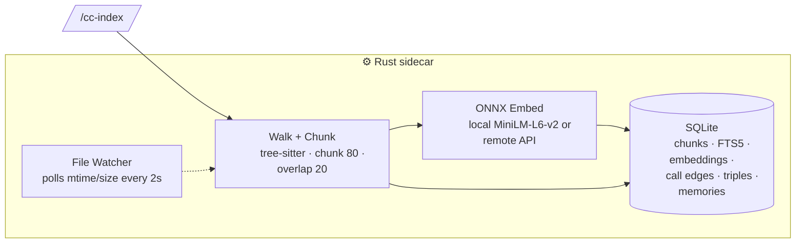
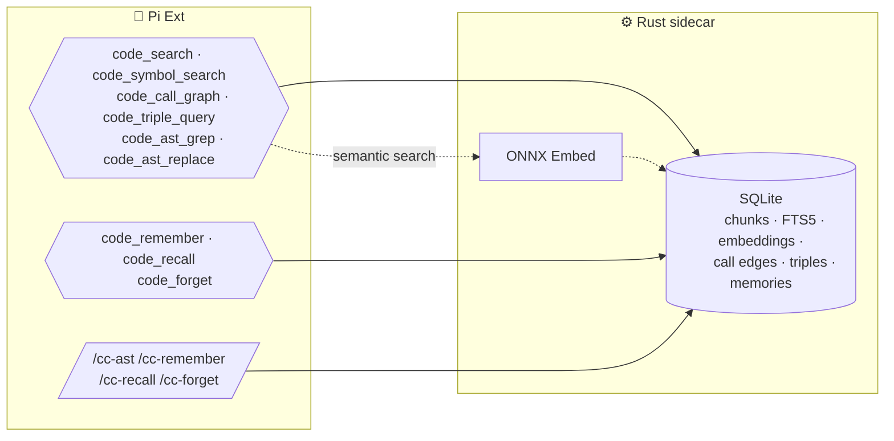

# pi-cortex

Code intelligence for Pi: search, AST analysis, call graph triples, and agent memory.

- **Semantic + keyword code search** with auto-blended mode
- **AST pattern search** (grep + replace) over indexed code
- **Call graph** with triple store queries
- **Agent memory** for remembering conversations and facts
- **Local embedding** via Rust + ONNX Runtime (DirectML GPU accelerated)
- **File watcher** auto-starts after indexing, runs in background

---

## Tools

**Agent-callable tools**:

| Tool                 | Purpose                                                                              |
| -------------------- | ------------------------------------------------------------------------------------ |
| `code_search`        | Semantic / keyword / hybrid search. Auto-blends based on query.                      |
| `code_symbol_search` | Look up functions, classes, or variables by name (plain text or regex, kind filter). |
| `code_outline`       | List every symbol in a file or directory: kind, name, line range.                    |
| `code_call_graph`    | Find callers, callees, or all calls in a file.                                       |
| `code_triple_query`  | Query knowledge-graph triples (subject-predicate-object) from indexed code.          |
| `code_ast_grep`      | Structural code search by identifier, node kind, or text.                            |
| `code_ast_replace`   | Structural find & replace with metavariables. Dry-run preview supported.             |
| `code_remember`      | Store a memory (text + embedding) for later recall.                                  |
| `code_recall`        | Recall memories by meaning, keyword, or both.                                        |
| `code_forget`        | Delete a memory by ID.                                                               |

Indexing is manual — use `/cc-index` below.

Cortex honors project `.gitignore` patterns and the optional `.cortexignore` file. Both use gitignore syntax; `.cortexignore` has higher precedence when patterns overlap.

---

## Commands

| Command         | Description                                                                                                                                                                                                                                                                                                                                                                                                                                                |
| --------------- | ---------------------------------------------------------------------------------------------------------------------------------------------------------------------------------------------------------------------------------------------------------------------------------------------------------------------------------------------------------------------------------------------------------------------------------------------------------- |
| `/cc-index`     | Index files in the current project. Optionally pass paths (e.g. `/cc-index src/`). After indexing, the Rust sidecar auto-starts a file watcher on the project. Later sessions automatically resume the watcher when this project has an index. The watcher polls every 2 seconds for mtime/size changes and re-indexes incrementally — edits are picked up within ~2 seconds and reported in the chat, with no tool call needed — until the sidecar exits. |
| `/cc-status`    | Show model, provider, files/chunks indexed, DB size, watcher status, and storage paths.                                                                                                                                                                                                                                                                                                                                                                    |
| `/cc-clean`     | Delete the current project's cortex index (its `pi-cortex.db` in the pi sessions folder). Run `/cc-index` to rebuild.                                                                                                                                                                                                                                                                                                                                      |
| `/cc-clean-all` | Recursively delete every cortex index under the pi sessions folder.                                                                                                                                                                                                                                                                                                                                                                                        |
| `/cc-ast`       | Structural code search. Equivalent to `code_ast_grep` but user-invoked.                                                                                                                                                                                                                                                                                                                                                                                    |
| `/cc-remember`  | Store a memory in cortex. Equivalent to `code_remember` but user-invoked.                                                                                                                                                                                                                                                                                                                                                                                  |
| `/cc-recall`    | Recall memories by query. Equivalent to `code_recall` but user-invoked.                                                                                                                                                                                                                                                                                                                                                                                    |
| `/cc-forget`    | Delete a memory by ID. Usage: `/cc-forget <memory_id>`.                                                                                                                                                                                                                                                                                                                                                                                                    |

---

## How it works

### Indexing



### Querying



Indexing (`/cc-index`) walks dirs, tree-sitter chunks, embeds (local ONNX or remote), stores in SQLite. A polling watcher keeps the index fresh. All tools query the same database. `code_search` auto-blends cosine similarity + FTS5 BM25. `code_symbol_search` and `code_call_graph` query stored symbols and edges. `code_triple_query` queries subject-predicate-object triples. `code_ast_grep` / `code_ast_replace` do structural search and pattern → rewrite with metavariables (dry-run previews supported). `code_remember` / `code_recall` / `code_forget` manage persistent memories.

---

## Search mode

`code_search` has a single mode that blends semantic (cosine similarity) and keyword (FTS5 BM25) automatically:

| Query looks like    | Keyword weight | Semantic weight |
| ------------------- | -------------- | --------------- |
| Code identifiers    | 0.7            | 0.3             |
| Short code-ish      | 0.5            | 0.5             |
| Full sentences      | 0.2            | 0.8             |
| Default (ambiguous) | 0.3            | 0.7             |

All scoring runs entirely in the Rust sidecar.

---

## Building the Rust sidecar

```bash
cd extensions/pi-cortex/rust-embedder
cargo build --release
```

The binary is expected at `rust-embedder/target/release/pi-embedder.exe` (Windows).

---

## Configuration

Config resolution: `<agentDir>/.pi/cortex/config.json` (created from defaults if missing), where `<agentDir>` is the pi agent dir (default `~/.pi/agent`). One config for all projects. Environment variables expanded in `model`, `baseUrl`, `apiKey` via `$VAR` or `${VAR}`.

### Default config

```json
{
    "model": "Xenova/all-MiniLM-L6-v2",
    "provider": "local",
    "baseUrl": "",
    "apiKey": "",
    "chunkSize": 80,
    "overlap": 20,
    "topK": 5,
    "indexBatchSize": 256,
    "queryPrefix": "query: ",
    "documentPrefix": "passage: "
}
```

---

## Storage layout

The index for a project lives in that cwd's pi session folder, named exactly the way pi names sessions (encoded cwd, e.g. `C:\Users\niel\.pi\agent` → `--C--Users-niel-.pi-agent--`). The DB is keyed by the cwd where the index was built — no `.pi` is ever created inside a project, and the same folder always resolves to the same DB regardless of where pi was launched. Models are cached once globally and shared by every project.

```text
<agentDir>/.pi/cortex/           # global, shared by all projects
  config.json
  pi-cortex.log
  models/
    Xenova--all-MiniLM-L6-v2/

<agentDir>/sessions/
  --C--Users-niel-.pi-agent--/   # one folder per indexed cwd
    pi-cortex.db
```

---

## Benchmark suite

```bash
python extensions/pi-cortex/benchmarks/bench_index.py --repo pi-cortex
python extensions/pi-cortex/benchmarks/bench_index.py --compare results/old.json results/latest.json
```

---

## Comparison with similar projects

Feature matrix vs other code-intelligence projects (researched 2026-08).

| Feature                     | pi-cortex (ours)                                                           | AFT (cortexkit)                           | oh-my-pi                           | ast-grep CLI                 | Continue                    | CodeGraph                   | CodeSeek                             | code-graph-mcp                   | sensegrep                       | Claude Code / Codex / Gemini CLI          |
| --------------------------- | -------------------------------------------------------------------------- | ----------------------------------------- | ---------------------------------- | ---------------------------- | --------------------------- | --------------------------- | ------------------------------------ | -------------------------------- | ------------------------------- | ----------------------------------------- |
| Host                        | Pi extension                                                               | Pi + OpenCode plugins                     | Pi fork (own agent)                | Standalone CLI               | VS Code / JetBrains         | MCP server (+ VS Code)      | MCP for Claude Code / Codex          | MCP server                       | MCP + CLI + VS Code             | Built-in agent tools                      |
| Semantic search             | ✅ local ONNX (MiniLM-L6-v2)                                               | ✅ fastembed / OpenAI-compatible / Ollama | ❌                                 | ❌                           | ✅ LanceDB (local or cloud) | ✅ BM25 + semantic          | ✅ LanceDB + Tantivy, RRF + reranker | ✅ BM25 + sqlite-vec, RRF        | ✅ (Gemini / OpenAI embeddings) | ⚠️ partial (Codex search, Gemini indexer) |
| Hybrid keyword + semantic   | ✅ FTS5 + vectors                                                          | ✅ trigram index + vectors                | ❌                                 | ❌                           | ✅ FTS5 + vectors           | ✅                          | ✅                                   | ✅                               | ✅                              | ⚠️                                        |
| Symbol search               | ✅ by name (substring or regex) + kind filter; `code_outline` per file/dir | ✅ aft_outline / aft_zoom                 | via LSP                            | ❌                           | ✅ tree-sitter code objects | ✅ 37-38 languages          | ⚠️ advertised, unimplemented stub    | ✅ 10+ languages                 | ✅ 30+ symbol filters           | ❌ built-in (via MCP)                     |
| Call graph                  | ✅ callers/callees (tree-sitter extraction)                                | ✅ aft_callgraph (callers, impact, trace) | via LSP + DAP                      | ❌                           | ❌                          | ✅ callers/callees + impact | ✅ PetCodeGraph                      | ✅ recursive CTE callers/callees | ❌                              | ❌ built-in                               |
| AST pattern search          | ⚠️ substring-based, no metavariables                                       | ✅ real tree-sitter, metavariables        | ✅ real tree-sitter, 50+ grammars  | ✅ 50+ languages, YAML rules | ❌                          | ⚠️ pattern search on graph  | ❌                                   | ✅ ast_search (structural)       | ✅ tree-sitter structural       | ❌ built-in                               |
| AST pattern replace         | ⚠️ substring-based, dry-run + diff                                         | ✅ ast_grep_replace (dry-run + diff)      | ✅ ast_edit (preview before apply) | ✅ structural rewrite        | ❌                          | ❌                          | ❌                                   | ❌                               | ❌                              | ❌ built-in                               |
| Cross-session memory        | ✅ remember/recall/forget (SQLite vectors)                                 | via Magic Context plugin                  | ✅ mnemopi (retain/recall/reflect) | ❌                           | ✅ codebase context         | ✅ memory layer             | ❌                                   | ❌                               | ❌                              | ✅ (Claude, Codex memory)                 |
| Local embeddings (offline)  | ✅                                                                         | ✅                                        | ✅ (mnemopi)                       | n/a                          | ✅ (ollama etc.)            | ✅                          | ❌ (API)                             | ❌ (API)                         | ❌ (remote only)                | ⚠️ (Gemini local index)                   |
| File watcher / auto-reindex | ✅ debounced watcher                                                       | ✅ persistent per-project daemon          | ✅                                 | ❌                           | ✅ branch-aware re-index    | ✅                          | ✅ MD5-incremental + git hooks       | ✅ PostToolUse auto-index        | ✅ watch mode                   | ✅                                        |

Notes:

- **Closest analogue: AFT** — same architecture (TS extension + long-running Rust sidecar, JSON-over-stdio protocol, SQLite, local ONNX embeddings) and feature surface. AFT adds hoisted read/write/edit/grep, LSP diagnostics, and per-file undo; pi-cortex adds `code_triple_query` and scoped memory (session/project/global).
- **Biggest gap: AST tools are substring-based** — `code_ast_grep` / `code_ast_replace` match text, not AST nodes, so metavariables like `$MSG` never match. AFT, oh-my-pi, and the ast-grep CLI do real tree-sitter structural matching.
- **MCP-based tools** (CodeGraph, CodeSeek, code-graph-mcp, sensegrep) attach to any agent via MCP but can't provide pi-cortex's custom TUI rendering (collapsed stat rows, colored diffs, expand hints) — that's native-extension territory.
- Sources: [AFT](https://github.com/cortexkit/aft) · [oh-my-pi](https://github.com/can1357/oh-my-pi) · [ast-grep](https://github.com/ast-grep/ast-grep) · [Continue](https://github.com/continuedev/continue) · [CodeGraph](https://github.com/codegraph-ai/codegraph) · [CodeSeek](https://github.com/iohub/codeseek) · [code-graph-mcp](https://github.com/sdsrss/code-graph-mcp) · [sensegrep](https://github.com/Stahldavid/sensegrep)
