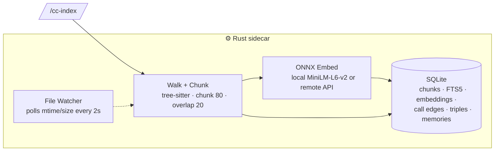
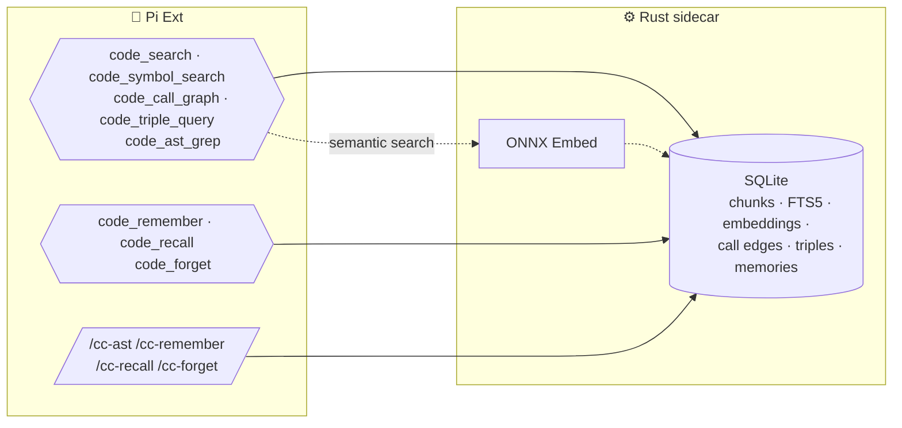

# pi-cortex

Code intelligence for Pi: search, AST analysis, call graph triples, and agent memory.

- **Semantic + keyword code search** with auto-blended mode
- **AST pattern search** (grep + replace) over indexed code
- **Call graph** with triple store queries
- **Agent memory** for remembering conversations and facts
- **Local embedding** via Rust + ONNX Runtime (DirectML GPU accelerated)
- **File watcher** auto-starts after indexing, runs in background

---

## Tools

**Agent-callable tools**:

| Tool                 | Purpose                                                                     | UI                                    |
| -------------------- | --------------------------------------------------------------------------- | ------------------------------------- |
| `code_search`        | Semantic / keyword / hybrid search. Auto-blends based on query.             | Collapse/expand + elapsed time (ms/s) |
| `code_symbol_search` | Look up functions, classes, or variables by name.                           | Collapse/expand + elapsed time (ms/s) |
| `code_call_graph`    | Find callers, callees, or all calls in a file.                              | Collapse/expand + elapsed time (ms/s) |
| `code_triple_query`  | Query knowledge-graph triples (subject-predicate-object) from indexed code. | Collapse/expand + elapsed time (ms/s) |
| `code_ast_grep`      | Structural code search by identifier, node kind, or text.                   | Collapse/expand + elapsed time (ms/s) |
| `code_remember`      | Store a memory (text + embedding) for later recall.                         | —                                     |
| `code_recall`        | Recall memories by meaning, keyword, or both.                               | Collapse/expand + elapsed time (ms/s) |
| `code_forget`        | Delete a memory by ID.                                                      | —                                     |

Indexing is manual — use `/cc-index` below.

---

## Commands

| Command          | Description                                                                                                                                                                                                                                                                   |
| ---------------- | ----------------------------------------------------------------------------------------------------------------------------------------------------------------------------------------------------------------------------------------------------------------------------- |
| `/cc-index`      | Index files in the current project. Optionally pass paths (e.g. `/cc-index src/`). After indexing, the Rust sidecar auto-starts a file watcher on the project. The watcher polls every 2 seconds for mtime/size changes and re-indexes incrementally until the sidecar exits. |
| `/cc-status`     | Show model, provider, files/chunks indexed, DB size, watcher status, and storage paths.                                                                                                                                                                                       |
| `/cleanup-embed` | Delete the cortex database (index.db + WAL). Run `/cc-index` to rebuild.                                                                                                                                                                                                      |
| `/cc-ast`        | Structural code search. Equivalent to `code_ast_grep` but user-invoked.                                                                                                                                                                                                       |
| `/cc-remember`   | Store a memory in cortex. Equivalent to `code_remember` but user-invoked.                                                                                                                                                                                                     |
| `/cc-recall`     | Recall memories by query. Equivalent to `code_recall` but user-invoked.                                                                                                                                                                                                       |
| `/cc-forget`     | Delete a memory by ID. Usage: `/cc-forget <memory_id>`.                                                                                                                                                                                                                       |

---

## How it works

### Indexing



### Querying



Indexing (`/cc-index`) walks dirs, tree-sitter chunks, embeds (local ONNX or remote), stores in SQLite. A polling watcher keeps the index fresh. All tools query the same database. `code_search` auto-blends cosine similarity + FTS5 BM25. `code_symbol_search` and `code_call_graph` query stored symbols and edges. `code_triple_query` queries subject-predicate-object triples. `code_ast_grep` does structural identifier/kind/text search. `code_remember` / `code_recall` / `code_forget` manage persistent memories.

---

## Search mode

`code_search` has a single mode that blends semantic (cosine similarity) and keyword (FTS5 BM25) automatically:

| Query looks like    | Keyword weight | Semantic weight |
| ------------------- | -------------- | --------------- |
| Code identifiers    | 0.7            | 0.3             |
| Short code-ish      | 0.5            | 0.5             |
| Full sentences      | 0.2            | 0.8             |
| Default (ambiguous) | 0.3            | 0.7             |

All scoring runs entirely in the Rust sidecar.

---

## Building the Rust sidecar

```bash
cd extensions/pi-cortex/rust-embedder
cargo build --release
```

The binary is expected at `rust-embedder/target/release/pi-embedder.exe` (Windows).

---

## Configuration

Config resolution: `<project>/.pi/cortex/config.json` (created from defaults if missing). Environment variables expanded in `model`, `baseUrl`, `apiKey` via `$VAR` or `${VAR}`.

### Default config

```json
{
    "model": "Xenova/all-MiniLM-L6-v2",
    "provider": "local",
    "baseUrl": "",
    "apiKey": "",
    "chunkSize": 80,
    "overlap": 20,
    "topK": 5,
    "indexBatchSize": 256,
    "queryPrefix": "query: ",
    "documentPrefix": "passage: "
}
```

---

## Storage layout

```text
<repo>/.pi/cortex/
  config.json
  models/
    Xenova--all-MiniLM-L6-v2/

<project>/.pi/cortex/
  config.json
  index.db
```

---

## Testing

```bash
cd extensions/pi-cortex
cargo build --release
pnpx vitest run --config vitest.config.ts
```

Tests create fixtures in `.test-tmp/` — they never touch files outside the extension directory.

---

## Benchmark suite

```bash
python extensions/pi-cortex/benchmarks/bench_index.py --repo pi-cortex
python extensions/pi-cortex/benchmarks/bench_index.py --compare results/old.json results/latest.json
```
